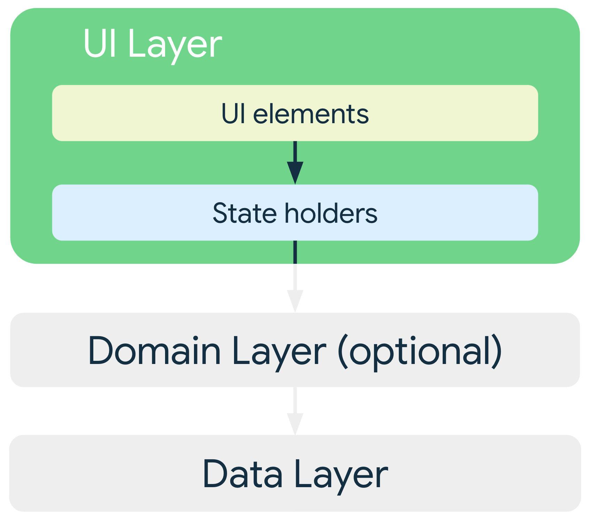

## App Architecture

자료 : [안드로이드 공식문서 - 안드로이드 아키텍처 ](https://developer.android.com/topic/architecture)

### 모바일 앱 사용자 환경

- Activity, Fragment, Service, Content Provider, Broadcast Receiver 를 비롯한 여러 앱 구성요소로 안드로이드 앱을 구성

### 일반적인 아키텍처 원칙

- 안드로이드 앱은 크기가 커지기 때문에 앱을 확장하고 견고함을 높여 앱을 더 쉽게 테스트할 수 있도록 아키텍처를 정의하는 것이 중요하다.
- 관심사 분리
  - Activity 또는 Fragment 같은 UI 기반 클래스는 UI 및 운영체제와 상호작용을 처리하는 로직만 포함해야 한다.
    - 최대한 가볍게 유지하여 구성요소 수명 주기와 관련된 문제를 피하고 테스트 가능성을 개선할 수 있다.
- 데이터 모델에서 UI 도출
  - 가급적이면 영구적으로 저장되는 데이터 모델을 권장
  - 앱의 UI 요소 및 기타 구성요소로부터 독립되어 있어, UI 생명주기와 관련없이 데이터를 관리할 수 있다.
  - 하지만, OS가 메모리에서 앱의 프로세스를 삭제하게된다면 데이터 모델도 삭제된다.
  - 영구 데이터 모델의 장점
    - Android OS에서 리소스를 확보하기 위해 앱을 제거해도 사용자 데이터는 삭제되지 않는다.
    - 네트워크 연결이 취약하거나 연결되어 있지 않아도 앱이 계속 작동된다.
- 단일 소스 저장소 (Single source of truth)
  - 새로운 데이터 타입을 정의할 때 SSOT에 할당해야 한다.
  - SSOT는 데이터의 소유자면서, SSOT만 수정과 변경이 가능하다.
  - 불변 타입을 사용하여 데이터를 노출하며, 다른 유형이 호출할 수 있는 이벤트를 수신하거나 함수를 노출하여 데이터를 수정한다.
  - 장점
    - 특정 유형 데이터의 모든 변경사항을 한 곳으로 모은다.
    - 다른 타입이 조작할 수 없도록 데이터를 보호한다.
    - 데이터 변경사항 추적이 용이하다.
- 단방향 데이터 흐름 (Unidirectional Data Flow)
  - SSOT는 종종 단방향 데이터를과 함께 사용된다.
  - UDF에서 `상태`는 `한 방향`으로만 흐른다. 데이터를 수정하는 `이벤트`는 반대 방향으로 흐른다.
  - 안드로이드에서 상태,데이터는 일반적으로 상위 범위 유형 -> 하위 범위 유형으로 흐른다.
    - 이벤트는 하위 범위 유형에서 트리거되어 상응하는 데이터 유형의 SSOT에 도달한다.
    - 애플리케이션 데이터는 보통 데이터 소스 -> UI로 흐른다.
      - ex, 버튼 누르기와 같은 사용자 이벤트는 UI -> SSOT로 흐르며, SSOT 에서는 애플리케이션 데이터가 불변 유형으로 수정 및 노출된다.
  - 데이터의 일관성을 강화하고, 오류 발생 확률을 낮춰주며, SSOT 패턴의 모든 이점을 가져올 수 있다.

### 권장 앱 아키텍처

- 권장 아키텍처
  - 일반 아키텍처 원칙에 따라 최소 두 가지 레이어가 포함되어야 한다.
    - 화면에 애플리케이션 데이터를 표시하는 UI 레이어
    - 앱의 비즈니스 로직을 포함하고 애플리케이션 데이터를 노출하는 데이터 레이어
  - 거기에 UI와 데이터 레이어 간의 상호작용을 간소화하고 재사용하기 위한 도메인 레이어를 추가할 수 있다.
- 권장 아키텍처 이미지

  

- 해당 아키텍처에서 권장하는 기술들

  - 반응형, 계층형 아키텍처
  - 앱의 모든 레이어에서 단방향 데이터 흐름
  - State Holder가 있는 UI 레이어로 UI 복잡성 관리
  - 코루틴, Flow
  - DI
  - 자료 : [안드로이드 공식문서 - 안드로이드 아키텍처 권장사항 ](https://developer.android.com/topic/architecture/recommendations)

### UI 레이어

- 화면에 애플리케이션 데이터를 표시하는 역할
- 사용자 상호작용 또는 외부 입력으로 인해 데이터가 변할 때마다 변경사항을 반영하도록 UI가 업데이트되어야 한다.
- 구성하는 방법
  - 화면에 렌더링 하는 요소 (View 또는 Jetpack Compose 사용하여 빌드할 수 있다.)
  - 데이터를 갖고 UI에 노출하며 로직을 처리하는 State Holder (ex, ViewModel)
- 이미지

  

### 데이터 레이어

- 비즈니스 로직을 포함한다. ( 비즈니스 로직 : 앱에 데이터를 생성,저장,변경 등을 정의 )
- 데이터 레이어는 0 ~ 여러개의 레포지토리로 구성된다.
- 다른 유형의 데이터를 조작하기 위한 각각의 레포지토리를 생성한다.
- 레포지토리의 담당 업무
  - 데이터 노출
  - 데이터 변경사항을 한 곳에 집중
  - 여러 데이터 소스간의 충돌 해결
  - 데이터 소스 추상화
  - 비즈니스 로직 포함
- 각 데이터 소스 클래스는 파일, 네트워크 소스, 로컬 데이터베이스 같은 하나의 데이터 소스만 사용해야 한다.
- 데이터 소스 클래스는 데이터 작업을 위해 애플리케이션과 시스템 사이에서 다리 역할을 한다.
- 이미지

  

### 도메인 레이어

- UI 레이어와 데이터 레이어 사이에 있는 레이어
- 복잡한 비즈니스 로직이나 여러 ViewModel에서 재사용되는 간단한 비즈니스 로직의 캡슐화를 담당
- 복잡성을 처리하거나 재사용성을 선호하는 등 필요한 경우에 도메인 레이어를 아키텍처에 포함시켜 사용한다.

### 구성요소 간 의존성 관리

- 애플리케이션에서 의존성을 관리하기 위한 디자인 패턴
  - DI : 런타임 시점에 다른 클래스가 이 종속 항목을 제공해야 한다.
  - Service locator : 클래스가 자신의 종속 항목을 구성하는 대신 종속 항목을 가져올 수 있는 registry를 가져온다.
- `We recommend following dependency injection patterns and using the Hilt library in Android apps`
  - Hilt 라이브러리 사용을 권장한다.
  - Hilt는 종속 항목 트리를 따라 이동하여 객체를 자동으로 구성하고 종속 항목의 컴파일 시간을 보장하며 안드로이드 프레임워크 클래스의 종속 항목 컨테이너를 만든다.

### 일반적인 권장 사항

- Activity, Service, Broadcast receiver와 같은 entry point를 데이터 소스로 지정하지 말기
  - entry point와 관련된 데이터 일부만 가져오도록 다른 컴포넌트에 맞춰 조정하기
- 안드로이드 클래스의 의존성을 줄이기
  - 앱 컴포넌트는 Context, Toast 같은 안드로이드 SDK API를 의존하는 유일한 클래스여야 한다
  - 추상화된 클래스는 테스트를 쉽게 만들고 결합도를 줄일 수 있다.
- 앱의 다양한 모듈 간 책임이 잘 정의된 바운더리를 구성한다.
  - 관련없는 책임들을 하나의 클래스에 정의하면 안되고, 관련 있는 책임들은 분산하면 안되고 하나의 클래스에 정의한다
- 각 모듈은 가능하면 적게 노출한다.
  - 내부 구현 세부정보를 최대한 감춘다.
- 다른 앱과 차별되도록 앱의 고유한 핵심에 초점을 맞춘다.
  - 동일 상용구 코드를 반복해서 작성하며 시간을 낭비하지 말고, 앱을 독특하게 만드는 데 시간과 에너지를 사용하고, 반복적인 상용구는 Jetpack 라이브러리와 기타 권장 라이브러리를 활용하도록 한다.
- 앱의 각 부분별로 독립적으로 테스트 할 수 있도록 고려한다.
  - 테스트 하기 쉽도록 코들르 작성한다.
- Type은 동시 실행 정책을 담당한다.
  - 오랜 시간 블로킹 해야하는 작업의 경우 올바른 스레드로 할당해야 한다.
- 가능한 관련성 높은 최신 데이터를 보존해야 한다.
  - 해당 규칙을 지키면 오프라인 모드일 때도 사용자가 앱의 기능을 이용할 수 있다.
  - 수신 상태가 좋지 못한 경우나 속도가 느린 환경의 경우에도 사용할 수 있도록 해당 규칙을 지켜야한다.

## 안드로이드 로드맵, stream blog

자료

- [안드로이드 로드맵](https://velog.io/@skydoves/2022-android-developer-roadmap-part4)
- [안드로이드 로드맵 - 원문](https://getstream.io/blog/design-patterns-and-architecture-the-android-developer-roadmap-part-4)

### 디자인 패턴

- 모던 Android 개발에서 전반적인 아키텍처 구조에 많은 영향을 주는 세 가지 주요패턴
  - Dependency Injection (의존성 주입)
    - 클래스의 인스턴스 생성 의무를 외부로 이전하는 패턴
    - 느슨한 결합도를 갖는 종속성 설계를 할 수 있다.
    - 장점
      - 객체 생성을 위한 불필요한 코드를 줄일 수 있다.
      - 클래스 간의 결합이 느슨하여 단위 테스트를 쉽게 작성할 수 있다.
      - 클래스 재사용성을 향상시킨다.
      - 코드 유지 보수성을 향상시킨다.
    - 수동으로 의존성 주입하기
      - 자료 : [안드로이드 공식문서 - 수동 의존성 주입](https://developer.android.com/training/dependency-injection/manual)
    - Hilt, Dagger, Koin(엄밀히 말하면 service locator pattern) 과 같은 효율적 솔루션 사용을 권장
      - Hilt : Dagger 위에서 동작하는 Android 전용 컴파일 타임 의존성 주입 라이브러리
        - 표준 Android Dagger 컴포넌트들을 생성하고 Dagger-Android 라이브러리에 비해 필요한 보일러 플레이트 코드의 양을 줄인다.
        - 또한, Google에서 Hilt와 관련하여 ViewModel, Jetpack Compose, Navigation 및 WorkManager와 호환성을 제공
        - 자료 : [안드로이드 공식문서 - Hilt 사용한 의존성 주입](https://developer.android.com/training/dependency-injection/hilt-android)
      - Dagger : javax.inject annotation(JSR 330)을 기반으로 하는 컴파일 타임 의존성 주입 라이브러리
        - Android 프로젝트에서 의존성 주입을 구성할 수 있지만 Dagger는 Android 프로젝트만을 위한 라이브러리가 아니기 때문에, 많은 추가 작업이 필요하다.
        - 추가 작업을 줄이길 원한다면 Hilt 또는 Dagger-Android 사용을 권장한다.
        - 자료 : [안드로이드 공식문서 - Dagger in Android](https://developer.android.com/training/dependency-injection/dagger-android)
      - Koin : Kotlin 프로젝트에서 인기 있는 의존성 주입(엄밀히 말하면 service locator pattern) 라이브러리
        - 사용하기 쉬워 Dagger 및 Hilt 사용이나 도입이 당장 어려운 경우 권장한다.
        - 런타임에 의존성을 생성하고 제공하기에 대규모 프로젝트 일 수록 Hilt,Dagger보다 성능이 제한된다.
        - 자료 : [Coin 공식 문서](https://insert-koin.io/docs/reference/koin-android/get-instances)
  - Observer Pattern (옵저버 패턴)
    - 관찰자에게 상태 변경을 자동으로 알리는 구독 매커니즘을 활용한 패턴
    - 직접 구현할 수도 있으며, RxKotlin, Kotlin Flows, LiveData 같은 라이브러리를 사용해 쉽게 구현할 수도 있다.
    - LiveData : 안드로이드 생명주기를 인식하고 스레드로부터 안전한 데이터 홀더 옵저버 패턴
      - LiveData의 관찰자는 Android 생명주기에 바인딩되어 있어, 관찰자를 수독으로 구독 취소할 필요가 없으며 생명주기가 활성화 되지 않은 경우에 데이터를 구독하지 않는다. 결과적으로 예측할 수 없고 식별하기 어려운 메모리 누수를 별다른 처리 없이 방지할 수 있다.
      - LiveData-ktx 라이브러리는 유용한 연산자를 제공하고 Data Binding 및 Room 호환성을 지원한다.
      - 최근에는 Coroutine이 광범위하게 사용되어 Kotlin의 Flow를 더 선호하는 경향이 있다.
      - 자료
        - [안드로이드 공식문서 - LiveData-ktx](https://developer.android.com/kotlin/ktx#livedata)
        - [안드로이드 공식문서 - Data Binding](https://developer.android.com/topic/libraries/data-binding)
        - [아티클 - LiveData -> Flow](https://medium.com/androiddevelopers/migrating-from-livedata-to-kotlins-flow-379292f419fb)
    - Kotlin Flows : 코루틴은 Kotlin 언어 수준에서 지원되는 비동기 및 논 블로킹 솔루션이다.
      - 비동기 Flow는 코루틴과 함께 동작하면 sequences와 유사한 cold streams 비동기 솔루션이다.
      - Flows는 Transform 연산자, Flattening 연산자 및 flowOn 연산자와 같은 유용한 연산자를 제공하여 다양한 비동기 연산을 수행한다.
      - Android에서 StateFlow 및 SharedFlow를 활용하여 state를 holding하고 관찰 가능한 flow를 구현하고 여러 구독자에게 값을 보낼 수 있다.
      - 자료
        - [코틀린 공식문서 - Asynchronous Flow](https://kotlinlang.org/docs/flow.html)
        - [코틀린 공식문서 - Coroutines](https://kotlinlang.org/docs/coroutines-overview.html)
    - RxKotlin(RxJava) : 옵저버 패턴, iterator 패턴 및 함수형 프로그래밍 등을 한꺼번에 제공하는 ReactiveX에서 유래
      - 관찰 가능한 시퀀스를 사용하여 비동기 및 이벤트 기반 프로그램을 구성할 수 있는 유용한 연산자를 제공
      - 연산자들을 사용하여 저수준 스레딩, 동기화 및 스레드 안전성과 같은 동시성 문제를 쉽게 해결할 수 있으며, RxAndroid와 같은 Android를 위한 유용한 솔루션이 많이 있다.
      - RxKotlin에는 많은 연산자가 포함되어 있어 러닝커브가 크다.
      - Kotlin Flows 또는 LiveData는 특히 프로젝트에서 복잡한 연산을 많이 수행할 필요가 없는 경우 사용하기 훨씬 쉽기에 프로젝트 성향에 따라 올바른 라이브러리 선택이 필요하다.
      - 자료
        - [깃허브 - RxKotlin](https://github.com/ReactiveX/RxKotlin)
        - [깃허브 - RxAndroid](https://github.com/ReactiveX/RxAndroid)
  - Repository Pattern (레포지토리 패턴)
    - 데이터 추상화를 제공하여 도메인과 데이터를 중재하는 Domain-Driven Design에서 비롯되었다.
    - 도메인과 관련된 실행 가능한 함수 집합체를 개념적으로 캡슐화하고, 다른 계층에 보다 객체지향적인 측면을 제공한다.
    - 안드로이드 개발에서 데이터 계층은 다른 계층에 공개 인터페이스로 노출되고 단일 정보 출처 원칙(SSOT)을 따르는 레포지토리로 구성된다.
      - 다른 레이어들은 Flow 또는 LiveData 같은 스트림으로 도메인 데이터를 관찰할 수 있으며 신뢰할 수 있다.
    - 자료 : [stream - 관련 자료](https://getstream.io/blog/build-whatsapp-clone/#app-architecture)

### 아키텍처

- 프로젝트의 전체 코드 복잡성과 유지 보수 비용을 결정하기에 확장 가능한 소프트웨어 개발에 있어서 필수적으로 고려해야할 개념이다.
- 프로젝트의 복잡성, 확장성 및 견고함에 광범위하게 영향을 미치며 테스트 코드 작성에도 영향을 미친다.
- 안드로이드의 아키텍처 예

  - Model-View-Viewmodel(MVVM), Model-View-Intent(MVI), Model-View-Presenter(MVP), Model-View-Controller(MVC), Presenters(Use cases(Entities))(Clean Architecture)
  - MVVM

    

    - View : 사용자가 화면에서 보는 UI 구성을 담당

      - TextView, Button, Jetpack Compose UI 같은 UI 컴포넌트를 포함하는 Android 컴포넌트들로 구성
      - UI 컴포넌트는 ViewModel에 대한 사용자 이벤트를 트리거하고 ViewModel에서 데이터 또는 UI 상태를 관찰하여 UI 화면을 구성한다.
      - 리스너와 같은 화면 및 사용자 상호작용을 나타내는 UI 로직만 포함되고 비즈니스 로직은 포함하지 않는다.

    - ViewModel : View에 대한 종속성이 없는 독립적인 구성 요소이며, Model의 비즈니스 데이터 또는 UI 상태를 보유하여 UI 컴포넌트로 전파한다.

      - ViewModel과 Model 사이에는 일대다 관계가 있으며 ViewModel은 데이터 변경 사항을 도메인 데이터 또는 UI 상태로 View에 알린다.
      - Google은 안드로이드 개발자가 비즈니스 데이터를 쉽게 유지하고 화면전환이 발생하는 동안 상태를 유지하는 데 도움이 되는 ViewModel 라이브러리 사용을 권장한다.
      - MS에서 공개했던 MVVM 아키텍처의 설계 목적을 ViewModel 라이브러리 사용하는 것만으로 충족할 수 없어 MS에서 제안하는 MVVM 아키텍처와는 다르다고 할 수 있다.
      - MS에서 제안하는 MVVM 설계에 가깝게 구현하기 위해서는 Data Binding과 같은 솔루션과 Flow,LiveData와 같은 구독 매커니즘 솔루션도 활용해야 한다.

    - Model : 일반적으로 비즈니스 로직, 복잡한 계산 작업 및 유효성 검사 로직을 포함하는 앱의 도메인/데이터 모델을 캡슐화한다.

      - 일반적으로 데이터 접근을 캡슐화하는 레포지토리의 remote service 및 로컬 데이터베이스와 함께 사용된다.
      - 레포지토리는 앱 전반에서 사용되는 데이터에 대한 불변성을 제공하고 신뢰할 수 있는 단일 소스를 보장한다.

    - 자료
      - [Microsoft - MVVM](https://learn.microsoft.com/en-us/previous-versions/xamarin/xamarin-forms/enterprise-application-patterns/mvvm)
      - [안드로이드 공식문서 - ViewModel](https://developer.android.com/topic/libraries/architecture/viewmodel)

  - MVI
    - 다른 계층에 불변 상태를 제공하고 사용자 작업의 결과를 나타내며 UI화면을 구성하는 상태의 단방향 및 불변성을 제공하는 single source of truth 에 중점을 둔다.
    - view( model ( intent() ))
      - view() -> intent() : UI events
      - intent() -> model() : 행동과 행동에 필요한 모델 데이터
      - model() -> view() : UI에 보여줄 새로운 모델 데이터
    - 상태 관리 매커니즘은 MVP 또는 MVVM 등 다른 패턴과 함께 구현할 수 있다. (아키텍처 설계에 따라 Presenter 또는 ViewModel 개념을 도입할 수 있다.)
    - Intent : 사용자 작업(버튼 클릭 같은 UI 이벤트)을 처리하는 인터페이스 및 기능에 대한 정의
      - 함수는 UI 이벤트를 Model의 인터페이스로 변환하고 결과를 조작할 수 있도록 Model에 전달
      - Model 함수를 수행하려는 `의도`가 있다는 의미로 intent 라고 명명했다고 할 수 있다.
    - Model : MVP 및 MVVM의 Model 의미와는 다르다.
      - Intent의 출력을 가져와 View에서 렌더링 할 수 있는 UI state로 조작하는 기능적 매커니즘
      - UI state는 변경할 수 없으며, 단일 소스 및 단방향 데이터 흐름을 따르는 비즈니스 로직에서 가져온다.
    - View : 화면과 리스너와 같은 사용자 상호 작용을 나타내며 비즈니스 로직은 포함하지 않는다.
      - MVI가 단방향 데이터 흐름을 보장하기에 View는 Model에서 오는 UI 상태에 따라 UI 컴포넌트를 렌더링 한다.
    - 자료
      - [Hannes Dorfmann - MVI 시리즈](https://hannesdorfmann.com/android/mosby3-mvi-1)
  - 클린 아키텍처
    - 모듈 분리, 재사용성 증가, 확장성 향상, 단위 테스트 사례 작성 용이성 같은 이점을 제공
    - 복잡한 비즈니스 로직이 필요하지 않은 규모의 프로젝트에서 사용할 경우 오버 엔지니어링이 될 수 있다.
    - 기본적으로 SOLID 설계 원칙을 따른다.
