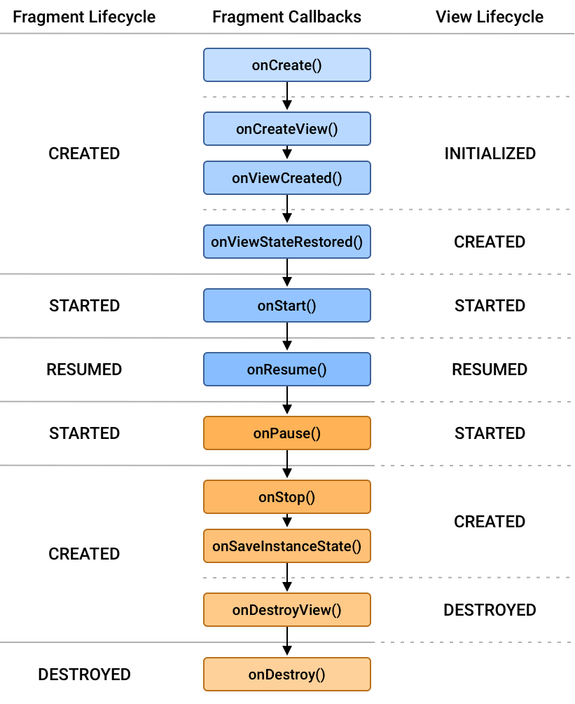

## Fragments

- 자료 : [안드로이드 공식문서 - 프래그먼트](https://developer.android.com/guide/fragments)
- 애플리케이션의 UI를 담당하고 재사용 가능하며 액티비티 또는 다른 프래그먼트와 결합해서 사용할 수 있다. ( 단독으로 사용 불가능 )
- Fragment Manager에 의해 관리된다.
- Navigation, BottomNavigationView, ViewPager2 등이 프래그먼트와 호환되도록 설계되어 있다.
- UI를 프래그먼트로 나누면 런타임시점에 Activity의 구성을 쉽게 변경할 수 있다.
  - Activity 생명주기 Started 상태에서 프래그먼트를 추가, 교체, 삭제가 가능하다.
- 프래그먼트를 사용하기 위해서는 `build.gradle` 파일에 종속성을 추가해야 한다.
- 프래그먼트를 배치할 위치를 정의할 때는 `FragmentContainerView` 를 추가해서 사용하자

  - 다른 뷰 그룹에서는 제공하지 않는 프래그먼트 관련 설정들을 제공한다.

### Fragment Lifecycles

- 생명주기에 따른 상태변경과 Activity에 결합되었음을 알려주는 중요 메서드들을 제공

- 프래그먼트 생명 주기 이미지

    

  자료 : [안드로이드 공식문서 - 프래그먼트 생명주기](https://developer.android.com/guide/fragments/lifecycle)

- onCreate() : onAttached() 호출된 후 호출된다.
  - 프래그먼트가 생성되어 FragmentManager에 추가되었음을 의미
  - 프래그먼트의 Activity가 생성되는 동안 호출될 수 있으므로 아직은 getActivity() 메서드 호출과 같은 Activity 기반 작업을 수행해서는 안된다.
- onCreateView() : 프래그먼트 대부분의 뷰 생성이 처리되는 부분
  - 유효한 View 인스턴스를 반환하면 프래그먼트의 뷰 생명 주기가 형성
  - 프래그먼트의 생성자에 layout id를 제공함으로써 적절한 시간에 뷰를 자동으로 inflate 할 수 있다.
- onViewCreated() : onCreateView() 에서 뷰 인스턴스 반환한 이후에 호출
  - inflate된 뷰를 파라미터로 받으며, 뷰의 계층 구조와 뷰의 생명주기가 완전히 초기화 되었음을 의미
  - UI 관련 작업들을 수행할 수 있다.
- onStart() : 프래그먼트가 사용자에게 나타날 때 호출
  - 일반적으로 Activity.onStart 생명 주기 메서드와 밀접한 관련이 있다.
  - 여러 Activity 또는 애플리케이션 간에 전환하는 경우 두 번 이상 실행 될 수 있다.
- onResume() : 프래그먼트가 스크린에 노출되어 사용자와 상호 작용할 준비가 되었을 때 호출
  - Activity.onResume 생명 주기 메서드와 연결
- onPause() : 사용자가 프래그먼트를 떠나기 시작할 때 호출
  - 하지만 부분적으로 보여질 수 있다. ( 사용자가 멀티 윈도우 모드에 있는 경우 )
  - Activity.onPause 생명 주기 메서드와 연결
- onStop() : 프래그먼트가 사용자에게 더 이상 표시되지 않을 때 호출
  - Activity.onStop 생명 주기 메서드와 연결
- onDestroyView() :이전에 생성된 뷰가 프래그먼트에서 분리되었을 때 호출
  - 프래그먼트의 뷰 생명 주기가 destroyed 상태이며 뷰를 더 이상 사용할 수 없다.
- onDestroy() : 프래그먼트가 제거되거나 FragmentManager가 파괴될 때 호출
  - 액티비티에서 분리하기 전에 남아 있는 모든 리소스를 해제하거나 제거할 수 있다.
