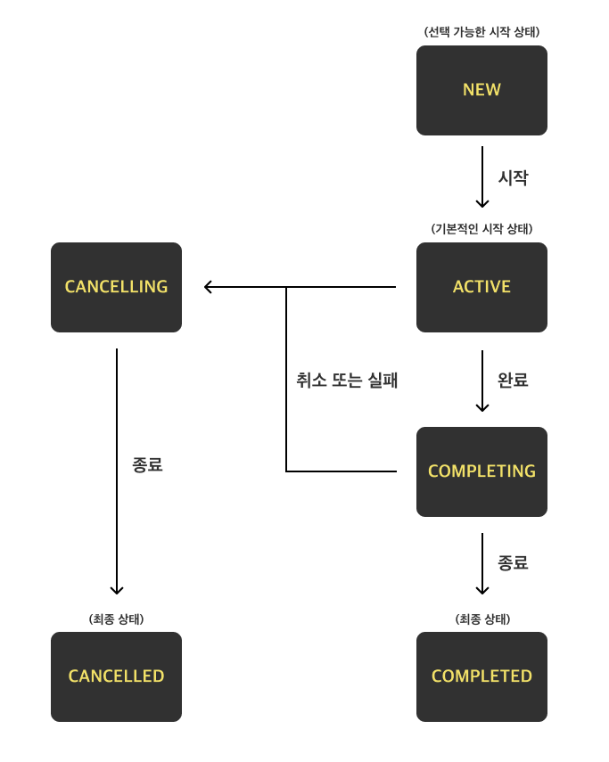

## 코틀린 코루틴

### 마르친 모스카와 지음 / 신성열 옮김

---

## 목차

[1장 코틀린 코루틴을 배워야 하는 이유](#코틀린-코루틴을-배워야-하는-이유)  
[2장 시퀀스 빌더](#시퀀스-빌더)  
[3장 중단은 어떻게 작동할까?](#중단은-어떻게-작동할까)  
[4장 코루틴의 실제 구현](#코루틴의-실제-구현)  
[5장 코루틴: 언어 차원에서의 지원 vs 라이브러리](#코루틴-언어-차원에서의-지원-vs-라이브러리)  
[6장 코루틴 빌더](#코루틴-빌더)  
[7장 코루틴 컨텍스트](#코루틴-컨텍스트)  
[8장 Job과 자식 코루틴 기다리기](#Job과-자식-코루틴-기다리기)  
[9장 취소](#취소)  
[10장 예외 처리](#예외-처리)  
[11장 코루틴 스코프 함수](#코루틴-스코프-함수)  
[12장 디스패처](#디스패처)  
[13장 코루틴 스코프 만들기](#코루틴-스코프-만들기)  
[14장 공유 상태로 인한 문제](#공유-상태로-인한-문제)  
[16장 채널](#채널)  
[17장 셀렉트](#셀렉트)  
[18장 핫 데이터 소스와 콜드 데이터 소스](#핫-데이터-소스와-콜드-데이터-소스)  
[19장 플로우란 무엇인가?](#플로우란-무엇인가)  
[20장 플로우의 실제 구현](#플로우의-실제-구현)  
[21장 플로우 만들기](#플로우-만들기)  
[22장 플로우 생명주기 함수](#플로우-생명주기-함수)  
[23장 플로우 처리](#플로우-처리)  
[24장 공유플로우와 상태플로우](#공유플로우와-상태플로우)  
[26장 일반적인 사용 예제](#일반적인-사용-예제)  
[27장 코루틴 활용 비법](#코루틴-활용-비법)  
[29장 코루틴을 시작하는 것과 중단 함수 중 어떤 것이 나을까?](#코루틴을-시작하는-것과-중단-함수-중-어떤-것이-나을까)  
[30장 모범 사례](#모범-사례)

## 코틀린 코루틴을 배워야 하는 이유

[목차로 이동](#코틀린-코루틴)

### 우리는 왜 코루틴을 배워야 할까?

- 이미 RxJava, Reactor 같은 JVM 계열 라이브러리 존재
- 자바 언어 자체적으로 멀티스레드 지원
- 콜백 방식을 활용하는 방법도 존재

### 코루틴의 장점은 무엇일까 ?

- 멀티플랫폼에서 작동시킬 수 있다.(JVM, JS, iOS 또는 다른 모듈들)
- 기존 코드 구조를 광범위하게 변경하지 않아도 된다.(RxJava, 콜백방식은 적용하기 위해 많은 코드 수정이 필요하다.)

### 안드로이드에서의 코루틴

안드로이드에서는 하나의 앱에서 뷰를 다루는 스레드가 단 하나만 존재한다.  
메인 스레드(UI 스레드)를 블로킹하면 앱 크래시(비정상 종료)가 발생할 수 있다.  
메인 스레드를 점유하지 않도록 하려면 어떤 방법이 있을까?

#### 스레드 전환

블로킹이 가능한 스레드를 먼저 사용하고, 이후에 메인 스레드로 전환하는 방식

```kotlin
fun onCreate() {
    thread {
        val news = getNewsFromApi()
        val sortedNews = news
            .sortedByDescending { it.publishedAt }
        runOnUiThread {
            view.showNews(sortedNews)
        }
    }
}
```

이렇게 문제를 해결할 경우 다음과 같은 문제가 발생한다.

- 스레드가 실행되었을 때 `멈출 수 있는 방법이 없어 메모리 누수`로 이어질 수 있다.
- 스레드를 많이 생성하면 비용이 많이 든다.
- 스레드를 자주 전환하면 복잡도를 증가시키며 관리하기가 어렵다.
- 코드가 길어지고 이해하기 어렵다.

#### 콜백

함수를 논블로킹으로 만들고 함수 작업이 끝났을 때 호출될 콜백 함수를 넘겨주는 방식이다.

- 콜백 방식은 취소할 수 있도록 만들 수는 있지만 복잡하다.
- 여러 API 호출을 병렬로 처리할 수 없다. (콜백 내부에 콜백을 사용한다면, 외부 콜백이 완료되고나서 내부 콜백 실행 가능하다.)
- 콜백 지옥(콜백 내부에 많은 콜백을 호출)이 발생할 수 있으며, 코드 가독성이 좋지 않다.
- 작업 순서 제어가 어렵다.

#### RxJava와 리액티브 스트림

데이터 스트림 내에서 일어나는 모든 연산을 시작, 처리, 관찰할 수 있다.  
리액티브 스트림은 스레드 전환, 동시성 처리를 지원하기에 연산을 병렬 처리할 수 있다.

- 메모리 누수도 없고, 취소가 가능하며, 스레드를 적절하게 사용할 수 있다.
- 다만, 구현하기 아주 복잡하다는 단점이 있다.
- 반환하는 함수들을 `Observable`, `Single` 클래스로 wrapping해야 하며, 많은 코드 변경이 필요하다.

#### 코틀린 코루틴

코루틴의 핵심은 특정 지점에서 멈추고 이후에 재개할 수 있다는 것이다.

- 메인 스레드에서 실행되더라도, 스레드를 블로킹하지 않을 수 있다.
- `async` 빌더를 통해 API를 병렬로 호출할 수도 있다.

### 백엔드에서의 코루틴

백엔드에서 코루틴 사용하는 가장 큰 장점은 간결성이다.

- `suspend` 제어자만 추가하여 쉽게 코루틴으로 변경할 수 있다.
- 동시성을 쉽게 구현하고, 테스트할 수 있으며, 코루틴을 취소할 수 있다.

스레드 사용하는 비용은 크다.

- 스레드를 명시적으로 생성하고 유지해야 하며, 스레드를 위한 메모리 할당이 필요하다.
- 코루틴을 중단, 재개에 사용되는 비용은 스레드에 비하면 엄청나게 적다.

## 시퀀스 빌더

[목차로 이동](#코틀린-코루틴)

코틀린에서는 시퀀스를 생성하는 시퀀스 빌더를 제공한다.

```kotlin

@SinceKotlin("1.3")
@Suppress("DEPRECATION")
3 public fun <T> sequence(@BuilderInference block: suspend SequenceScope<T>.() -> Unit): Sequence<T> =
    Sequence { iterator(block) }

```

#### 현재(2025년 11월) 시퀀스 빌더 함수는 어노테이션의 문구사용에 유의하라는 어노테이션을 볼 수 있었다. <br> 그 이유는 무엇일까?

- sequence 빌더 내부는 suspend 함수처럼 보이지만 continuation 기반의 low-level 코루틴 구현을 사용한다.
    - 람다 내부에서 `📌 yield suspend 함수`를 사용할 수는 있지만, 그 외 suspend 함수를 사용할 수 없다.
    - Dispatcher를 변경하거나 Job 취소 등의 작업을 처리할 수 없다.
    - 지연 처리는 가능하지만, 비동기로 작업할 수 없다.
    - 예외를 추적하기 어렵다.

위의 내용들을 종합해보면 코틀린의 구조화된 동시성을 따를 수 없으며 개발자의 실수를 불러일으킬 가능성이 있다.

cf. `📌 yield()` : sequence 빌더 내부의 yield()는 수신 객체 지정 람다 SequenceScope 추상클래스의 suspend 추상 메서드인 `yield(value: T)`로 다음 값(
value)을 반환하는 역할을 수행한다.   
`SequenceScope와 그의 메서드 yield()`는 패키지가 `package kotlin.sequences` 에 속해 있고 `코루틴에서 제공하는 중단함수 yield()`는
`package kotlinx.coroutines`에 포함된다.

### 시퀀스의 특징

- 요구되는 연산을 최소한으로 수행한다.
- 무한정이 될 수 있다.
- 메모리 사용이 효율적이다.

시퀀스 빌더는 `반환(yield)이 아닌 중단 함수`를 사용하면 안된다.  
중단이 필요하다면 데이터를 가져오기 위해 `Flow`를 사용하는 것이 더 낫다.

### 시퀀스를 언제 사용하면 좋을까?

1회성으로 동기적 작업이면서 CPU 연산만 필요한 경우에 사용하기 적합하다.

- sequence는 동기적 iterator 이면서 지연 가능하다.
- suspend context가 필요없고 context switching 비용이 없다.

## 중단은 어떻게 작동할까?

[목차로 이동](#코틀린-코루틴)

코루틴은 중단되었을 때 `Continuation` 객체를 반환한다.  
`Continuation`을 이용하면 멈췄던 곳에서 다시 코루틴을 실행할 수 있다. 중단했을 때 어떤 자원도 사용하지 않으며 재개할 때 다른 스레드에서 시작할 수도 있다.

### 재개

```kotlin 
suspend fun main() {
    println("Before")

    suspendCoroutine<Unit>() { }

    print("After")
}
```

위 코드는 suspendCoroutine 호출 지점에서 멈춘 뒤 재개되지 않는다.  
다시 실행하기 위해서는 어떻게 할 수 있을까?  
suspendCoroutine의 람다 함수는 중단되기 전에 실행되고 람다 함수는 Continuation 객체를 인자로 받는다.  
Continuation 객체를 이용해 중단 및 재개를 진행할 수 있다.

아래는 `Continuation` 인터페이스 명세다.

```kotlin 
@SinceKotlin("1.3")
public interface Continuation<in T> {
    public val context: CoroutineContext

    public fun resumeWith(result: Result<T>)
}
```

성공 시 호출

```kotlin
@SinceKotlin("1.3")
@InlineOnly
public inline fun <T> Continuation<T>.resume(value: T): Unit =
    resumeWith(Result.success(value))
```

예외발생 시 호출

```kotlin
@SinceKotlin("1.3")
@InlineOnly
public inline fun <T> Continuation<T>.resumeWithException(exception: Throwable): Unit =
    resumeWith(Result.failure(exception))
```

### 값으로 재개하기

위에서 봤던 `suspendCoroutine`의 타입이었던 Unit이 의미하는 것은 무엇일까?
Continuation에서 중단, 재개에 사용할 타입을 의미한다.

```kotlin
suspend fun main() {
    println("Before")

    val user = suspendCoroutine<User> { continuation ->
        requestUser { user ->
            continuation.resume(user)
        }
    }

    println(user)
    println("After")
}
```

중단 함수는 Retrofit, Room 같이 많이 사용되는 라이브러리에 의해 지원되고 있어,  
위 코드처럼 중단 함수 내에 콜백 함수를 사용할 일은 거의 없다.  
만약 필요하다면, `suspendCoroutine` 대신 `suspendCancellableCoroutine` 을 사용하는 것이 좋다.  
예외 상황에서는 데이터를 반환할 수 없어 코루틴이 중단된 곳에서 예외를 전파시켜야 한다.

### 함수가 아닌 코루틴을 중단시킨다

중단 함수는 코루틴이 아니고, 코루틴을 중단할 수 있는 함수다.

## 코루틴의 실제 구현

[목차로 이동](#코틀린-코루틴)

다음은 코루틴의 동작 과정에서 중요한 점이다.

- 중단 함수는 함수가 시작할 때와 중단 함수가 호출되었을 때 상태를 가진다는 점에서 상태 머신과 비슷하다.
- Continuation 객체는 상태를 나타내는 숫자와 로컬 데이터를 가진다.
- 모든 Continuation 객체는 실행을 재개하거나 재개된 함수를 완료할 때 사용되는 콜 스택으로 사용된다.

### Continuation 전달 방식

코틀린 팀은 중단 함수가 구현될 수 있는 방법 중에서 CPS(Continuation Passing Style)을 택했다.  
관례상 Continuation 은 마지막 파라미터로 전달된다.

```kotlin
suspend fun getUser(): User?
suspend fun setUser(user: User)
suspend fun checkAvailability(flight: Flight): Boolean

// 중단 함수 내부 -->
fun getUser(continuation: Continuation<*>): Any?
fun setUser(user: User, continuation: Continuation<*>): Any
fun checkAvailability(flight: Flight, continuation: Continuation<*>): Any
```

중단 함수 내부를 보면 `Any?` 또는 `Any` 타입으로 바뀌게 된다.  
그 이유는 중단 함수를 실행하는 도중 중단될 경우 선언된 타입의 값을 반환하지 않을 수 있기 때문이다. 이때, 중단함수는 특별한 마커인 `COROUTINE_SUSPENDED`를 반환한다.  
그렇기에 getUser 함수가 `User?` 또는 `COROUTINE_SUSPENDED` 를 반환할 수 있어 가장 가까운 슈퍼타입인 `Any?` 타입으로 지정된다.

간단한 함수를 통해 더 자세히 알아보자.

```kotlin
suspend fun myFunction() {
    println("Before")
    delay(1000) // 중단 함수
    println("After")
}

// 내부를 간단하게 표현 해보면 -->
fun myFunction(continuation: Continuation<Unit>): Any {
    val continuation = continuation as? MyFunctionContinuation ?: MyFunctionContinuation(continuation)

    if (continuation.label == 0) {
        println("Before")
        continuation.label = 1
        if (delay(1000, continuation) == COROUTINE_SUSPENDED) {
            return COROUTINE_SUSPENDED
        }
    }
    if (continuation.label == 1) {
        println("After")
        return Unit
    }
    error("Impossible")
}
```

함수가 시작되는 지점은 함수의 시작점(최초 호출 시점)과 중단 이후 재개 시점(Continuation resume 시점) 두 곳이다.  
label 필드를 통해 현재 상태를 저장한다.  
delay에 의해 중단된 경우 COROUTINE_SUSPENDED를 반환하며, 중단이 일어나면 콜 스택에 있는 모든 함수가 종료되고 중단된 코루틴을 실행하던 스레드를 실행 가능한 코드가 사용할 수 있게 된다.

Continuation 객체로 wrapping한 이후의 핵심 부분 코드를 살펴보자.

```kotlin
class MyFunctionContinuation(
    val completion: Continuation<Unit>
) : Continuation<Unit> {
    override val context: CoroutineContext
        get() = completion.context

    var label = 0
    var result: Result<Any>? = null

    override fun resumeWith(result: Result<Unit>) {
        this.result = result
        val res = try {
            val r = myFunction(this)
            if (r == COROUTINE_SUSPENDED) return
            Result.success(r as Unit)
        } catch (e: Throwable) {
            Result.failure(e)
        }
        completion.resumeWith(res)
    }
}
```

### 콜 스택

함수 a가 함수 b를 호출하면 가상 머신은 a의 상태와 b가 끝나면 실행 될 지점을 콜 스택에 저장한다.  
코루틴을 중단하면 스레드를 반환해 콜 스택에 있는 정보가 사라지게 된다. 코루틴에서는 Continuation 객체가 콜 스택의 역할을 대신한다.  
Continuation 객체는 중단이 되었을 때의 상태(label), 함수의 지역 변수와 파라미터, 중단 함수를 호출한 함수가 재개될 위치 정보를 갖고 있다.  
하나의 Continuation 가 다른 하나를 참조하고, 참조된 객체가 또 다른 Continuation 객체를 참조하는 구조로 이뤄져 있다.

### 중단 함수의 성능

중단 함수를 사용하는 것이 비용이 클 것이라고 생각하지만, 함수를 상태로 구분하는 것은 숫자를 비교하는 것 만큼 쉬운 작업이며 실행점이 변하는 비용 또한 거의 들지 않는다.  
Continuation 객체에 상태를 저장하는 것 또한 간단하다. 지역 변수를 복사하지 않고 새로운 변수가 메모리 내 특정 값을 가리키게 한다.  
Continuation 객체를 생성하는 비용이 들긴 하지만, RxJava나 콜백 함수의 성능에 대해 신경 쓰지 않았다면 중단 함수 성능에 대해서도 걱정하지 않아도 된다.

## 코루틴: 언어 차원에서의 지원 vs 라이브러리

[목차로 이동](#코틀린-코루틴)

코루틴은 코틀린 언어에서 자체적으로 지원하는 부분과 코틀린 코루틴 라이브러리 두 가지로 구성되어 있다.

### 코틀린 언어에서 자체적으로 지원

- 컴파일러가 지원하며 코틀린 기본 라이브러리에 포함되어 있다.
- kotlin.coroutines 패키지에 포함된다.
- Continuation, suspendCoroutines 등 기본적인 것들과 suspend 키워드를 최소한으로 제공한다.
- 직접 사용하기 어렵다.
- 거의 모든 동시성 스타일이 허용된다.

### kotlinx.coroutines 라이브러리에서 지원

- 의존성 추가가 필요하다
- kotlinx.coroutines 패키지에 포함된다.
- launch, async, Deferred 등 다양한 기능을 제고앟ㄴ다.
- 직접 사용하기 편리하다.
- 단 하나의 명확한 동시성 스타일을 위해 설계되어 있다.

## 코루틴 빌더

[목차로 이동](#코틀린-코루틴)

중단 함수는 Continuation 객체를 다른 중단 함수로 전달해야 한다.  
따라서, 중단 함수가 다른 일반 함수를 호출하는 것은 가능하지만 일반 함수가 중단 함수를 호출하는 것은 불가능하다.  
코루틴 빌더는 중단 함수의 시작 지점을 만들어주는 역할을 한다.

### launch 빌더

launch가 작동하는 방식은 thread 함수를 호출하여 새로운 스레드를 시작하는 것과 비슷하다.

```kotlin
fun main() {
    GlobalScope.launch {
        delay(1000L)
        println("World!")
    }
    GlobalScope.launch {
        delay(1000L)
        println("World!")
    }
    println("Hello,")
    Thread.sleep(2000L)
}
```

launch 함수는 CoroutineScope 인터페이스의 확장 함수다.   
여기서 CoroutineScope 인터페이스는 부모 코루틴과 자식 코루틴 사이의 관계를 정립하기 위한 목적으로 사용되는 구조화된 동시성의 핵심이다.

만약 위 코드에서 Thread.sleep을 호출하지 않았다면 어떻게 될까?  
main 함수는 `Hello,`를 출력하고 종료될 것이다. 그 이유는 delay()는 스레드를 중단시키는 것이 아닌 코루틴을 중단시키기 때문이다.  
스레드가 블로킹되지 않으면 할 일이 없다고 생각하고 바로 종료되고 만다.  
launch는 `📌 데몬 스레드`와 어느정도 비슷하다고 볼 수 있다. 하지만, 훨씬 가볍다.

cf. `📌 데몬 스레드` : 일반 스레드의 작업을 돕는 보조적인 역할의 스레드, 일반 스레드 종료 시 강제 종료된다.

### runBlocking 빌더

runBlocking 빌더는 새로운 코루틴을 실행한 뒤 완료될 때까지 현재 스레드를 중단 가능한 상태로 블로킹한다.
runBlocking 내부에서 delay() 메서드를 호출할 경우, Thread.sleep(1000L)과 비슷하게 작동한다.   
디스패처를 변경해 다른 스레드에서 작동하게 할 수 있지만, 이 경우에도 코루틴이 완료될 때까지 해당 빌더가 시작된 스레드가 블로킹된다.  
runBlocking이 사용되는 특수한 경우는 두 가지가 있다.

- 프로그램이 끝나는 걸 방지하기 위해 스레드를 블로킹할 필요가 있는 메인 함수
- 프로그램이 끝나는 걸 방지하기 위해 스레드를 블로킹할 필요가 있는 유닛 테스트

### async 빌더

async 빌더는 launch와 비슷하지만 값을 생성하도록 설계되어 있고, Deferred\<T> 타입의 객체를 리턴하며, T는 생성되는 값의 타입이다.  
Deferred에는 작업이 끝나면 값을 반환하는 중단 메서드인 await가 있다.  
launch 빌더와 비슷하게 호출되자마자 코루틴을 즉시 시작한다.  
그리고 여러 다른 곳에서 데이터를 얻어와 합치는 경우처럼, 병렬로 실행할 때 주로 사용된다.

### 구조화된 동시성

빌더 함수들의 내부를 확인해보자.

```kotlin
fun <T> runBlocking(
    context: CoroutineContext = EmptyCoroutineContext,
    block: suspend CoroutineScope.() -> T
): T

fun CoroutineScope.launch(
    context: CoroutineContext = EmptyCoroutineContext,
    start: CoroutineStart = CoroutineStart.DEFAULT,
    block: suspend CoroutineScope.() -> T
): Job

fun <T> CoroutineScope.async(
    context: CoroutineContext = EmptyCoroutineContext,
    start: CoroutineStart = CoroutineStart.DEFAULT,
    block: suspend CoroutineScope.() -> T
): Deferred<T>
```

launch, async는 CoroutineScope의 확장함수라는 것을 알 수 있다.  
다만, runBlocking은 CoroutineScope의 확장함수가 아니여서 루트 코루틴으로만 사용될 수 있다.

```kotlin
fun main() = runBlocking {
    launch {
        delay(1000L)
        println("World")
    }
    this.launch {
        delay(2000L)
        println("world!")
    }
    println("Hello,")
}
// 출력
// Hello,
// World
// world!
```

그러므로 위와 같이 사용할 수 있으며, launch 빌더는 runBlocking의 자식이 된다.  
부모는 자식들을 위한 스코프를 제공하고 자식들을 해당 스코프 내에서 호출한다. 이를 통해 구조화된 동시성이라는 관계가 성립된다.

### 부모-자식 관계에서 가장 중요한 특징

- 자식은 부모로부터 컨텍스트를 상속받는다.
- 부모는 모든 자식이 작업을 마칠 때까지 기다린다.
- 부모 코루틴이 취소되면 자식 코루틴도 취소된다.
- 자식 코루틴에서 에러가 발생하면, 부모 코루틴 또한 에러로 소멸한다.

### 현업에서의 코루틴 사용

중단 함수는 다른 중단 함수들로부터 호출되어야 하며, 모든 중단 함수는 코루틴 빌더로 시작되어야 한다.  
그리고, runBlocking을 제외한 모든 코루틴 빌더는 CoroutineScope에서 시작되어야 한다.  
코루틴 스코프는 직접 만들거나 프레임워크에서 제공하는 스코프를 사용할 수 있다.  
첫 번째 빌더가 스코프에서 시작되면 다른 빌더가 첫 번째 빌더의 스코프에서 시작될 수 있고, 이게 구조화되는 과정의 본질이 된다.

중단 함수에선 스코프를 어떻게 처리할 수 있을까?  
중단 함수 내부에서 중단될 수 있지만 함수 내에는 스코프가 없다. 스코프를 인자로 넘기는 방식은 좋은 방식이라고 할 수 없다.  
대신 코루틴 빌더가 사용할 스코프를 만들어주는 coroutineScope 함수를 사용해볼 수 있다.

### coroutineScope 사용하기

```kotlin
suspend fun getArticlesForUser(
    userToken: String?,
): List<ArticleJson> = coroutineScope {
    val articles = async { articleRepository.getArticles() }
    val user = userService.getUser(userToken)
    articles.await()
        .filter { canSeeOnList(user, it) }
        .map { toArticleJson(it) }
}
```

async 빌더를 호출하기 위해서 스코프가 필요하지만, 함수에 스코프를 넘기고 싶지 않을 때 위 코드같이 구현할 수 있다.  
coroutineScope는 람다 표현식이 필요로 하는 스코프를 만들어 주는 중단 함수다.  
중단 함수 내에서 스코프가 필요할 때 일반적으로 사용하며 let, run, use 같이 람다식이 반환하는 것이면 무엇이든 반환한다.  
중단 함수를 coroutineScope와 함께 시작하는 것도 가능하며, 메인 함수와 runBlocking을 함께 사용하는 것보다 세련된 방법이다.

```kotlin
suspend fun main(): Unit = coroutineScope {
    launch {
        delay(1000L)
        println("World!")
    }
    println("Hello,")
}
// 출력
// Hello,
// World!
```

### 정리

코루틴은 스코프 또는 runBlocking 에서 시작된다.  
이후에 다른 코루틴 빌더나 중단 함수를 호출할 수 있다.  
중단 함수에서 빌더를 실행할 수 없으므로 coroutineScope와 같은 코루틴 스코프 함수를 사용할 수 있다.

## 코루틴 컨텍스트

[목차로 이동](#코틀린-코루틴)

CoroutineScope의 정의를 보면 CoroutineContext를 감싸는 wrapper처럼 보인다.

```kotlin
public interface CoroutineScope {
    public val coroutineContext: CorotuineContext
}
```

이전에 봤던 Continuation 객체에서도 CoroutineContext를 포함하고 있다.

```kotlin
public interface Continuation<in T> {
    public val context: CoroutineContext
    public fun resumeWith(result: Result<T>)
}

```

이처럼 코루틴에서 중요한 요소들이 CoroutineContext를 사용하고 있는 것을 알 수 있다.

CoroutineContext는 원소나 원소들의 집합을 나타내는 인터페이스이면서 Job, CoroutineName, CoroutineDispatcher 같은 Element 객체들이 인덱싱된 집합이다.  
각 Element 또한 CoroutineContext 다.  
컨텍스트에서 모든 원소는 식별할 수 있는 유일한 Key를 가지고 있고 키는 주소로 비교된다.

CoroutineContext는 컬렉션과 비슷하기 때문에 get을 이용해 유일한 키를 가진 원소를 찾을 수 있다.  
원소가 컨텍스트에 있으면 반환된다는 점에서 Map과 비슷하며, 없으면 null이 대신 반환된다.

CoroutineContext는 두 개의 CoroutineContext를 합쳐 하나의 CoroutineContext로 만들 수 있다. 더하기 연산자를 활용해서 합칠 수 있다.  
CoroutineContext에 같은 키를 가진 또 다른 원소가 더해지면 새로운 원소가 기존 원소를 대체한다.    
CoroutineContext에서 원소를 제거할 때는 minusKey 함수에 제거하고 싶은 원소를 넣으면 된다.

### CoroutineContext와 빌더

CoroutineContext는 코루틴의 데이터를 저장하고 전달하는 방법이다.  
부모-자식 관계의 영향 중 하나로 부모는 Context를 자식에게 전달한다. 자식은 부모로부터 CoroutineContext를 상속받는다고 할 수 있다.  
모든 자식은 빌더의 인자에서 정의된 특정 컨텍스트를 가질 수 있다.  
CoroutineContext를 계산하는 간단한 공식은 `defaultContext + parentContext + childContext` 로 자식 Context는 부모로부터 상속받은 컨텍스트 중 같은 키를 가진
원소를 대체한다.  
기본값으로 설정되는 원소는 ContinuationInterceptor가 설정되지 않았을 때 사용되는 Dispatchers.Default이며, 애플리케이션이 디버그 모드일 때는 CoroutineId도 기본값으로
설정된다.

### 중단 함수에서 Context에 접근하기

CoroutineScope는 Context를 접근할 때 사용되는 coroutineContext 프로퍼티를 가지고 있다.  
중단 함수에서 Context에 접근하기 위해 중단 함수 사이 전달되는 Continuation 객체가 참조하고 있다.

## Job과 자식 코루틴 기다리기

[목차로 이동](#코틀린-코루틴)

### 구조화된 동시성으로 보는 부모-자식 관계의 특성

1. 자식은 부모로부터 Context를 상속받는다.
2. 부모는 모든 자식이 작업을 마칠 때까지 기다린다.
3. 부모 코루틴이 취소되면 자식 코루틴도 취소된다.
4. 자식 코루틴에서 에러가 발생하면, 부모 코루틴 또한 에러로 소멸한다.

1번 특성은 코루틴 빌더의 가장 기본적인 특성이며 2~4번의 특성은 Context 중 Job 과 관련이 있다.

### Job

Job은 수명을 가지고 있으며 취소 가능하다.

Job의 상태와 상태 변화



Active 상태에서는 Job이 실행되고 코루틴은 Job을 수행한다.  
Job이 코루틴 빌더에 의해 생성되었을 때 실행되는 상태로, 자식 코루틴을 시작할 수 있다.  
대부분의 코루틴이 Active 상태로 시작되고, 지연 시작되는 코루틴만 New 상태에서 시작된다.  
지연 시작되는 코루틴은 작업이 실행되는 시점에 Active 상태가 된다.  
실행이 완료되면 Completing 상태가 되며 자식들을 기다리고 있다. 자식들의 실행이 모두 종료되었을 때 Completed 상태가 된다.

만약, Job이 실행 중에 취소되거나 실패하게 된다면 Cancelling 상태가 되며, 연결을 끊거나 자원을 반납하는 작업을 할 수 있다.  
반납하는 작업이 모두 완료되면 Job이 Cancelled 상태가 된다.

Job의 상태를 확인하고 싶다면 isActive, isCompleted, isCancelled 프로퍼티를 통해 확인할 수 있다.

### 코루틴 빌더는 부모의 Job을 기초로 자신들의 Job을 생성한다.

코틀린 코루틴 라이브러리의 모든 코루틴 빌더는 자신만의 잡을 생성한다.  
**Job은 코루틴이 상속하지 않는 유일한 Coroutine Context다.**  
모든 코루틴은 자신만의 Job을 생성하며 인자 또는 부모 코루틴으로부터 온 Job은 새로운 Job의 부모로 사용된다.  
부모 Job은 자식 Job 모두를 참조할 수 있으며, 자식 또한 부모를 참조할 수 있다. 이러한 부모-자식 관계가 있기에 Coroutine Scope 내에서 취소와 예외 처리 구현이 가능하다.

```kotlin
fun main(): Unit = runBlocking {
    val job: Job = launch {
        dealy(1000)
    }

    val parentJob: Job = coroutineContext.job // == coroutineContext[Job]!!
    println(job == parentJob) // false
    val parentChildren: Sequence<Job> = parentJob.children
    println(parentChildren.first() == job) // true
} 
```

위 코드는 runBlocking 빌더(부모)의 Job(코드의 parentJob 변수)에서 자식 Job(코드의 launch 빌더 Job)을 참조할 수 있음을 보여주는 코드 예시다.

만약, 새로운 Job Context가 부모 Job을 대체한다면 구조화된 동시성 작동 방식은 유효하지 않게 된다.(아래 코드 예시)

```kotlin
fun main(): Unit = runBlocking {
    launch(Job()) {
        delay(1000)
        println("Will not be printed")
    }
}
// launch 블럭의 print문이 출력 되기 전에 종료된다.
```

자식(launch 빌더)은 인자로 들어온 잡을 부모로 사용하기에 runBlocking과의 부모-자식 관계가 사라진다.   
다시말해 다른 Context들을 상속받게 되더라도, 부모-자식 관계는 정립되지 못한다.

### 자식들 기다리기

Job의 장점 중 하나로, join 메서드를 사용해서 코루틴이 완료될 때까지 기다릴 수 있다.  
join 메서드는 지정한 Job이 Completed나 Cancelled 같은 마지막 상태에 도달할 때까지 기다리는 중단 함수다.

```kotlin
fun main(): Unit = runBlocking {
    launch {
        delay(1000)
    }
    launch {
        dealy(2000)
    }

    val children = coroutineContext[Job]?.children
    val childrenCount = children?.count() // 자식 수 파악 가능 (현재 코드에서는 2)
    children?.forEach { it.join() } // 자식이 모두 마지막 상태에 될 때까지 기다릴 수 있다.
}
```

### Job 팩토리 함수

Job() 팩토리 함수를 사용해서 코루틴 없이도 Job을 만들 수 있다.  
팩토리 함수로 생성하는 Job은 어떤 코루틴과도 연관되지 않으며, Context로 사용될 수 있다.

```kotlin
suspend fun main(): Unit = coroutineScope {
    val job = Job()
    launch(job) { // 새로운 Job이 부모로부터 상속받은 Job을 대체한다.
        delay(1000)
    }
    launch(job) { // 새로운 Job이 부모로부터 상속받은 Job을 대체한다.
        delay(2000)
    }
    job.join() // 여기서 영원히 대기하게 된다.
}
```

위 코드는 자식 코루틴이 모두 작업을 마쳐도 Job이 여전히 Active 상태에 있어서 종료되지 않는다.  
팩토리 함수로 만들어진 Job은 다른 코루틴에 의해 여전히 사용될 수 있기 때문이다.
따라서, Job의 모든 자식 코루틴에서 join을 호출하는 것이 바람직한 방법이다.

Job() 은 팩토리 함수의 좋은 예시다.

```kotlin
public fun Job(parent: Job? = null): CompletableJob
```

Job 팩토리 함수가 반환하는 타입은 하위 인터페이스 타입인 CompletableJob이다.  
CompletableJob 인터페이스는 Job 인터페이스에 두 가지 메서드를 추가해 기능성을 확장한 타입이다.

- `complete(): Boolean` : Job은 완료하는 데 사용된다. 모든 자식 코루틴은 작업이 완료될 때까지 실행된 상태를 유지하지만, complete를 호출한 Job에서 새로운 코루틴이 시작될 수는
  없다.
- `completeExceptionally(exception: Throwable): Boolean` :  인자로 받은 예외로 Job을 완료시킨다. 모든 자식 코루틴은 주어진 예외를 래핑한
  CancellationException으로 즉시 취소된다.

```kotlin
suspend fun main(): Unit = coroutineScope {
    val job = Job()
    launch(job) { // 새로운 Job이 부모로부터 상속받은 Job을 대체한다.
        delay(1000)
    }
    launch(job) { // 새로운 Job이 부모로부터 상속받은 Job을 대체한다.
        delay(2000)
    }
    job.complete()
    job.join()
}
```

complete 함수는 Job의 마지막 코루틴을 시작한 후 자주 사용된다. 이후에는 join 함수를 사용해 Job이 완료되는 걸 기다리기만 하면 된다.

## 취소

[목차로 이동](#코틀린-코루틴)

Job 인터페이스는 cancel 메서드로 취소를 할 수 있다.

### cancel 메서드의 특징

- 호출한 코루틴은 첫 번째 중단점에서 Job을 끝낸다.
- Job이 자식을 가지고 있다면, 같이 취소된다. 하지만 부모는 영향을 받지 않는다.
- Job이 취소되면, 취소된 Job은 새로운 코루틴의 부모로 사용될 수 없다. Cancelling 상태가 되었다가 Cancelled 상태로 바뀐다.

코루틴을 취소하기 위해서 사용되는 예외는 CancellationException 타입 또는 CancellationException의 서브타입 이어야 한다.

cancel이 호출된 뒤 다음 작업을 진행하기 전에 join을 사용하는 것이 일반적이다.  
만약, join을 호출하지 않으면 race condition(경쟁 상태)이 될 수 있다.  
join을 호출하면 코루틴이 취소될 때(Cancelled)까지 중단되므로 race condition이 발생하지 않는다.  
그렇기에 kotlinx.coroutines 라이브러리에서는 cancelAndJoin 이라는 확장함수도 제공한다.

```kotlin
public suspend fun Job.cancelAndJoin() {
    cancel()
    return join()
}
```

Job() 팩토리 함수로 생성된 Job도 cancelAndJoin 함수로 취소할 수 있다.  
이 방법으로 Job에 연관된 수많은 코루틴을 한 번에 취소할 때 자주 사용된다.

```kotlin
suspend fun main(): Unit = coroutineScope {
    val job = Job()
    launch(job) {
        repeat(1000) { i ->
            delay(200)
            println("print $i")
        }
    }
    delay(1100)
    job.cancelAndJoin()
    println("cancelled !")
}
// print 0
// print 1
// print 2
// print 3
// print 4
// cancelled !
```

안드로이드에서의 모든 코루틴을 취소하는 경우 예시

```kotlin
class ProfileViewModel : ViewModel() {
    private val scope = CoroutineScope(Dispatchers.Main + SupervisorJob())

    fun onCreate() {
        scope.launch { loadUserData() }
    }

    override fun onCleared() {
        scope.coroutineContext.cancelChildren()
    }
}
```

### 취소는 어떻게 작동하는가?

Job이 취소되면 Cancelling 상태로 바뀐다. 상태가 바뀐 뒤 첫 번째 중단점에서 CancellationException 예외를 던진다.  
예외는 try-catch 사용해서 잡을 수 있지만, 다시 던지는 것이 좋다.  
취소된 코루틴은 단지 멈추는 것이 아니라 내부적으로 예외를 사용해 취소되는 것을 명심해야 한다. finally 블록 안에서 자원을 정리한다.

try-catch 에서 CancellationException 을 잡고 후처리 과정을 진행하고 싶을 수도 있다.
Job은 이미 Cancelling 상태가 되었기에 다른 코루틴을 시작하거나 중단하는 것은 불가능하다.  
다른 코루틴을 시작하려고 하면 무시되고, 중단하려고 한다면 CancellationException 을 던진다.

데이터 베이스 변경 사항을 롤백하는 경우와 같이 코루틴이 이미 취소되었을 때 중단 함수를 반드시 호출해야 하는 경우가 있다.  
이럴 때는 withContext(NonCancellable) 로 포장해서 사용하는 방법이 있다.
withContext를 통해 Context를 바꾸고, 취소될 수 없는 Job인 NonCancellable 객체를 사용해 블록 내부의 Job은 Active 상태를 유지하며, 중단 함수를 사용할 수 있다.

```kotlin
suspend fun main(): Unit = coroutineScope {
    val job = Job()
    launch(job) {
        try {
            delay(200)
            println("Coroutine finished")
        } finally {
            println("Finally")
            withContext(NonCancellable) {
                delay(1000)
                println("Cleanup done")
            }
        }
    }
    dealy(100)
    job.cancelAndJoin()
    println("Done")
}
// Finally
// Cleanup done
// Done
```

### invokeOnCompletion

자원을 해제하는 데 자주 사용되는 다른 방법은 Job의 invokeOnCompletion 메서드를 호출하는 것이다.  
invokeOnCompletion 메서드는 Job이 Completed 또는 Cancelled 같은 마지막 상태에 도달했을 때 호출될 핸들러를 지정하는 역할을 한다.  
핸들러의 파라미터 중 하나인 예외 종류는 다음과 같다.

- Job이 예외 없이 끝나면 null 을 반환한다.
- 코루틴이 취소되었다면 CancellationException 을 반환한다.
- 코루틴을 종료시킨 예외를 반환한다.

invokeOnCompletion은 취소하는 중에 동기적으로 호출되며, 어떤 스레드에서 실행할 지 결정할 수는 없다.

### 중단될 수 없는 걸 중단하기

복잡한 연산이나 큰 파일을 읽는 과정처럼 긴 시간이 걸리는 상황에서 중단이 필요할 수 있다.

1. yield() 주기적으로 호출하기

- yield는 최상위 중단 함수로, 코루틴을 중단하고 즉시 재실행한다.
- 중단점이 생겼기 때문에 취소 또는 중단중에 필요한 모든 작업을 할 수 있는 기회가 주어진다.
- 중단하고 재개하기에 스레드 풀을 가진 디스패처를 사용하면 스레드가 바뀔 수 있다.
- 중단 가능하지 않으면서 CPU 집약적이거나 시간 집약적 연산들이 중단 함수에 있다면, 각 연산들 사이에 yield()를 사용하는 것이 좋다.

2. Job의 상태 추적하기

- 코루틴 빌더 내부에서 this는 빌더의 scope를 참조하고 있다. scope는 coroutineContext를 가지고 있고, coroutineContext는 Job에 접근해 현재 상태를 알 수 있다.
- Job은 코루틴이 Active한지 확인하는 데 사용된다. CoroutineScope의 확장함수로 isActive를 제공해준다.

3. ensureActive() 함수 사용하기

- `ensureActive()` : Job이 Active 상태가 아니면 CancellationException을 던지는 함수
- yield와는 달리 CoroutineScope에서 호출되어야 한다.
- yield 보다 가볍다.

### suspendCancellableCoroutine

suspendCoroutine 과 비슷하지만, Continuation 객체를 몇 가지 기능이 추가된 CancellableContinuation\<T>로 래핑한다.  
invokeOnCancellation 메서드로 코루틴이 취소되었을 때 행동을 정의할 수 있다.(라이브러리의 실행 취소 및 자원 해제할 때 주로 사용된다.)

## 예외 처리

[목차로 이동](#코틀린-코루틴)

코루틴이 예외를 받았을 때 자기 자신을 취소하고 예외를 부모로 전파한다.  
부모는 자기 자신과 자식들 모두를 취소하고 예외를 부모로 전파한다. 더 이상 부모가 없다면 프로그램을 종료시킨다.  
예외 전파가 정지되지 않으면 구조화된 모든 코루틴이 취소된다.

코루틴 간 상호작용은 Job을 통해 일어나기 때문에, 코루틴 빌더 내부에 새로운 코루틴 빌더를 try-catch 문으로 래핑하는 것는 소용없다.

```kotlin
fun main(): Unit = runBlocking {
    try { // 무시되며 예외를 잡을 수 없다.
        launch {
            delay(1000)
            throw Error("Error")
        }
    } catch (e: Throwable) {
        println("Will not be printed")
    }
    launch {
        delay(2000)
        println("Will not be printed")
    }
}
```

### SupervisorJob

SupervisorJob을 사용하면 자식에서 발생한 모든 예외를 무시할 수 있다.  
일반적으로 SupervisorJob은 다수의 코루틴을 시작하는 스코프로 사용된다.

```kotlin
fun main(): Unit = runBlocking {
    val scope = CoroutineScope(SupervisorJob())
    scope.launch {
        delay(1000)
        throw Error("Some error")
    }

    scope.launch {
        delay(2000)
        println("Will be printed")
    }

    delay(3000)
}
// 출력 
// Will be printed
```

SupervisorJob을 부모 코루틴의 인자로 사용하는 실수를 하기 쉽다.

```kotlin
fun main(): Unit = runBlocking {
    launch(SupervisorJob()) {
        launch {
            delay(1000)
            throw Error("Some error")
        }

        launch {
            delay(2000)
            println("Will not be printed")
        }
    }
    delay(3000)
}
```

SupervisorJob은 단 하나의 자식(`자식 = launch(SupervisorJob())`)만 가지기 때문에 예외 처리할 때 아무런 도움이 되지 않는다.  
runBlocking과의 부모-자식관계를 끊는다. 부모 코루틴이 없는 Job은 일반 잡과 동일하게 작동한다.

### supervisorScope

코루틴 빌더를 supervisorScope로 래핑해서 예외 전파를 막을 수 있다.  
supervisorScope는 단지 중단 함수일 뿐, 중단 함수 본체를 래핑하는 데 사용된다.  
서로 무관한 다수의 작업을 스코프 내에서 실행할 수 있게 한다.

```kotlin
suspend fun notifyAnalytics(actions: List<UserAction>) =
    supervisorScope {
        actions.forEach { action ->
            launch {
                notifyAnalytics(action)
            }
        }
    }
```

coroutineScope : 코루틴 빌더와 달리 부모에 영향을 미치는 대신 try-catch를 이용해 잡을 수 있는 예외를 던진다.

**supervisorScope는 withContext(SupervisorJob()) 으로 대체될 수 없다는 것을 명심하자!**

- Job은 상속되지 않는 유일한 Context다.
- SupervisorJob이 withContext의 부모가 된다.
- 자식 코루틴에서 예외가 발생하면 withContext 코루틴으로 전달되며, Job이 취소되고, 자식 코루틴 또한 취소되며 마지막으로 예외가 던져진다.

### await

예외가 발생했을 때 async 코루틴 빌더는 launch처럼 부모 코루틴을 종료하고 부모와 관련있는 다른 코루틴 빌더도 종료시킨다.

```kotlin
class MyException : Throwable()

suspend fun main() = supervisorScope {
    val str1 = async<String> {
        delay(1000)
        throw MyException()
    }

    val str2 = async {
        delay(2000)
        "Text2"
    }

    try {
        println(str1.await())
    } catch (e: MyException) {
        println(e)
    }

    println(str2.await())
}
// 출력
// MyException
// Text2
```

코루틴이 예외로 종료되어 반환할 값이 없지만, await가 MyException을 던지게 되어 출력된다.  
supervisorScope가 사용되어서 또 다른 async는 중단되지 않고 끝까지 실행된다.

### CancellationException은 부모까지 전파되지 않는다

예외가 CancellationException의 서브 클래스라면 부모로 전파되지 않는다.  
현재 코루틴을 취소 시킬 뿐이다.

### 코루틴 예외 핸들러

예외를 다룰 때 예외를 처리하는 기본 행동을 정의하는 것이 유용할 때 CoroutineExceptionHandler Context 사용하면 편리하다.  
예외 전파를 중단시키지는 않지만 예외가 발생했을 때 해야 하는 것들을 정의하는 데 사용할 수 있다.(예외 로깅 등)  
안드로이드에서는 사용자에게 대화창이나 에러 메시지를 보여 줌으로써 어떤 문제가 발생했는 지 알리는 역할을 한다.

## 코루틴 스코프 함수

[목차로 이동](#코틀린-코루틴)

### 코루틴 스코프 함수 사용하기 전에 사용하는 방법

1. 중단 함수 내에서 중단 함수 호출

```kotlin
suspend fun getUserProfile(): UserProfileData {
    val user = getUserData()
    val notifications = getNotifiactions()

    return UserProfileData(
        user = user,
        notifications = notifications,
    )
}
```

이 방식은 작업이 동시에 진행되지 않는다. 순차적으로 작업 진행된다.

2. GlobalScope 활용

```kotlin
suspend fun getUserProfile(): UserProfileData {
    val user = GlobalScope.async { getUserData() }
    val notifications = GlobalScope.async { getNotifiactions() }

    return UserProfileData(
        user = user.await(),
        notifications = notifications.await(),
    )
}
```

GlobalScope는 EmptyCoroutineContext 를 가진 스코프다.  
그러므로 이 방식은 async가 취소될 수 없으며, 부모로부터 스코프를 상속받지 않는다.  
결과적으로 부모가 취소되어도 async 내부 함수가 실행 중인 상태가 될 수 있어 메모리 누수가 발생할 수 있으며 CPU를 차지하게 될 수 있다.  
또한, 코루틴 단위 테스트하기가 매우 어려워진다.

3. Scope를 함수 인자로 넘기고 받기

```kotlin
suspend fun getUserProfile(
    scope: CoroutineScope,
): UserProfileData {
    val user = scope.async { getUserData() }
    val notifications = scope.async { getNotifiactions() }

    return UserProfileData(
        user = user.await(),
        notifications = notifications.await(),
    )
}
```

이 방식은 취소 가능하며 단위 테스트도 가능한 구조다.  
하지만 스코프가 함수로 전달되면 예외, 취소 발생 시 구조화된 코루틴들에게 전파되기에 발생 지점을 찾기 어려울 수 있으며 잠재적 위험성이 존재하게 된다.

### 코루틴 스코프 함수

중단함수에서 코루틴 스코프를 만들기 위해 사용되는 함수다.

코루틴 빌더와 코루틴 스코프의 차이점

|       코루틴 빌더<br/>(runBlocking 제외)       |                              코루틴 스코프 함수                               |
|:---------------------------------------:|:---------------------------------------------------------------------:|
|         launch, async, produce          | coroutineScope,<br/>supervisorScope,<br/>withContext,<br/>withTimeout |
|          CoroutineScope의 확장함수           |                                 중단 함수                                 |
| CoroutineScope 리시버의 CoroutineContext 사용 |            중단 함수의 Continuation 객체가 가진 CoroutineContext 사용             |
|           예외는 Job을 통해 부모로 전파됨           |                         일반 함수와 같은 방식으로 예외를 던짐                         |
|              비동기인 코루틴을 시작함              |                       코루틴 빌더가 호출된 곳에서 코루틴을 시작함                        |

runBlocking은 함수 본체를 곧바로 호출하고 결과를 반환하는 특징으로 보면 코루틴 빌더보다 코루틴 스코프 함수에 가까워보인다.     
코루틴 스코프 함수와의 가장 큰 차이점은 runBlocking은 블로킹 함수지만 코루틴 스코프는 중단함수다.

#### CoroutineScope

coroutineScope는 새로운 스코프를 시작하는 중단 함수면서, 인자로 들어온 함수가 생성한 값을 반환한다.

```kotlin
suspend fun <R> coroutineScope(
    block: suspend CoroutineScope.() -> R
): R
```

coroutineScope 함수는 새로운 코루틴을 생성하지만 새로운 코루틴이 끝날 때까지 coroutineScope를 호출한 코루틴을 중단하기 때문에 호출한 코루틴이 작업을 동시에 시작하지는 않는다.    
생성된 coroutineScope는 바깥 스코프의 coroutineContext를 상속받지만 Context의 Job을 오버라이딩 한다.  
생성된 스코프는 부모의 책임을 이어서 받는다.

- 부모로부터 컨텍스트를 상속받는다.
- 자신의 작업을 끝내기 전까지 모든 자식을 기다린다.
- 부모가 취소되면 자식들 모두를 취소한다.

코루틴 빌더와 달리 coroutineScope나 스코프에 속한 자식에서 예외가 발생하면 다른 모든 자식이 취소되고 예외가 다시 던져진다.  
중단 함수에서 병렬로 작업을 수행할 경우 이러한 특성을 가진 coroutineScope를 사용하는 것이 좋다.

#### withContext

withContext는 coroutineScope와 비슷하지만 Scope의 Context를 변경할 수 있다.  
따라서, withContext(EmptyCoroutineContext)와 coroutineScope()는 같은 방식으로 작동한다.  
주로 기존 Scope와 Context가 다른 코루틴 스코프를 설정하기 위해 사용된다.

> coroutineScope{} 가 작동하는 방식이 async{}.await() 과 비슷하고 withContext(context)도 async(context){}.await() 과 비슷하다.  
> 가장 큰 차이는 async는 스코프가 필요하지만, 코루틴 스코프 함수인 coroutineScope와 withContext는 해당 함수를 호출한 중단점에서 스코프를 들고온다는 점이다.  
> 두 경우 모두 async 이후 await을 바로 호출하는 방법 대신 코루틴 스코프 함수를 사용하는 것이 좋다.

#### supervisorScope

supervisorScope는 호출한 스코프로부터 상속받은 CoroutineScope를 만들고 지정된 중단 함수를 호출한다.(SupervisorJob으로 오버라이딩)  
주로 서로 독립적인 작업을 시작하는 함수에서 사용된다.

```kotlin
class ArticlesRepositoryComposite(
    private val articleRepositories: List<ArticleRepository>,
) : ArticleRepository {
    override suspend fun fetchArticles(): List<Article> =
        supervisorScope {
            articleRepositories
                .map { async { it.fetchArticles() } }
                .mapNotNull {
                    try {
                        it.await()
                    } catch (e: Throwable) {
                        e.printStackTrace()
                        null
                    }
                }
                .flatten()
                .sortedByDescending { it.publishedAt }
        }
}
```

위 코드에서 await를 호출하고 async 코루틴이 예외로 끝나게 된다면 await는 예외를 다시 던지게 된다.  
따라서 async에서 발생하는 예외를 전부 처리하려면 try-catch 블록으로 await 호출을 래핑해야 한다.

#### withTimeout

withTimeout은 인자로 들어온 람다식을 실행할 때 시간 제한을 설정할 수 있다.  
실행 시간이 너무 오래 걸리면 람다식은 취소되고 TimeoutCancellationException(CancellationException의 서브타입)을 던진다.  
테스트할 때 특정 함수의 실행시간이 많게 또는 적게 걸리는 지 확인하는데 사용할 수 있다.

코루틴 빌더 내부에서 TimeoutCancellationException을 던지면 해당 코루틴만 취소되고 부모에게는 영향을 주지 않는다.

```kotlin
suspend fun main(): Unit = coroutineScope {
    launch { // 1
        launch { // 2
            delay(2000)
            println("Will not be printed")
        }
        withTimeout(1000) {
            delay(1500)
        }
    }
    launch { // 3
        delay(2000)
        println("Done")
    }
}
// 출력문
// Done
```

withTimeout 내부의 delay 시간이 더 길어서 TimeoutCancellationException을 던지게 된다.  
던진 예외는 1에서 잡히고 1의 자식인 코루틴 2를 취소시킨다.    
결과적으로 3의 코루틴 빌더가 실행되어 Done을 출력하게 된다.

withTimeoutOrNull로 시간 초과 시 예외가 아닌 null을 반환하게 할 수도 있다.  
이 함수는 소요되는 시간이 너무 길 때, 무언가 잘못되었음을 알리는 용도로 사용할 수 있다.

### 추가적인 연산

작업을 수행하는 도중 추가적인 연산을 수행하는 경우의 예시를 보자.

```kotlin
class ShowUserDataUseCase(
    private val repo: UserDataRepository,
    private val view: UserDataView,
) {
    suspend fun showUserData() = coroutineScope {
        val name = async { repo.getName() }
        val friends = async { repo.getFriends() }
        val profile = async { repo.getProfile() }
        val user = User(
            name = name.await(),
            friends = friends.await(),
            profile = profile.await()
        )
        view.show(user)
        launch { repo.notifyProfileShown() }
    }
}
```

위 코드는 coroutineScope가 사용자 데이터를 보여준 뒤, launch 빌더 코루틴이 끝나기를 기다려야 하므로 launch의 목적과 관련된 유의미한 작업을 한다고 볼 수 없다.  
만약 뷰를 업데이트할 때 프로그레스 바를 보여주고 있다면, launch 블럭이 끝날 때까지 기다려야 한다.  
또 다른 문제로는 취소하는 과정에서 문제가 발생한다.  
만약 `getFriends()` 함수에서 예외가 발생하면 다른 async 빌더들은 필요가 없으므로 취소가 되는 것이 올바르지만, notifyProfileShown은 분석하는 용도의 함수로 이 함수에서만 예외가 발생할
경우 전체 과정이 취소되는 것을 올바르지 않다.

```kotlin
class ShowUserDataUseCase(
    private val repo: UserDataRepository,
    private val view: UserDataView,
    private val analyticsScope: CoroutineScope,
) {
    suspend fun showUserData() = coroutineScope {
        val name = async { repo.getName() }
        val friends = async { repo.getFriends() }
        val profile = async { repo.getProfile() }
        val user = User(
            name = name.await(),
            friends = friends.await(),
            profile = profile.await()
        )
        view.show(user)
        analyticsScope.launch { repo.notifyProfileShown() }
    }
}
```

위 코드와 같이 핵심 동작에 영향을 주지 않는 추가 연산의 경우 또 다른 스코프에서 시작하는 것이 낫다.  
생성자 주입으로 스코프를 전달하면 전달된 클래스를 통해 독립적인 작업을 실행한다는 것을 명확하게 알 수 있다.  
따라서 중단 함수는 주입된 스코프에서 시작한 연산이 끝날 때까지 기다리지 않는다.

## 디스패처

[목차로 이동](#코틀린-코루틴)

디스패처는 코루틴이 실행되어야 할 스레드, 스레드 풀을 결정할 수 있도록 한다.

### Default 디스패처

기본적으로 설정되는 디스패처는 CPU 집약적 연산을 수행하도록 설계된 Dispatchers.Default다.  
Default는 코드가 실행되고 있는 컴퓨터의 CPU 개수와 동일한 수의 스레드 풀을 가지고 있다.  
비용이 많이 드는 작업이 Dispatchers.Default의 스레드를 다 써버려서 Default 를 사용하는 다른 코루틴이 실행될 기회가 제한된다고 의심할 때 limitedParallelism 을 설정하여
디스패처가 같은 스레드 풀을 사용하지만 같은 시간에 특정 수 이상의 스레드를 사용하지 못하도록 제한할 수 있다.

### Main 디스패처

안드로이드에서 메인 스레드는 UI와 상호작용하는 데 사용하는 유일한 스레드다.  
메인 스레드는 자주 사용되지만 블로킹되면 전체 애플리케이션이 멈추므로 주의해서 사용해야 한다.  
메인 스레드에서 코루틴을 실행하려면 Dispatchers.Main을 사용한다.  
메인 디스패처는 정의하는 의존성이 없다면 사용할 수 없다.(android, javaFx, swing, ... 사용하기 위한 의존성 추가 필요)  
또한, 단위 테스트에서 사용하기 위한 메인 디스패처는 정의 되어 있지 않아서 `kotlinx-coroutines-test` 라이브러리를 활용해 직접 디스패처를 설정해야 한다.

```kotlin
class SomeTest {
    private val dispatcher = Executors
        .newSingleThreadExecutor()
        .asCoroutineDispatcher()

    @Before
    fun setup() {
        Dispatchers.setMain(dispatcher)
    }

    @After
    fun tearDown() {
        Dispatchers.resetMain()
        dispatcher.close()
    }

    @Test
    fun testUi() = runBlocking {
        launch(Dispatchers.Main) {

        }
    }
}

```

블로킹 대신 중단하는 라이브러리를 사용하고 복잡한 연산을 하지 않으면 Dispatchers.Main 으로 충분하다.  
CPU 집약적인 작업을 한다면 Dispatchers.Default 를 사용할 수 있다.  
하지만, 시간이 오래 걸리는 I/O 작업이나 블로킹 함수가 있는 라이브러리가 필요하다면 Main, Default 디스패처로 부족하다.  
Default 디스패처를 블로킹하게 되면 스레드 풀에 있는 모든 스레드를 블로킹하게 되어 아무런 연산도 수행할 수 없는 상황이 벌어질 수 있다.

### IO 디스패처

IO 디스패처는 파일을 읽고 쓰거나, 안드로이드의 shared preference 사용, 블로킹 함수 호출하는 경우 등 I/O 연산으로 스레드를 블로킹 할 때 사용하기 위해 설계되었다.  
Dispatchers.IO는 64개(또는 더 많은 코어가 있다면 해당 코어의 수)로 제한이 된다.  
Dispatchers.IO는 Dispatchers.Default와 같은 스레드 풀을 공유한다. 덕분에 스레드는 재사용되고 다시 배분될 필요가 없다.  
해당 스레드 풀의 최대 활성화 가능 스레드 수는 Dispatchers.IO(64개) + CPU 코어 수가 된다.
만약 이 스레드 풀의 모든 스레드들이 블로킹 된다면 이후에 실행해야 할 요청들은 모두 대기하게 된다.

### 커스텀 스레드 풀을 사용하는 IO 디스패처

limitedParallelism 함수는 `독립적인 스레드 풀을 가진 새로운 디스패처`를 만든다. 이렇게 만들어진 스레드 풀에서의 스레드 수는 사용자가 정의할 수 있다.

```kotlin
suspend fun printCoroutinesTimes(
    dispatcher: CoroutineDispatcher
) {
    val test = measureTimeMillis {
        coroutineScope {
            repeat(100) {
                launch(dispatcher) {
                    Thread.sleep(1000)
                }
            }
        }
    }
    println("$dispatcher took: $test")
}

suspend fun main(): Unit = coroutineScope {
    launch {
        printCoroutinesTimes(Dispatchers.IO) // 2초 가량
    }
    launch {
        val dispatchers = Dispatchers.IO
            .limitedParallelism(100)
        printCoroutinesTimes(Dispatchers.IO) // 1초 가량
    }
}
```

> Dispatchers.Default의 limitedParallelism은 디스패처에 스레드 수 제한을 추가하는 반면,
> Dispatchers.IO의 limitedParallelism은 Dispatchers.IO와 독립적인 디스패처를 만든다.

limitedParallelism을 가장 잘 활용하는 방법은 스레드를 블로킹하는 경우가 잦은 클래스에서 자기만의 한도를 가진 커스텀 디스패처를 정의하는 것이다.  
너무 많은 스레드를 할당 할 경우 자원을 비효율적으로 사용하게 되고, 너무 적은 스레드를 할당할 경우 사용 가능한 스레드를 기다리게 하므로 성능상 좋지 않다.  
또, 중요한 점은 limitedParallelism에서 설정한 스레드의 한도는 다른 디스패처와 무관하다.

### 정해진 수의 스레드풀을 가진 디스패처

Executors 클래스를 스레드의 수가 정해져 있는 스레드 풀이나 캐싱된 스레드 풀을 만들 수 있다.  
이렇게 만들어진 스레드 풀은 ExecutorService 나 Executor 인터페이스를 구현하며, asCoroutineDispatcher 함수로 디스패처로 변형하는 것도 가능하다.  
ExecutorsService.asCoroutineDispatcher() 로 만들어진 디스패처의 가장 큰 문제점은 close 함수로 닫혀야 한다는 것이다. 닫지 않을 경우 스레드 누수가 발생할 수 있다.  
또 다른 문제는 정해진 스레드 풀을 만들면 사용하지 않는 스레드가 다른 서비스와 공유되지 않고 살아있는 상태로 유지되어 있어 비효율적이게 될 수 있다.

### 프로젝트 룸의 가상 스레드 사용하기

JVM 플랫폼은 Project Loom 이라는 새로운 기술을 발표했다.  
Loom의 가장 혁신적인 특징은 일반적인 스레드보다 훨씬 가벼운 가상 스레드를 도입했다는 점이다.  
코루틴에서 프로젝트 룸이 유용한 경우는 스레드를 블로킹할 수 밖에 없는 상황에서 Dispatchers.IO 대신 가상스레드를 사용할 때다.  
스레드를 사용 할 때보다 훨씬 좋은 성능을 보여주고 있다. 아직 실험 단계여서 코틀린 코루틴 팀은 프로젝트 룸이 안정화되면 가상 스레드를 기본으로 사용할 수도 있다고 했기에 나중에는 스레드가 아닌 가상 스레드에서
코루틴을 실행하게 될 수도 있을 것이다.

### 제한받지 않는 디스패처

Dispatchers.Unconfined는 스레드를 바꾸지 않는다. 시작한 스레드에서 실행이 되고 재개되었을 때는 재개한 스레드에서 실행이 된다.  
모든 스코프에서 Dispatchers.Unconfined를 사용하면 모든 작업이 같은 스레드에서 실행되기에 연산의 순서를 쉽게 통제할 수 있어 단위 테스트할 때 유용하다.

### 메인 디스패처로 즉시 옮기기

코루틴을 배정하는 것에도 비용이 든다. withContext가 호출되면 코루틴은 중단되고 큐에서 기다리다가 재개된다.  
현재 디스패처와 동일한 디스패처를 갖고 있는 함수를 호출한다면 불필요한 재배정 비용이 발생하게 되고 기다리고 있는 큐가 쌓여있다면 모두 실행되고나서 차례가 오기에 지연이 발생할 수 있다.  
이런 경우를 방지하기 위해 반드시 필요한 경우에만 배정하는 Dispatchers.Main.immediate가 있다.  
메인 디스패처 외의 다른 디스패처에서는 즉시 배정하는 옵션을 지원하지 않고 있다.

### 작업의 종류에 따른 디스패처

- 단지 중단할 경우에는 사용하고 있는 스레드 수가 얼마나 많은지는 문제가 되지 않는다.
- 블로킹할 경우에는 스레드 수가 많을수록 모든 코루틴이 종료되는 시간이 빨라진다.
- CPU 집약적인 연산에서는 Dispatchers.Default가 가장 좋은 선택지다.
    - 스레드를 많이 사용할수록 스레드 컨텍스트 스위칭 시간이 더 늘어나 의미 있는 연산 하는 시간이 줄어들게 된다.
    - Dispatchers.IO 도 CPU 집약적인 연산을 하면 안되는데 블로킹 연산을 처리하기 위한 용도로 사용하기에 다른 작업이 스레드 전체를 블로킹 할 수 있다.
- 메모리 집약적인 연산을 처리하고 있다면 더 많은 스레드를 사용하는 것이 조금은 더 낫다.

## 코루틴 스코프 만들기

[목차로 이동](#코틀린-코루틴)

### 안드로이드에서 스코프 만들기

onCreate를 통해 MainViewModel이 데이터를 가져오는 경우를 예시를 들어본다.    
특정 스코프에서 시작한 코루틴이 데이터를 가지고 오는 작업을 수행해야 한다.  
BaseViewModel에서 스코프를 만들면, 모든 ViewModel에서 쓰일 스코프를 단 한 번 정의할 수 있다.

```kotlin
abstract class BaseViewModel : ViewModel() {
    protected val scope = CoroutineScope(Dispatchers.Main + Job())

    override fun onCleared() {
        scope.cancel()
    }
}

class MainViewModel(
    private val userRepo: UserRepository,
    private val newsRepo: NewsRepository,
) : BaseViewModel {
    fun onCreate() {
        scope.launch {
            val user = userRepo.getUser()
            view.showUserData(user)
        }
        scope.launch {
            val news = newsRepo.getNews().sortedByDescending { it.date }
            view.showNews(news)
        }
    }
}
```

일반적으로 사용자가 화면에서 벗어나면 onDestroy(ViewModel에서는 onCleared)를 호출하여 작업을 취소해야 한다.  
스코프를 취소 가능하게 하려면 Job이 필요하다(실제로 CoroutineScope 함수가 Job을 추가하지만 명시적으로 추가해줄 수도 있다.)  
전체 스코프 대신 스코프가 가지고 있는 자식 코루틴만 취소하는 것이 더 좋은 방법이다.

아래와 같이 자식 코루틴만 취소하면 ViewModel이 Active한 상태로 유지되는 한, 같은 스코프에서 새로운 코루틴을 시작할 수 있다.

```kotlin
abstract class BaseViewModel : ViewModel() {
    protected val scope = CoroutineScope(Dispatchers.Main + Job())

    override fun onCleared() {
        scope.coroutineContext.cancelChildren()
    }
}
```

Job을 사용하고 에러가 발생하여 자식 코루틴 하나가 취소된 경우 부모와 다른 자식 코루틴 모두가 함께 취소된다.  
만약 사용자 데이터를 가지고 올 때 예외가 발생하더라도 뉴스는 계속 보여주도록 하고 싶다면 BaseViewModel의 Job을 SupervisorJob을 사용해서 예외 전파를 제한할 수 있다.

안드로이드에서 다양한 종류의 예외가 발생했을 경우 취해야 할 행동을 정의할 수 있다.  
HTTP 호출로 401 에러를 받으면 로그인 창을 띄우거나, 500번대 에러를 받으면 서버에 문제가 생겼다는 메시지를 보여줄 수 있다.  
BaseViewModel에 예외 처리 핸들러를 한 번 정의해 두고 ViewModel에 전달하는 방법이 많이 사용된다.  
잡히지 않은 예외가 있는 경우 CoroutineExceptionHandler를 사용해 해당 함수를 호출할 수 있다.

```kotlin
abstract class BaseViewModel(
    private val onError: (Throwable) -> Unit
) : ViewModel() {
    private val exceptionHandler = CoroutineExceptionHandler { _, throwable -> onError(throwable) }
    private val context = Dispatchers.Main + SupervisorJob() + exceptionHandler
    protected val scope = CoroutineScope(context)

    override fun onCleared() {
        context.cancelChildren()
    }
}
```

BaseActivity나 다른 뷰 요소에서 LiveData 프로퍼티로 예외를 가지고 있는 것도 예외를 처리하는 또 다른 방법이다.

```kotlin
abstract class BaseViewModel : ViewModel() {
    private val _failure: MutableLiveData<Throwable> = MutableLiveData()
    val failure: LiveData<Throwable> = _failure

    private val exceptionHandler = CoroutineExceptionHandler { _, throwable -> _failure.value = throwable }
    private val context = Dispatchers.Main + SupervisorJob() + exceptionHandler
    protected val scope = CoroutineScope(context)

    override fun onCleared() {
        context.cancelChildren()
    }
}
```

#### viewModelScope와 lifecycleScope

안드로이드에서는 스코프를 따로 정의하는 대신에 viewModelScope, lifecycleScope를 사용할 수 있다.(라이브러리 추가 필요)
Dispatchers.Main과 SupervisorJob을 사용하고, ViewModel이나 라이프사이클이 종료되었을 때 Job을 취소 시킨다는 점에서 위에서 설명한 방식과 거의 동일하다.  
스코프에서 CoroutineExceptionHandler 같은 특정 컨텍스트가 필요없다면 viewModelScope, lifecycleScope 사용하는 것이 편리하고 좋다.

### 추가적인 호출을 위한 스코프 만들기

스코프를 호출을 중단하기 위한 목적으로 사용하려는 경우 SupervisorScope를 사용하는 것만으로 충분하다.

```kotlin
val analyticsScope = CoroutineScope(SupervisorJob())
```

모든 예외를 관제 시스템으로 보내고 싶다면 CoroutineExceptionHandler를 사용해야 한다.

```kotlin
private val exceptionHandler =
    CoroutineExceptionHandler { _, throwable ->
        FirebaseCrashlytics.getInstance().recordException(throwable)
    }

val analyticsScope = CoroutineScope(SupervisorJob() + exceptionHandler)
```

## 공유 상태로 인한 문제

[목차로 이동](#코틀린-코루틴)

### 동기화 블로킹

자바에서 사용되는 synchronized 블록이나 동기화된 컬렉션으로 동시성 문제를 해결할 수 있다.

```kotlin
var counter = 0

fun main() = runBlocking {
    val lock = Any()
    massiveRun {
        synchronized(lock) { // 스레드 블로킹
            counter++
        }
    }
    println(counter) // 1_000_000
}

suspend fun massiveRun(action: suspend () -> Unit) =
    withContext(Dispatchers.Default) {
        repeat(1000) {
            launch {
                repeat(1000) { action() }
            }
        }
    }

```

이 방법은 몇 가지 문제점이 있다.

- synchronized 블록 내부에서 중단 함수를 사용할 수 없다.
- synchronized 블록에서 코루틴이 자기 차례를 기다릴 때 스레드를 블로킹 한다.

디스패처 원리를 생각해보면 코루틴이 스레드를 블로킹하는 건 지양해야 한다.  
메인 스레드가 블로킹 된다면?, 제한된 수의 스레드만 가지고 있다면?, 왜 스레드 자원을 낭비해야 하는가?  
이러한 방법 대신 코루틴에 특화된 방법을 사용해야 한다. 블로킹 대신 중단, 충돌 회피하는 방법을 사용해야 한다.

### 원자성

자바는 다양한 원자값을 가지고 있다. 원자값을 활용한 연산은 빠르며 스레드 안전을 보장한다.  
lock 없이 로우 레벨로 구현되어 있어 효율적이고 사용하기 쉽다.  
AtomicInteger, AtomicLong, AtomicReference, ... 등을 사용하면 된다.  
하지만 하나의 연산에서 원자성을 가지고 있다고 해서 전체 연산에서 원자성이 보장되는 것은 아니다.

```kotlin
private var counter = AtomicInteger()
counter.incrementAndGet() // 원자성 보장
counter.set(counter.get() + 1) // 원자성 보장되지 않는다. 
```

원자성은 하나의 원시타입 변수 또는 하나의 참조의 안전을 보장하기 위해 사용되지만, 복잡한 경우 다른 방법을 사용해야 한다.

### 싱글스레드로 제한된 디스패처

싱글스레드 디스패처를 사용하면 공유 상태와 관련된 대부분의 문제를 해결할 수 있는 가장 쉬운 방법이다.

```kotlin
val dispatcher = Dispatchers.IO.limitedParallelism(1)

var counter = 0

fun main() = runBlocking {
    massiveRun {
        withContext(dispatcher) {
            counter++
        }
    }
    println(counter) // 1_000_000
}
```

두 가지 방법으로 디스패처를 사용할 수 있다.

1. 코스 그레인드 스레드 한정(coarse-grained thread confinement)  
   `디스패처를 싱글스레드로 제한한 withContext로 전체 함수를 래핑하는 방법`  
   사용하기 쉽고 충돌을 방지할 수 있지만, 함수 전체에서 멀티스레딩의 이점을 누릴 수 없다.

```kotlin
class UserDownloader(
    private val api: NetworkService
) {
    private val users = mutableListOf<User>()
    private val dispatchers = Dispatchers.IO.limitedParallelism(1)

    suspend fun downloaded(): List<User> =
        withContext(dispatcher) {
            users.toList()
        }

    suspend fun fetchUser(id: Int) = withContext(dispatcher) {
        val newUser = api.fetchUser(id)
        users += newUser
    }
}
```

api.fetchUser가 여러 개의 스레드에서 병렬로 시작할 수 있지만 함수 본체는 싱글스레드로 제한된 디스패처에서 실행된다.  
그 결과, 블로킹 되는 함수 또는 CPU 집약적인 함수를 호출하면 함수 실행이 느려지게 된다.

2. 파인 그레인드 스레드 한정(fine-grained thread confinement)  
   `상태를 변경하는 구문들만 래핑하는 방법`으로, 예제에서는 users를 사용하는 모든 줄에 해당한다.  
   조금 더 번거롭지만 critical section이 아닌 부분이 블로킹되거나 CPU 집약적인 경우에 더 나은 성능을 제공한다.  
   일반적인 중단 함수에 적용하는 경우에는 성능에 큰 차이가 없다.

```kotlin
class UserDownloader(
    private val api: NetworkService
) {
    private val users = mutableListOf<User>()
    private val dispatchers = Dispatchers.IO.limitedParallelism(1)

    suspend fun downloaded(): List<User> =
        withContext(dispatcher) {
            users.toList()
        }

    suspend fun fetchUser(id: Int) {
        val newUser = api.fetchUser(id)
        withContext(dispatcher) {
            users += newUser
        }
    }
}
```

### 뮤텍스

뮤텍스는 단 하나의 열쇠가 있는 방이라고 생각할 수 있다. 뮤텍스의 가장 중요한 기능은 lock이다.  
첫 번째 코루틴이 lock을 호출하면 열쇠를 가지고 중단 없이 작업을 수행한다. 또 다른 코루틴이 lock을 호출하면 첫 번째 코루틴이 unlock을 호출할 때까지 중단된다.  
이와 같은 방식으로 단 하나의 코루틴이 lock과 unlock 사이에 존재할 수 있다.

lock과 unlock을 직접 사용하는 건 위험할 수 있다.   
두 함수 사이에 예외가 발생할 경우 열쇠를 돌려받을 수 없으며(unlock이 호출되지 않는다) 그 결과 다른 코루틴이 lock을 통과할 수 없게 된다.  
이 현상을 데드락이라고 부른다.    
대신 lock으로 시작해 finally 블록에서 unlock을 호출하는 withLock 함수를 사용하여 블록 내에서 어떤 예외가 발생하더라도 자물쇠를 성공적으로 unlock 할 수 있다.

```kotlin
val mutex = Mutex()
var counter = 0

fun main() = runBlocking {
    massiveRun {
        mutex.withLock {
            counter++
        }
    }
    println(counter) // 1_000_000
}
```

synchronized 블록과 달리 뮤텍스가 가지는 중요한 이점은 스레드가 아닌 코루틴을 중단시킨다는 것이다.  
싱글스레드로 제한된 디스패처를 사용하는 것보다 가볍고 조금 더 나은 성능을 보인다.  
하지만, 뮤텍스를 사용할 때 마주하는 위험한 경우는 코루틴이 lock을 두 번 통과할 수 없다는 것이다.

```kotlin
suspend fun main() {
    val mutex = Mutex()
    println("Started")
    mutex.withLock {
        mutex.withLock {
            println("Will never be printed")
        }
    }
}
```

위 코드는 교착상태에 빠지게 되며 영원히 블로킹된 상태로 머물게 된다.

또 다른 문제점은 코루틴이 중단되었을 때 뮤텍스를 풀 수 없다.

```kotlin
class MessagesRepository {
    private val messages = mutableListOf<String>()
    private val mutex = Mutex()

    suspend fun add(message: String) = mutex.withLock {
        delay(1000)
        messages.add(message)
    }
}

suspend fun main() {
    val repo = MessagesRepository()

    val timeMillis = measureTimeMillis {
        coroutineScope {
            repeat(5) {
                launch {
                    repo.add("Message$it")
                }
            }
        }
    }
    println(timeMillis) // 5_000 이상
}
```

싱글 스레드로 제한한 디스패처의 경우 delay나 네트워크 호출이 코루틴을 중단시키면 스레드를 다른 코루틴이 사용해 1초정도로 작업을 완료할 수 있다.

따라서 전체 함수를 Mutex로 래핑하는 방식은 지양해야 한다.(코스 그레인드 방식)  
뮤텍스를 사용하기로 했다면 Lock을 두 번 걸지 않고 중단 함수를 호출하지 않도록 신경 써야한다.  
만약 하나의 함수에서 여러 중단 함수 호출이 필요한 경우 싱글스레드로 제한된 디스패처를 사용하는 것을 글쓴이는 더 선호했다.

### 세마포어(Semaphore)

세마포어는 Mutex와 비슷한 방식으로 작동하지만 둘 이상 접근할 수 있다.  
세마포어는 여러 개의 접근을 허용하므로, acquire, release, withPermit 함수를 가지고 있다.  
공유 상태로 인해 생기는 문제를 해결할 수는 없지만 동시 요청을 처리하는 수를 제한할 때 사용할 수 있어 처리율 제한 장치를 구현할 때 도움이 된다.

```kotlin
class LimitedNetworkUserRepository(
    private val api: UserApi
) {
    // 동시 요청을 10로 제한
    private val semaphore = Semaphore(10)

    suspend fun requestUser(userId: String) =
        semaphore.withPermit {
            api.requestUser(userId)
        }
}
```

## 채널

[목차로 이동](#코틀린-코루틴)

Channel API는 코루틴끼리의 통신을 위한 기본적인 방법으로 추가되었다.  
채널은 송신자와 수신자의 수에 제한이 없으며, 전송된 모든 값을 단 한 번만 받을 수 있다.

Channel은 두 개의 서로 다른 인터페이스를 구현한 하나의 인터페이스다.  
SendChannel은 원소를 보내거나 채널을 닫는 용도로 사용된다.  
ReceiveChannel은 원소를 받을 때 사용된다.

```kotlin
interface SendChannel<in E> {
    suspend fun send(element: E)
    fun close(): Boolean
    // ...
}

interface ReceiveChannel<out E> {
    suspend fun receive(): E
    fun cancel(cause: CancellationException? = null)
    // ...
}

interface Channel<E> : SendChannel<E>, ReceiveChannel<E>
```

채널의 진입점을 제한하기 위해 ReceiveChannel이나 SendChannel 중 하나만 노출시키는 것도 가능하다.  
send, receive 모두 중단 함수라는 특징은 필수적인 특징이다.

- receive를 호출했는데 채널에 원소가 없다면 코루틴은 원소가 들어올 때까지 중단된다.
- send는 채널의 용량이 다 찼을 때 중단된다. 대부분의 채널은 용량이 제한되어 있다.

> 중단 함수가 아닌 함수로 보내거나 받아야 하면 trySend, tryReceive를 사용할 수 있다.  
> 두 연산 모두 연산이 성공했는지 실패했는지에 대한 정보를 담고 있는 ChannelResult를 즉시 반환한다.
> 용량이 제한적인 채널에서만 trySend, tryReceive를 사용해야 한다.  
> (버퍼가 없는) 랑데뷰 채널에서는 작동하지 않는다.

채널은 송신자, 수신자 수에 제한이 없지만 채널의 양쪽 끝에 하나씩의 코루틴만 있는 경우가 일반적이다.

수신자는 송신자가 얼마나 많은 원소를 보내는지 알 수 없기에 채널이 닫힐 때까지 원소를 받기 위해 for-loop 나 consumeEach 함수를 사용할 수 있다.

```kotlin
suspend fun main(): Unit = coroutineScope {
    val channel = Channel<Int>()
    launch {
        repeat(5) { index ->
            delay(1000)
            channel.send(index * 2)
        }
        channel.close()
    }

    launch {
        for (element in channel) {
            println(element)
        }
        // consumeEach
        // channel.consumeEach { element ->
        //     println(element)
        // }
    }
}
```

위 코드 원소를 보내는 방식의 문제점은 예외가 발생하거나 정상 종료되는 경우 모두 채널을 닫는 것을 깜빡하기 쉽다.  
예외로 인해 코루틴이 원소를 보내는 걸 중단하면 다른 코루틴은 원소를 받기 위해 영원히 기다리게 된다.  
ReceiveChannel을 반환하는 코루틴 빌더인 produce 함수를 사용하면 조금 더 편리하다.  
`produce 함수는 빌더로 시작된 코루틴이 어떻게 종료되든 상관없이 채널을 닫는다.`

```kotlin
suspend fun main(): Unit = coroutineScope {
    val channel = produce {
        repeat(5) { index ->
            println("Producing next one")
            delay(1000)
            send(index * 2)
        }
    }

    for (element in channel) {
        println(element)
    }
}
```

### 채널 타입

설정한 용량 크기에 따라 채널을 4가지로 구분할 수 있다.

- 무제한(Unlimited): 제한이 없는 용량 버퍼를 가진 Channel.UNLIMITED로 설정된 채널로, send가 중단되지 않는다.
- 버퍼(Buffered): 특정 용량 크기 또는 Channel.BUFFERED(기본값 64, JVM 버퍼 설정을 오버라이드할 수도 있다)로 설정된 채널이다.
- 랑데뷰(Rendezvous): 용량이 0이거나 Channel.RENDEZVOUS(용량 0)인 채널로, 송신자와 수신자가 만날 때만 원소를 교환한다.
- 융합(Conflated): 버퍼 크기가 1인 Channel.CONFLATED를 가진 채널로, 새로운 원소가 이전 원소를 대체한다.

Channel에 직접 설정할 수 있지만 produce 함수를 호출해 설정할 수도 있다.  
정해진 크기의 용량을 가지고 있다면 버퍼가 가득 찰 때까지 원소가 생성되고, 이후에 생성자는 수신자가 원소를 소비하기를 기다리기 시작한다.  
기본(또는 Channel.RENDEZVOUS) 용량을 가진 채널의 경우 송신자는 항상 수신자를 기다린다.

### 버퍼 오버플로일 때

버퍼가 꽉 찼을 때의 행동을 정의할 수 있다.

- SUSPEND(기본 옵션): 버퍼가 가득 찼을 때, send 메서드가 중단된다.
- DROP_OLDEST: 버퍼가 가득 찼을 때, 가장 오래된 원소가 제거된다.
- DROP_LATEST: 버퍼가 가득 찼을 때, 가장 최근의 원소가 제거된다.

Channel.CONFLATED는 용량 1로 설정하고 onBufferOverflow를 DROP_OLDEST로 설정한 것임을 알 수 있다.  
produce 함수에서는 onBufferOverflow를 설정할 수 없으므로, 오버플로 옵션을 변경하려면 Channel 함수를 사용해 채널을 정의해야 한다.

```kotlin
val channel = Channel<Int>(
    capacity = 2,
    onBufferOverflow = BufferOverflow.DROP_OLDEST
)
```

### 전달되지 않은 원소 핸들러

Channel의 onUndeliveredElement 파라미터는 원소가 어떠한 이유로 처리되지 않을 때 호출된다.  
대부분 채널이 닫히거나 취소되었음을 의미하지만, send, receive, receiveOrNull 또는 hasNext가 에러를 던질 때 발생할 수도 있다.
주로 채널에서 보낸 자원을 닫을 때 사용한다.

```kotlin
val channel = Channel<Resource>(capacity) { resource ->
    resource.close()
}

val channel = Channel<Resource>(
    capacity = capacity,
    onUndeliveredElement = { resource ->
        resource.close()

    }
)
```

### 팬아웃(Fan-out)

여러 개의 코루틴이 하나의 채널로부터 원소를 받을 수도 있다. 하지만 원소를 적절하게 처리하려면 반드시 for 루프를 사용해야 한다.

```kotlin
fun CoroutineScope.produceNumbers() = produce {
    repeat(10) {
        delay(100)
        send(it)
    }
}

fun CoroutineScope.launchProcessor(
    id: Int,
    channel: ReceiveChannel<Int>
) = launch {
    for (msg in channel) {
        println("#$id received $msg")
    }
}

suspend fun main(): Unit = coroutineScope {
    val channel = produceNumbers()
    repeat(3) { id ->
        delay(10)
        launchProcessor(id, channel)
    }
}
```

채널은 원소를 기다리는 코루틴들을 FIFO 큐로 가지고 있다. 그렇기에 위 코드에서 코루틴이 순차적으로 원소를 받을 수 있었다.

### 팬인(Fan-in)

여러 개의 코루틴이 하나의 채널로 원소를 전송할 수 있다.  
다수의 채널을 하나의 채널로 합쳐야 할 경우에는 produce 함수로 여러 개의 채널을 합치는 fanIn 함수를 사용할 수 있다.

```kotlin
fun <T> CoroutineScope.fanIn(
    channels: List<ReceiveChannel<T>>
): ReceiveChannel<T> = produce {
    for (channel in channels) {
        launch {
            for (elem in channel) {
                send(elem)
            }
        }
    }
}
```

### 실제 사용 예

채널을 사용하는 전형적인 예는 데이터가 한 쪽에서 생성되고 다른 쪽에서 데이터를 처리하는 것이다.  
사용자 클릭에 반응, 서버로부터 새로운 알림이 오는 경우, 시간이 흐르면서 검색 결과를 업데이트하는 경우 등 예시로 들 수 있다.  
하지만 대부분의 경우 Channel과 Flow가 합쳐진 channelFlow, callbackFlow를 사용하는 것이 더 좋다.

순수한 형태의 채널은 조금 더 복잡한 처리를 요하는 경우에 유용하다.  
수많은 상품 정보가 변경되는 것을 감지해야 하는 상황이 있을 때, 고전적으로 처리하는 방식에는 문제가 있다.

1. 내부적인 예외가 발생하거나 서버가 재개되면 어디서 멈췄는지에 대한 단서를 남기지 않는다.
2. 대규모 상품을 제공하는 판매자가 오랫동안 서버를 붙들고 있으면, 다른 판매자들은 데이터 변경을 위해 한참을 기다려야 한다.    
   또한, 같은 시간에 너무 많은 네트워크 요청이 몰리게 되면 서버에 부하가 발생할 수 있다.

이런 경우 파이프라인을 설정하는 것이 해결책이 될 수 있다.  
첫 번째 채널은 처리해야 할 판매자를 가지고 있고, 두 번째 채널은 갱신해야 할 상품을 가지고 있도록 한다.  
두 채널 모두 버퍼를 가지고 처리해야 할 데이터에 제한을 둬서 서버는 같은 시간에 갱신해야 할 상품의 수를 조절할 수 있다.  
또한 파이프라인을 추가해 중간과정, 상황에 따른 처리(판매자의 이전 요청 처리 전에 또 다른 변경을 요청하는 경우)등을 쉽게 추가할 수 있다.

## 셀렉트

[목차로 이동](#코틀린-코루틴)

코루틴은 가장 먼저 완료되는 코루틴의 결과를 기다리는 select 함수를 제공한다.

```kotlin
suspend fun askMultipleForData(): String = coroutineScope {
    select<String> {
        async {
            requestData1() // 100초 중단 후 Data1 반환
        }.onAwait { it }
        async {
            requestData2() // 1초 중단 후 Data2 반환
        }.onAwait { it }
    }.also { coroutineContext.cancelChildren() }
}

suspend fun main(): Unit = coroutineScope {
    println(askMultipleForData())
}
// (1초 후)
// Data2
```

## 핫 데이터 소스와 콜드 데이터 소스

[목차로 이동](#코틀린-코루틴)

|       핫       |        콜드        |
|:-------------:|:----------------:|
| 컬렉션(List,Set) | Sequence, Stream |
|    Channel    | Flow, RxJava 스트림 |

Hot 데이터 스트림은 데이터를 소비하는 것과 무관하게 원소를 생성하지만, Cold 데이터 스트림은 요청이 있을 때만 작업을 수행하며 아무것도 저장하지 않는다.  
Hot 데이터 스트림은 항상 사용 가능한 상태고(각 연산이 최종 연산이 될 수 있다), 여러 번 사용되었을 때 매번 결과를 다시 계산할 필요가 없다.  
Cold 데이터 스트림은 무한할 수 있으며, 최소한의 연산만 수행하고, 메모리를 적게 사용한다.

### Channel(Hot) 과 Flow(Cold)

Flow를 생성하는 가장 일반적인 방법은 produce 함수와 비슷한 형태인 flow 빌더를 사용하는 것이다.

```kotlin
val channel = produce {
    while (true) {
        val x = computeNextValue()
        send(x)
    }
}

val flow = flow {
    whiel(true) {
        val x = computeNextValue()
        emit(x)
    }
}
```

Channel은 Hot 이기에 곧바로 계산한다. 별도의 코루틴에서 계산을 수행한다.  
따라서, produce는 CoroutineScope의 확장함수로 정의되어 있는 코루틴 빌더가 되어야 한다.  
버퍼 크기가 0인 랑데뷰 채널은 수신자가 준비될 때까지 재개되지 않는다. 다만, 채널은 Hot 데이터 스트림이기에 소비되는 것과 상관없이 값을 생성한 뒤에 가지게 된다.  
수신자가 얼마나 많은지에 대해서는 신경 쓰지 않는다. 각 원소를 단 한 번 받을 수 있기에 첫 번째 수신자가 모든 원소를 소비하면 두 번째 수신자는 어떤 원소도 받을 수 없다.

```kotlin
private fun CoroutineScope.makeChannel() = produce {
    for (i in 1..3) {
        delay(1000)
        send(i)
    }
}
```

Flow는 Cold 데이터 소스이기에 값이 필요할 때만 생성한다.  
flow는 빌더가 아니면 어떠한 처리도 하지 않는다, 최종 연산이 호출 될 때 원소가 어떻게 생성되어야 하는 지 정의한 것에 불과하다.  
그래서 flow는 CoroutineScope가 필요하지 않고 flow 빌더를 호출한 최종 연산의 스코프에서 실행된다.

```kotlin
private fun makeFlow() = flow {
    for (i in 1..3) {
        delay(1000)
        emit(i)
    }
}
```

## 플로우란 무엇인가?

[목차로 이동](#코틀린-코루틴)

Flow는 비동기적으로 계산해야 할 값의 스트림을 나타낸다.  
flow 인터페이스 자체는 떠다니는 원소들을 모으는 역할을 하며, 플로우 끝에 도달할 때까지 각 값을 처리하는 것을 의미한다.

```kotlin
interface Flow<out T> {
    suspend fun collect(collector: FlowCollector<T>)
}
```

시퀀스는 CPU 집약적인 연산 또는 블로킹 연산일 때 필요할 때마다 값을 계산하는 플로우를 나타내기에 적절하다.  
시퀀스의 최종 연산은 중단 함수가 아니기에 시퀀스 빌더 내부에 중단점이 있다면 값을 기다리는 스레드가 블로킹된다.  
따라서 SequenceScope의 리시버에서 호출되는 yield, yieldAll 외에 다른 중단 함수를 사용할 수 없다.
sequence 빌더 내부에서 delay 중단함수 호출하면 컴파일은 되지만 코루틴 중단이 아닌 스레드를 블로킹하게 되는 문제가 발생한다.

중단 함수 호출이 필요한 경우 sequence 가 아닌 flow 를 사용할 수 있다.  
플로우의 빌더와 연산은 중단 함수이며 구조화된 동시성과 적절한 예외 처리를 지원한다.

플로우는 코루틴을 사용해야 하는 데이터 스트림으로 사용되어야 한다.

### 플로우의 특징

플로우의 최종 연산은 스레드를 블로킹하는 대신 코루틴을 중단시킨다.  
코루틴 컨텍스트를 활용하고 예외 처리하는 등의 코루틴 기능도 제공한다.  
또한, 플로우도 취소가 가능하고 구조화된 동시성을 갖추고 있다.  
플로우의 최종 연산은 중단 가능하며, 연산이 실행될 때 부모 코루틴과의 관계가 정립된다.

```kotlin
// 플로우는 중단 함수가 아니기에 CoroutineScope가 필요 없다.
fun usersFlow(): Flow<String> = flow {
    repeat(3) {
        delay(1000)
        val ctx = currentCoroutineContext()
        val name = ctx[CoroutineName]?.name
        emit("User$it in $name")
    }
}

suspend fun main() {
    val users = usersFlow()

    withContext(CoroutineName("Name")) {
        val job = launch {
            users.collect { println(it) }  // 최종 연산인 collect 는 중단함수 
        }
        launch {
            delay(2100)
            println("I got enough")
            job.cancel()
        }
    }
}
// 출력
// User0 in Name
// User1 in Name
// I got enough
```

### 실제 사용 예

- 웹소켓이나 RSocket 알림과 같이 서버가 보낸 이벤트를 통해 전달된 메시지를 받는 경우
- 텍스트 입력 또는 클릭과 같은 사용자 액션이 감지된 경우
- 센서 또는 위치나 지도와 같은 기기의 정보 변경을 받는 경우
- 데이터베이스의 변경을 감지하는 경우

주식 시장의 상황을 보여주는 주식 거래 워크스테이션처럼 1초에도 여러 번 결과를 갱신해야 하는 경우, 채팅이나 검색에 대한 실시간 제안을 제공하는 경우 등 플로우를 사용하는 좋은 예로 들 수 있다.  
동시성 처리가 필요한 상황에서도 유용하게 사용할 수 있다.

```kotlin
suspend fun getOffers(
    sellers: List<Seller>
): List<Offer> = coroutineScope {
    sellers
        .map { seller ->
            async { api.requestOffers(seller.id) }
        }
        .flatMap { it.await() }
}
```

위 접근 방식은 적절하지만 판매자 목록의 크기가 클 경우 한 번에 많은 요청을 서버에게 요청하게 된다.  
flow를 사용하면 사용자 측면에서 동시성 호출 수를 제한하여 서버에 가해지는 부하를 조절할 수 있다.

```kotlin
suspend fun getOffers(
    sellers: List<Seller>
): List<Offer> = sellers
    .asFlow()
    .flatMapMerge(concurrency = 20) { seller ->
        async { api.requestOffers(seller.id) }.asFlow()
    }
    .toList()
```

## 플로우의 실제 구현

[목차로 이동](#코틀린-코루틴)

플로우는 중단 가능한 람다식에 몇 가지 요소가 추가된 기능을 제공하며, 어떤 연산을 실행할지 정의한 것이다.

### Flow 이해하기

람다식부터 시작해서 점차 Flow의 형태까지 변하는 과정을 이해 해보자.

1. 람다식  
   람다식은 한 번 선언하고 여러번 호출 할수있다.

```kotlin
fun main() {
    val f: () -> Unit = {
        print("A")
        print("B")
        print("C")
    }
    f() // ABC
    f() // ABC
}
```

2. 지연 람다식  
   람다식은 순차적으로 호출되기에, 이전 호출이 완료되기 전에 같은 람다식을 추가적으로 호출할 수 없다.

```kotlin
suspend fun main() {
    val f: suspend () -> Unit = {
        print("A")
        delay(1000)
        print("B")
        delay(1000)
        print("C")
    }
    f()
    f()
}
// A(1초대기)B(1초대기)C
// A(1초대기)B(1초대기)C
```

3. 람다식에 함수 파라미터  
   내부에 함수 파라미터에 emit 이라는 이름으로 설정  
   하지만, flow의 emit 함수는 중단함수가 되어야 한다.

```kotlin
suspend fun main() {
    val f: suspend ((String) -> Unit) -> Unit = { emit ->
        emit("A")
        emit("B")
        emit("C")
    }
    f { println(it) } // ABC
    f { println(it) } // ABC
}
```

4. 중단함수 파라미터를 SAM 으로 추출  
   함수형 인터페이스를 사용해서 기존 람다식 그대로 사용할 수 있다.

```kotlin
fun interface FlowCollector {
    suspend fun emit(value: String)
}

suspend fun main() {
    val f: suspend (FlowCollector) -> Unit = {
        it.emit("A")
        it.emit("B")
        it.emit("C")
    }
    f { print(it) } // ABC
    f { print(it) } // ABC
}
```

5. f 함수 내에서 FlowCollector를 리시버로 받기  
   it를 호출하지 않고, this 또는 함수형 인터페이스의 함수에 바로 접근 가능

```kotlin
suspend fun main() {
    val f: suspend FlowCollector.() -> Unit = {
        emit("A")
        emit("B")
        emit("C")
    }
    f { println(it) } // ABC
    f { println(it) } // ABC
}
```

6. 람다식 전달하는 대신 인터페이스를 구현한 객체 생성

```kotlin
fun interface FlowCollector {
    suspend fun emit(value: String)
}

interface Flow {
    suspend fun collect(collector: FlowCollector)
}

suspend fun main() {
    val builder: suspend FlowCollector.() -> Unit = {
        emit("A")
        emit("B")
        emit("C")
    }
    val flow: Flow = object : Flow {
        override suspend fun collect(collector: FlowCollector) {
            collector.builder()
        }
    }
    flow.collect { print(it) } // ABC
    flow.collect { print(it) } // ABC
}
```

7. 플로우 생성을 간단하게 도와주는 flow 빌더 정의  
   collect를 호출하면 flow 빌더를 호출할 때 넣은 람다식이 실행된다.  
   빌더의 람다식이 emit을 호출하면 collect가 호출되었을 때 명시된 람다식이 호출된다.

```kotlin
fun interface FlowCollector<T> {
    suspend fun emit(value: T)
}

interface Flow<T> {
    suspend fun collect(collector: FlowCollector<T>)
}

fun <T> flow(
    builder: suspend FlowCollector<T>.() -> Unit
) = object : Flow<T> {
    override suspend fun collect(collector: FlowCollector<T>) {
        collector.builder()
    }
}

suspend fun main() {
    val f: Flow<String> = flow {
        emit("A")
        emit("B")
        emit("C")
    }
    f.collect { println(it) } // ABC
    f.collect { println(it) } // ABC
}
```

### Flow에서 제공하는 메서드 내부

```kotlin
fun <T, R> Flow<T>.map(
    transformation: suspend (T) -> R
): Flow<R> = flow {
    collect {
        emit(transformation(it))
    }
}

fun <T> Flow<T>.onEach(
    action: suspend (T) -> Unit
): Flow<T> = flow {
    collect {
        action()
        emit(it)
    }
}
```

### 동기로 작동하는 Flow

Flow도 중단 함수처럼 동기로 작동하기에, Flow가 완료되기 전까지 collect 호출이 중단된다.  
즉, Flow는 새로운 코루틴을 시작하지 않는다.   
Flow에서 각각의 처리 단계는 동기로 실행되기에 onEach 내부에 delay가 있다면 원소사이에 지연이 생긴다.

```kotlin
suspend fun main() {
    flowOf("A", "B", "C")
        .onEach { delay(1000) }
        .collect { println(it) }
}
// (1초 후) A
// (1초 후) B
// (1초 후) C
```

### Flow와 공유 상태

플로우의 각 단계는 동기로 작동하기에 동기화 없이도 플로우 내부에 변경 가능한 상태를 정의할 수 있다.

```kotlin
fun <T, K> Flow<T>.distinctBy(
    keySelector: (T) -> K
) = flow {
    val sentKeys = mutableSetOf<K>()
    collect { value ->
        val key = keySelector(value)
        if (key !in sentKeys) {
            sentKeys.add(key)
            emit(value)
        }
    }
}
```

플로우 단계 외부의 변수를 추출해서 함수에서 사용하면 동기화에 문제가 발생할 수 있다.  
외부 변수는 같은 플로우가 모으는 모든 코루틴이 공유하게 되기 때문이다.  
이런 경우에는 동기화가 필수이며 플로우 컬렉션이 아닌 플로우에 종속되게 된다.

## 플로우 만들기

[목차로 이동](#코틀린-코루틴)

### 플로우 빌더 이해하기

플로우 빌더는 플로우를 만드는 가장 기본적인 방법이다.

```kotlin
public fun <T> flowOf(vararg elements: T): Flow<T> = flow {
    for (element in elements) {
        emit(element)
    }
}
```

### channelFlow

channelFlow builder는 일반 함수이며, 최종 연산으로 시작된다.  
한 번 시작하기만 하면 리시버를 기다릴 필요 없이 분리된 코루틴에서 값을 생성하는 점이 채널과 비슷하다.  
channelFlow는 주로 여러 개의 값을 독립적으로 계산해야 할 때 사용한다.
channelFlow는 ProducerScope\<T>에서 작동한다. ProducerScope는 produce 빌더가 사용하는 것과 같은 타입이다.  
ProducerScope는 CoroutineScope를 구현했기에 빌더에서 새로운 코루틴을 시작할 때 사용할 수 있다.  
채널에 접근해 SendChannel 함수로 직접 조작할 수도 있다.

```kotlin
interface ProducerScope<in E> : CoroutineScope, SendChannel<E> {
    val channel: SendChannel<E>
}
```

```kotlin
fun <T> Flow<T>.merge(other: Flow<T>): Flow<T> =
    channelFlow {
        launch {
            collect { send(it) }
        }
        other.collect { send(it) }
    }
```

다른 코루틴처럼 channelFlow도 모든 자식 코루틴이 종료 상태가 될 때까지 끝나지 않는다.

### callbackFlow

사용자 클릭이나 활동 변화를 감지해야 하는 이벤트 플로우가 필요할 때, 감지하는 프로세스는 이벤트를 처리하는 프로세스와 독립적이어야 하므로 channelFlow를 사용해도 좋다.  
하지만, 이러한 상황에서는 callbackFlow를 사용하는 것이 더 낫다.
callbackFlow는 콜백 함수를 래핑하는 방식이고 ProducerScope\<T>에서 작동한다.
다음은 콜백을 래핑하는데 유용한 몇 가지 함수들이다.

- awaitClose { } :  채널이 닫힐 때까지 중단되는 함수다.  
  채널이 닫힌 다음에 인자로 들어온 함수가 실행된다. callbackFlow에서 중요한 역할을 한다.  
  awaitClose 가 없다면 콜백 등록하고나서 코루틴은 바로 종료된다. callbackFlow 빌더의 실행이 끝나고 기다릴 자식 코루틴이 없으면 해당 코루틴은 종료된다.  
  awaitClose를 사용하면 코루틴이 종료되는 것을 막고, 채널이 닫힐 때까지 원소를 감지한다.
- trySendBlocking(value) : send와 비슷하지만 중단 대신 블로킹하여 중단 함수가 아닌 일반함수에서도 사용할 수 있다.
- close() : 채널을 닫는다.
- cancel(throwable) : 채널을 종료하고 플로우에 예외를 던진다.

#### 사용예시

```kotlin
fun flowFrom(api: CallbackBasedApi): Flow<T> = callbackFlow {
    val callback = object : Callback {
        override fun onNextValue(value: T) {
            trySendBlocking(value)
        }
        override fun onApiError(cause: Throwable) {
            cancel(CancellationException("API Error", cause))
        }
        override fun onCompleted() = channel.close()
    }
    api.register(callback)
    awaitClose { api.unregister(callback) }
}
```

## 플로우 생명주기 함수

[목차로 이동](#코틀린-코루틴)

플로우는 요청이 한쪽 방향으로 흐르고 요청에 의해 생성된 값이 다른 방향으로 흐르는 파이프라고 할 수 있다.  
플로우가 완료되거나 예외가 발생했을 때, 정보가 전달되어 중간 단계가 종료된다.  
모든 정보가 플로우로 전달되므로 값, 예외 및 다른 특정 이벤트를 감지할 수 있다.

### onEach

플로우의 값을 하나씩 받기 위해 onEach 함수를 사용한다.  
onEach는 중단 함수이며, 원소는 순서대로 처리되며 onEach에 dealy를 넣으면 값이 흐를때마다 지연되게 된다.

### onStart

최종 연산이 호출될 때와 같이 플로우가 시작되는 경우에 호출되는 리스너를 설정한다.  
첫 번째 원소가 생성되는 것을 기다렸다가 호출되는 게 아닌 첫 번째 원소를 요청했을 때 호출되는 함수다.  
원소들은 onStart부터 아래로 흐르게 된다.

```kotlin
suspend fun main() {
    flowOf(1, 2)
        .onEach { delay(1000) }
        .onStart { println("Before") }
        .collect { println(it) }
}
```

### onCompletion

플로우가 완료(정상 또는 예외 발생 모두)되었을 때 호출되는 리스너를 설정할 수 있다.

```kotlin
fun updateNews() {
    scope.launch {
        newsFlow()
            .onStart { showProgressBar() }
            .onCompletion { hideProgressBar() }
            .collect { view.showNews(it) }
    }
}
```

### onEmpty

예기치 않은 이벤트가 발생해 값을 내보내기 전에 플로우가 완료될 때 실행된다.  
기본값을 내보내기 위한 목적으로 사용될 수 있다.

```kotlin
suspend fun main() = coroutineScope {
    flow<List<Int>> { delay(1000) }
        .onEmpty { emit(emptyList()) }
        .collect { println(it) }
}
```

### catch

플로우를 만들거나 처리하는 도중에 예외가 발생하면 예외는 아래로 흐르면서 처리하는 단계를 하나씩 닫는다.  
이 과정에서 catch는 예외를 잡고 별도의 작업을 처리할 수 있다. 예외를 잡아 전파되는 것을 멈추게 한다.   
이전 단계는 이미 완료된 상태지만, catch는 새로운 값을 여전히 내보낼 수 있어 남은 플로우를 지속할 수 있다.  
catch 함수의 윗부분에서 던진 예외에만 반응한다.

```kotlin
val flow = flow {
    emit("Message1")
    throw MyError()
}

suspend fun main(): Unit {
    flow.catch { emit("Error") }
        .collect { println("Collected $it") }
}
// 출력
// Collected Message1
// Collected Error
```

```kotlin
fun updateNews() {
    scope.launch {
        newsFlow()
            .catch {
                view.handleError(it)
                emit(emptyList())
            }
            .onStart { showProgressBar() }
            .onCompletion { hideProgressBar() }
            .collect { view.showNews(it) }
    }
}
```

### 잡히지 않은 예외

플로우에서 잡히지 않은 예외는 플로우를 즉시 취소하며, collect는 예외를 다시 던진다.  
중단 함수와 coroutineScope와 동일한 방식으로 예외를 처리한다.  
플로우 바깥에서 try-catch 블록을 사용해서 예외를 잡을 수도 있다.

```kotlin
val flow = flow {
    emit("Message1")
    emit("Message2")
}

suspend fun main(): Unit {
    flow.onStart { println("Before") }
        .catch { println("Caught $it") }
        .collect { throw MyError() } // catch 블록으로 최종 연산에 대한 예외를 잡을수는 없다.
}
```

위 방식에서는 최종 연산에 대한 예외를 처리하기 위해서 try-catch 블록을 사용해야한다.
try-catch 블록으로 감싸는 대신 연산을 onEach 블럭 내부로 옮기고 catch 블록에서 처리할 수도 있다.

```kotlin
suspend fun main(): Unit {
    flow.onStart { println("Before") }
        .onEach { throw MyError() }
        .catch { println("Caught $it") }
        .collect()
}

```

### flowOn

플로우 연산과 플로우 빌더의 인자로 사용되는 람다식은 모두 중단 함수다.  
중단 함수는 구조화된 동시성을 위해 컨텍스트가 필요하며 부모와 관계를 유지한다.  
플로우 함수들의 컨텍스트는 collect가 호출되는 곳의 컨텍스트를 통해 얻어온다.  
flowOn은 플로우 윗부분에 있는 함수에서만 작동한다.

### launchIn

collect는 플로우가 완료될 때까지 코루틴을 중단하는 중단 연산이다.  
launch 빌더로 collect를 래핑하면 플로우를 다른 코루틴에서 처리할 수 있다.  
별도의 코루틴에서 플로우를 시작하기 위해 launchIn을 주로 사용한다.

```kotlin
fun <T> Flow<T>.launchIn(scope: CoroutineScope): Job =
    scope.launch { collect() }

suspend fun main(): Unit = coroutineScope {
    flowOf("User1", "User2")
        .onStart { println("Users:") }
        .onEach { println(it) }
        .launchIn(this)
}

// Users:
// User1
// User2
```

### 플로우 생명주기 함수를 안드로이드에서 사용하는 예시

```kotlin
fun updateNews() {
    newsFlow()
        .onStart { showProgressBar() }
        .onCompletion { hideProgressBar() }
        .onEach { view.showNews(it) }
        .catch { view.handleError(it) }
        .launchIn(viewModelScope)
}
```

## 플로우 처리

[목차로 이동](#코틀린-코루틴)

플로우 생성과 최종 연산 사이에 중간 연산 과정을 플로우 처리(flow processing)라고 한다.

### map

Flow의 각 원소를 변환 함수에 따라 변환하는 함수다.

```kotlin
fun <T, R> Flow<T>.map(
    transform: suspend (value: T) -> R
): Flow<R> = flow { // 여기서 새로운 플로우를 생성
    collect { value ->  // 여기서 리시버를 통해 원소를 모은다. 
        emit(transform(value))
    }
}
```

### filter, take, drop

filter : Flow의 주어진 조건에 맞는 값들만 가진 플로우를 반환한다.
take : 특정 수의 원소만 통과시킬 때 사용한다.(개수만큼만 통과)
drop : 특정 수의 원소를 무시할 수 있다.(앞에서 개수만큼 무시)

### 컬렉션 처리는 어떻게 작동할까?

flow 빌더와 람다식을 가진 collect만으로 구현할 수도 있다.  
filter와 map 함수를 인라인으로 구현했을 때의 코드를 보자.

```kotlin
suspend fun main() {
    flowOf('a', 'b')
        .map { it.uppercase() }
        .collect { print(it) } // AB
}

suspend fun main() {
    flow map@{ // 1
        flow flowOf@{ // 2
            for (element in arrayOf('a', 'b')) { // 3
                this@flowOf.emit(element) // 4
            }
        }.collect { value -> // 5
            this@map.emit(value.uppercase()) // 6
        }
    }.collect { // 7
        println(it) // 8
    }
}
```

1에서 플로우를 시작하고 7에서 원소들을 모은다.    
모으기 시작할 때 1번 @map 람다식을 수행하며, 이 람다식은 2번에서 또 다른 빌더를 호출하고 5번에서 원소를 모은다.    
원소들을 모을 때는 2의 람다식을 수행한다. 3번 'a', 'b' 배열을 가진 배열의 원소를 탐색한다.  
'a'를 4번에서 내보내며 5의 람다식이 호출되며 'A'로 값을 변경하며 7번의 람다식이 호출된다.  
7의 람다식이 종료되고 6에서 람다식이 재개된다. 6의 람다식도 종료되었으므로 4번의 람다식이 호출되며 'b'를 내보낸다.    
'b'도 'a'와 같은 방식으로 진행된다.

### merge, zip, combine

두 개의 플로우를 하나로 합치는 방법 세 가지다.

#### merge

두 개의 플로우에서 생성된 원소들을 하나로 합친다.  
한 플로우의 원소가 다른 플로우를 기다리지 않는다. 하나의 플로우가 지연된다고 해서 합치고자하는 다른 플로우의 원소 생성이 중단되지 않는다.    
여러 개의 이벤트들을 똑같은 방법으로 처리할 때 사용한다.

```kotlin
merge(flow1, flow2)
```

#### zip

두 플로우로부터 쌍을 만든다.  
원소가 쌍을 이루는 방법을 정하는 함수가 필요하며, 각 원소는 한 쌍의 일부가 되므로 쌍이 될 원소를 기다려야 한다.  
쌍을 이루지 못하고 남은 원소는 유실되므로 한 플로우에서 zipping이 완료되면 생성되는 플로우 또한 완료된다.

```kotlin
flow1.zip(flow2) { f1, f2 -> "${f1}_${f2}" }
```

#### combine

모든 새로운 원소가 전임자를 대체한다. 첫 번째 쌍이 이미 만들어졌다면 다른 플로우의 이전 원소와 함께 새로운 쌍이 만들어진다.

```kotlin
flow1.combine(flow2) { f1, f2 -> "${f1}_${f2}" }
```

zip은 쌍을 필요로 하기에 첫 번째 플로우가 닫히면 함수 또한 끝나게 되지만, combine은 그런 제한이 없기에 두 플로우 모두 닫힐 때까지 원소를 내보낸다.  
combine은 두 데이터 소스의 변화를 능동적으로 감지할 때 주로 사용된다.  
View가 감지 가능한 원소 두 가지 중 하나라도 변경될 때 반응해야 하는 경우 combine을 주로 사용한다.  
예시로, 알림 뱃지가 현재 사용자 상태와 알림 모두에 영향을 받는다면, 두 가지 모두 감지하고 변경된 것을 합쳐 뷰를 갱신할 수 있다.

### fold, scan

#### fold

초기값부터 시작하여 주어진 원소 각각에 대해 두 개의 값을 하나로 합치는 연산을 적용하여 컬렉션의 모든 값을 하나로 합친다.  
fold는 최종연산으로 Flow가 완료될 때까지 중단된다.

#### scan

scan은 누적되는 과정의 모든 값을 생성하는 중간 연산이다. 이전 단계에서 값을 받은 즉시 새로운 값을 만든다.
변경해야 할 사항을 플로우가 가지고 있으며, 변경 내역에 대한 객체가 필요할 때 주로 사용된다.

```kotlin
fun <T, R> Flow<T>.scan(
    initial: R,
    operation: suspend (accumulator: R, value: T) -> R
): Flow<R> = flow {
    var accumulator: R = initial
    emit(accumulator)
    collect { value ->
        accumulator = operation(accumulator, value)
        emit(accumulator)
    }
}

suspend fun main() {
    flowOf(1, 2, 3, 4)
        .onEach { delay(1000) }
        .scan(0) { acc, v -> acc + v }
        .collect { println(it) }
}
```

### flatMapConcat, flatMapMerge, flatMapLatest

flatMap을 플로우에서 생각해보면 변환함수가 평탄화하여 플로우를 반환한다고 할 때,   
플로우의 원소가 나오는 시간이 다르다. 또한, 두 번째 원소에서 만들어진 플로우가 첫 번째 플로우에서 만들어진 원소를 기다려야 하는지, 동시에 처리해야하는지 어떻게 처리할 지를 정하는 다양한 함수를 제공한다.(
flatMap은 존재하지 않는다.)

#### flatMapConcat

생성된 플로우를 하나씩 처리한다.   
두 번째 플로우는 첫 번째 플로우가 완료되었을 때 시작할 수 있다.

```kotlin
fun flowFrom(element: String) = flowOf(1, 2, 3)
    .onEach { delay(1000) }
    .map { "${it}_${element}" }

suspend fun main() {
    flowOf("A", "B", "C")
        .flatMapConcat { flowFrom(it) }
        .collect { println(it) }
}
// 출력
// (1초 후) 1_A 
// (1초 후) 2_A
// (1초 후) 3_A
// (1초 후) 1_B
// (1초 후) 2_B
// (1초 후) 3_B
// (1초 후) 1_C
// (1초 후) 2_C
// (1초 후) 3_C
```

#### flatMapMerge

만들어진 플로우를 동시에 처리한다.  
concurrency 인자를 사용해 동시에 처리할 수 있는 플로우의 수를 설정할 수 있다. (기본값 16)  
JVM에서 DEFAULT_CONCURRENCY_PROPERTY_NAME 프로퍼티를 사용해 변경할 수 있다.  
기본값이 16으로 설정되어 있어 동시에 16개만 처리 가능하다는 점을 유념해야 한다.

```kotlin
fun flowFrom(element: String) = flowOf(1, 2, 3)
    .onEach { delay(1000) }
    .map { "${it}_${element}" }

suspend fun main() {
    flowOf("A", "B", "C")
        .flatMapMerge { flowFrom(it) }
        .collect { println(it) }
}
// 출력
// (1초 후)
// 1_A
// 1_B
// 1_C
// (1초 후)
// 2_A
// 2_B
// 2_C
// (1초 후)
// 3_A
// 3_B
// 3_C
```

플로우의 각 원소에 대한 데이터를 요청할 때 주로 사용된다.  
예시로, 종류를 목록으로 가지고 있다면 종류별로 요청을 보내야 할 때, async 함수로 처리할 수도 있지만 Flow와 함께 flatMapMerge를 사용하면 2가지 이점이 있다.

1. 동시성 인자를 제어하고 같은 시간에 얼마만큼의 종류를 처리할 지 결정할 수 있다.(같은 시간에 너무 많은 요청을 한 번에 보내는 걸 피할 수 있다.)
2. Flow를 반환하여 데이터가 생성될 때마다 다음 원소를 보낼 수 있다.(함수를 사용하는 측면에서 보면 데이터를 즉시 처리할 수 있다.)

```kotlin
// as-is
suspend fun getOffers(
    categories: List<Category>
): List<Offer> = coroutineScope {
    categories
        .map { async { api.requestOffers(it) } }
        .flatMap { it.await() }
}
```

```kotlin
// to-be
suspend fun getOffers(
    categories: List<Category>
): Flow<Offer> = categories
    .asFlow()
    .flatMapMerge(concurrency = 20) {
        suspend { api.requestOffers(it) }.asFlow() // 또는 flow { emit(api.requestOffers(it)) }
    }
```

#### flatMapLatest

새로운 플로우가 나타나면 이 전에 처리하던 플로우를 잊어버린다. 새로운 값이 나올 때마다 이전 플로우 처리는 사라진다.

### 재시도(retry)

예외는 플로우를 따라 흐르면서 각 단계를 하나씩 종료한다.  
종료된 단계는 비활성화되기 때문에, 예외가 발생한 뒤 메시지를 보내는 건 불가능하지만, 각 단계가 이전 단계에 대한 참조를 가지고 있어 플로우를 다시 시작하기 위해 참조를 사용할 수 있다.  
이 원리에 기반해, retry와 retryWhen 함수를 제공한다.

플로우의 이전 단계에서 예외가 발생할 때마다 조건자를 확인한다.
대부분의 경우 몇 번까지 재시도할 지, 특정 예외 클래스가 발생했을 때만 처리할지를 명시한다.
이럴 때, retryWhen을 사용하는 retry 함수를 사용할 수 있다.

```kotlin
// retry 실제 구현 코드
fun <T> Flow<T>.retry(
    retires: Long = Long.MAX_VALUE,
    predicate: suspend (cause: Throwable) -> Boolean = { true }
): Flow<T> {
    require(retires > 0) {
        require(retries > 0) {
            "Expected positive amount of retires, but had $retires"
        }
    }
    return retryWhen { cause, attempt ->
        attempt < retries && predicate(cause)
    }
}

// retryWhen을 간단히 구현한 모습
fun <T> Flow<T>.retryWhen(
    predicate: suspend FlowCollector<T>.(
        cause: Throwable,
        attempt: Long,
    ) -> Boolean,
): Flow<T> = flow s {
    var attempt = 0L
    do {
        val shallRetry = try {
            collect { emit(it) }
            false
        } catch (e: Throwable) {
            predicate(e, attempt++)
                .also { if (!it) throw e }
        }
    } while (shallRetry)
}
```

retry 사용 예시

```kotlin
// 1
fun makeConnection(config: ConnectionConfig) = api
    .startConnection(config)
    .retry { e ->
        delay(1000)
        log.error(e) { "Error for $config" }
        true
    }

// 2 재시도 횟수에 따라 시간 간격을 점진적으로 증가
fun makeConnection(config: ConnectionConfig) = api
    .startConnection(config)
    .retryWhen { e, attempt ->
        delay(100 * attempt)
        log.error(e) { "Error for $config" }
        e is ApiException && e.code !in 400.499
    }
```

### 중복 제거 함수

distinctUntilChanged : 반복되는 원소가 동일하다고 판단되면 제거한다. 바로 이전의 원소와 동일한 원소만 제거한다.

```kotlin
fun <T> Flow<T>.distinctUntilChanged(): Flow<T> = flow {
    var previous: Any? = NOT_SET
    collect {
        if (previous == NOT_SET || previous != it) {
            emit(it)
            previous = it
        }
    }
}
private val NOT_SET = Any()
```

distinctUntilChangedBy : 두 원소가 동일한지 판단하기 위해 비교할 key selector를 인자로 받는다.  
distinctUntilChanged : 람다 표현식을 받아 두 원소가 비교되는 방법을 정의한다.(기본으로 사용되는 equals를 대신하게 된다.)

### 최종 연산

플로우 처리를 끝내는 연산으로, count, first, fold, reduce, collect 등이 있다.  
중단 가능하며 플로우가 완료되었을 때 값을 반환한다.  
다른 연산과정이 필요하다면 collect 메서드를 사용해서 최종 연산을 직접 구현할 수도 있다.

```kotlin
suspend fun Flow<Int>.sum(): Int {
    var sum = 0
    collect { value ->
        sum += value
    }
    return sum
}
```

## 공유플로우와 상태플로우

[목차로 이동](#코틀린-코루틴)

### SharedFlow

SharedFlow를 통해 메시지를 보내면 대기하고 있는 모든 코루틴이 수신하게 된다.

```kotlin
suspend fun main(): Unit = coroutineScope {
    val mutableSharedFlow = MutableSharedFlow<String>(replay = 0)

    launch {
        mutableSharedFlow.collect {
            println("#1 received $it")
        }
    }
    launch {
        mutableSharedFlow.collect {
            println("#2 received $it")
        }
    }

    delay(1000)
    mutableSharedFlow.emit("Message1")
    mutableSharedFlow.emit("Message2")
}

// (1초후)
// #1 received Message1
// #2 received Message1
// #1 received Message2
// #2 received Message2
// (프로그램은 계속 실행 중)
```

MutableSharedFlow는 메시지 보내는 작업을 유지할 수도 있다. replay 인자를 설정하면 마지막으로 전송한 값들이 정해진 수만큼 저장된다.  
코루틴이 감지를 시작하면 저장된 값들 먼저 받게 된다. resetReplayCache를 사용하면 값을 저장한 캐시를 초기화할 수 있다.  
코틀린에서는 감지만 하는 인터페이스와 변경하는 인터페이스를 구분하는 것이 관행이다.  
MutableSharedFlow는 SharedFlow와 FlowCollector 모두를 상속한다. SharedFlow는 Flow를 상속하고 감지하는 목적으로 사용되며, FlowCollector는 값을 내보내는
목적으로 사용된다.

```kotlin
interface MutableSharedFlow<T> : SharedFlow<T>, FlowCollector<T> {
    fun tryEmit(value: T): Boolean
    val subscriptionCount: StateFlow<Int>
    fun resetReplayCache()
}

interface SharedFlow<out T> : Flow<T> {
    val replayCache: List<T>
}

interface FlowCollector<in T> {
    suspend fun emit(value: T)
}
```

#### shareIn

다양한 클래스가 변화를 감지하는 상황에서 하나의 플로우로 여러 개의 플로우를 만들고 싶을 때 SharedFlow가 해결책이다.    
그리고 Flow를 SharedFlow로 바꾸는 가장 쉬운 방법이 shareIn 함수다.    
shareIn 함수는 SharedFlow를 만들고 Flow의 원소를 보낸다. 플로우의 원소를 모으는 코루틴을 시작하므로 첫 번째 인자로 코루틴 스코프를 받는다.  
세 번째 인자는 replay 를 설정할 수 있다.  
두 번째가 흥미로운데, 리스너의 수에 따라 값을 언제부터 감지할 지 결정한다.

- SharingStarted.Eagerly : 즉시 값을 감지하기 시작하고 플로우로 값을 전송한다. replay값에 제한이 있고 감지를 시작하기 전에 값이 나오면 일부를 유실할 수 있다.(replay 인자가
  0이라면 먼저 들어온 값이 모두 유실된다.)
- SharingStarted.Lazily : 첫 번째 구독자가 나올 때 감지하기 시작한다. 첫 번째 구독자는 내보내진 모든 값을 수신하는 것이 보장되며, 이후의 구독자는 replay 수만큼 가장 최근 값들을 받게
  된다. 모든 구독자가 사라져도 데이터 방출하는 Flow는 Active 상태지만, 구독자가 없으면 replay 수만큼 최근 값들을 캐싱한다.
- SharingStarted.WhileSubscribed() : 첫 번째 구독자가 나올 때 감지하기 시작하며, 마지막 구독자가 사라지면 플로우도 멈춘다.
  SharedFlow가 멈췄을 때 새로운 구독자가 나오면 플로우가 다시 시작된다. WhileSubscribed는 stopTimeoutMillis(마지막 구독자가 사라지고 난 뒤 감지할 시간은 기본값 0)와
  replayExpirationMillis(기본값은 Long.MAX_VALUE, 멈춘 뒤 replay 값을 가지고 있는 시간) 파라미터를 추가로 가지고 있다.

```kotlin
suspend fun main(): Unit = coroutineScope {
    val flow = flowOf("A", "B", "C", "D")
        .onStart { println("Started") }
        .onCompletion { println("Finished") }
        .onEach { delay(1000) }

    val sharedFlow = SharedFlow<String> = flow.shareIn(
        scope = this,
        started = SharingStarted.WhileSubscribed(),
        replay = 0,
    )
}
```

동일한 변화를 감지하려고 하는 서비스가 여러 개 일 때 shareIn 사용하면 편리하다.

```kotlin
class LocationService(
    private val locationDao: LocationDao,
    private val scope: CoroutineScope,
) {
    private val locations = locationDao.observeLocations()
        .shareIn(
            scope = scope,
            started = SharingStarted.WhileSubscribed(),
        )

    fun observeLocations(): Flow<List<Location>> = locations
}
```    

> 호출할 때마다 새로운 SharedFlow를 만들면 안된다. SharedFlow를 만든 뒤 프로퍼티로 저장하자.

### StateFlow

StateFlow는 SharedFlow의 개념을 확장시킨 것으로, replay 인자 값이 1인 SharedFlow와 비슷하게 작동한다.
value 프로퍼티로 접근 가능한 값 하나를 항상 가지고 있다.

```kotlin
interface StateFlow<out T> : SharedFlow<T> {
    val value: T
}

interface MutableStateFlow<T> : StateFlow<T>, MutableSharedFlow<T> {
    override var value: T
    fun compareAndSet(expect: T, update: T): Boolean
}
```

초기 값은 생성자를 통해 전달되어야 한다. value 프로퍼티로 값을 얻어올 수도 있고 설정할 수도 있다.  
안드로이드에서는 StateFlow가 LiveData를 대체하는 최신 방식으로 사용되고 있다.  
StateFlow는 초기값을 가지고 있어 null일 필요가 없고, 따라서 ViewModel에서 상태를 나타낼 때 주로 사용된다.

```kotlin
class LatestNewsViewModel(
    private val newsRepository: NewsRepository
) : ViewModel() {
    private val _uiState = MutableStateFlow<NewsState>(LoadingNews)
    val uiState: StateFlow<NewsState> = _uiState

    fun onCreate() {
        scope.launch {
            _uiState.value = NewsLoaded(newsRepository.getNews())
        }
    }
}
```

StateFlow는 데이터가 덮어 씌워지기 때문에, 관찰이 느린 경우 상태의 중간 변화를 받을 수 없는 경우도 있다.

#### stateIn

stateIn은 Flow\<T>를 StateFlow\<T>로 변환하는 함수다.
스코프에서만 호출 가능하지만 중단 함수이기도 하다.  
StateFlow는 항상 값을 가져야 하기에 값을 명시하지 않았을 때는 첫 번째 값이 계산될 때까지 기다려야 한다.

```kotlin
suspend fun main() = coroutineScope {
    val flow = flowOf("A", "B", "C")
        .onEach { delay(1000) }
        .onEach { println("Produced $it") }
    val stateFlow: StateFlow<String> = flow.stateIn(this)

    println("Listening")
    println(stateFlow.value)
    stateFlow.collect { println("Received $it") }
}
// 출력
// (1초 후)
// Produced A
// Listening
// A
// Received A
// (1초 후)
// Produced B
// Received B
// (1초 후)
// Produced C
// Received C
```

stateIn의 두 번째 형태는 중단 함수가 아니지만 초기 값과 started 모드를 지정해야 한다.  
started 모드는 sharedIn과 같은 옵션을 가진다.

```kotlin
suspend fun main() = coroutineScope {
    val flow = flowOf("A", "B")
        .onEach { delay(1000) }
        .onEach { println("Produced $it") }

    val stateFlow: StateFlow<String> = flow.stateIn(
        scope = this,
        started = SharingStarted.Lazily,
        initialValue = "Empty"
    )

    println(stateFlow.value)
    delay(2000)
    stateFlow.collect { println("Received $it") }
}
// Empty
// (2초 후)
// Received Empty
// (1초 후)
// Produced A
// Received A
// (1초 후)
// Produced B
// Received B
```

하나의 데이터 소스에서 값이 변경된 걸 감지하는 경우에 주로 stateIn 함수를 사용한다.  
StateFlow로 상태를 변경할 수 있으며, View가 변화를 감지할 수 있게 된다.

사용 예시

```kotlin
class LocationsViewModel(
    private val locationService: LocationService
) : ViewModel() {
    private val location = locationService.observeLocations()
        .map { it.toLocationsDisplay() }
        .stateIn(
            scope = viewModelScope,
            started = SharingStarted.Lazily,
            initialValue = emptyList(),
        )

    // ...
}
```

## 일반적인 사용 예제

[목차로 이동](#코틀린-코루틴)

### 데이터/어댑터 계층

인기 많은 JVM 라이브러리가 기본적으로 또는 몇몇 의존성을 추가하는 것으로 코틀린 코루틴을 지원한다.  
Retrofit, Room 의 경우 suspend 제어자만 추가하면 중단 함수를 사용할 수 있다.   
만약, 코틀린 코루틴을 지원하지 않는 라이브러리를 사용해 콜백함수를 사용해야 하는 경우라면, suspendCancellableCoroutine을 사용해 콜백 함수를 중단 함수로 변환한다.  
콜백 함수가 호출되면 Continuation 객체의 resume 메서드를 사용해 코루틴을 재개해야 하고, 콜백 함수가 취소 가능하다면, invokeOnCancellation 람다식 내부에서 취소해야 한다.

```kotlin
suspend fun requestNews(): News {
    return suspendCancellableCoroutine<News> { cont ->
        val call = requestNewsApi { news ->
            cont.resume(news)
        }
        cont.invokeOnCancellation {
            call.cancel()
        }
    }
}
```

#### 콜백을 사용할 때 성공과 실패를 처리하는 방법

```kotlin
suspend fun requestNews(): Result<News> { // Result 객체로 반환
    return suspendCancellableCoroutine<News> { cont ->
        val call = requestNewsApi(
            onSuccess = { news -> cont.resume(Result.success(news)) },
            onError = { e -> cont.resume(Result.failure(e)) }
        )
        cont.invokeOnCancellation {
            call.cancel()
        }
    }
}

suspend fun requestNews(): News {
    return suspendCancellableCoroutine<News> { cont ->
        val call = requestNewsApi(
            onSuccess = { news -> cont.resume(news) },
            onError = { e -> cont.resumeWithException(e) } // 중단점에서 예외 던지기
        )
        cont.invokeOnCancellation {
            call.cancel()
        }
    }
}
```

#### 블로킹 함수

블로킹 함수를 사용할 수 밖에 없는 경우 일반적인 중단 함수에서 블로킹 함수를 절대 호출해서는 안된다.  
코틀린 코루틴에서 스레드를 정밀하게 사용하기에 스레드가 블로킹되면 심각한 문제를 불러일으킬 수 있다.  
안드로이드에서 Dispatchers.Main의 스레드가 블로킹되면 앱 실행이 멈추게 되고 Dispathcers.Default 스레드가 블로킹되면 프로세서를 효율적으로 사용하지 못하게 된다.  
따라서 디스패처를 명시하지 않고 블로킹 함수를 호출해서는 절대 안되며, 블로킹 함수를 호출할 경우 withContext를 사용해 디스패처를 명시해야한다.  
만약 함수를 호출하는 코루틴이 너무 많다면 Dispatchers.IO와 독립적인 스레드 제한을 가진 디스패처를 사용해야 한다.(limitedParallelism 설정)  
Dispatchers.IO의 기본 스레드 수인 64개를 초과하여 사용될 경우 의도치 않게 스레드가 블로킹되며 작업이 대기하게 되는 경우를 방지 하기 위해서다.  
이때 스레드 수 제한은 너무 작은 수를 설정할 경우 코루틴이 다른 코루틴을 대기하는 상황이 발생할 수 있으며, 너무 큰 수로 설정할 경우 활성화된 스레드로 인해 할당된 메모리가 커지고 CPU 실행 시간도 길어지게
되므로 적절한 스레드 수 설정이 중요하다.  
CPU 집약적 연산이 필요하다면 Disptahcers.Default, 메인 뷰를 다루는 연산이 필요하다면 Dispatchers.Main.immediate 에서 실행해야 한다.

#### Flow 감지하기

중단 함수는 하나의 값을 생성하고 가져오는 과정에 적합하다. 하지만 여러 개의 값을 다루는 경우에는 Flow를 사용해야 한다.    
API를 통해 하나의 값을 가져올 때는 중단 함수를 사용하는 것이 가장 좋다.   
반면, 웹소켓을 설정하고 메시지를 기다릴 때와 같은 상황에서는 Flow를 사용해야 한다.  
만약 사용하는 라이브러리에서 값을 반환할 수 없다면 Flow를 만들 때 callbackFlow, channelFLow를 사용한다. 그리고 Flow 빌더 끝에는 awaitClose를 반드시 넣어줘야 한다.

```kotlin
fun listenMessages(): Flow<List<Message>> = callbackFlow {
    socket.on("NewMessage") { args ->
        trySend(args.toMessage())
    }
    awaitClose()
}
```

버튼을 클릭하는 경우 등 UI 이벤트 감지할 때도 Flow를 주로 사용한다.

```kotlin
fun EditText.listenTextChange(): Flow<String> = callbackFlow {
    val watcher = doAfterTextChanged {
        trrySendBlocking(it.toString())
    }
    awaitClose { removeTextChangedListener(watcher) }
}
```

Flow는 콜백 함수로 사용될 수 있으며, 콜백 함수가 여러 개의 값을 만들 때 사용해야 한다.

```kotlin
fun flowFrom(api: CallbackBasedApi): Flow<T> = callbackFlow {
    val callback = object : Callback {
        override fun onNextValue(value: T) {
            trySendBlocking(value)
        }
        override fun onApiError(cause: Throwable) {
            cancel(CancellationException("API Error", cause))
        }
        override fun onCompleted() = channel.close()
    }
    api.register(callback)
    awaitClose { api.unregister(callback) }
}
```

Flow 빌더에서 특정 디스패처가 필요하면, flowOn을 사용해서 디스패처를 변경할 수 있다.

### 도메인 계층

도메인 계층에서는 비즈니스 로직을 구현한다. 코루틴 스코프 객체에서 연산을 처리하거나 중단 함수를 노출시키는 건 절대 안된다.  
스코프 객체에서 코루틴을 시작하는 건 UI, Presenter 계층에서 담당해야 한다.   
도메인 계층에서 코루틴을 시작하려면 코루틴 스코프 함수를 사용해야 한다.  
실제 사용 예시를 살펴보면, 도메인 계층에서는 다른 중단 함수를 호출하는 중단 함수가 대부분이다.

```kotlin
class NetworkUserRepository(
    private val api: UserApi,
) : UserRepository {
    override suspend fun getUser(): User = api.getUser().toDomainUser()
}
```

#### 동시 호출

두 개의 프로세스를 병렬로 실행하려면 함수 본체를 coroutineScope로 래핑하고 내부에서 async 빌더로 각 프로세스를 비동기로 실행해야 한다.

```kotlin
suspend fun produceCurrentUser(): User = coroutineScope {
    val profile = async { repo.getProfile() }
    val friends = async { repo.getFriends() }
    User(profile.await(), friends.await())
}
```

두 개의 비동기 프로세스를 시작한 뒤 완료되는 걸 기다리고 싶을 때 위와 같이 사용할 수 있다.  
하지만, 하나의 프로세스만 async로 시작하고, 나머지 하나는 기존 코루틴에서 실행해도 같은 결과를 얻을 수 있다.  
병렬로 실행되는 프로세스에 각각 async를 사용해 가독성을 높이거나, 적은 수의 코루틴을 사용해 적은 수의 객체를 만드는 것의 차이가 있고, 선호하는 방법을 선택하면 되겠다.

컬렉션 처리 함수와 async를 함께 사용하면 리스트의 각 원소를 비동기로 처리할 수 있다. 이때 awaitAll 함수를 사용해 결과를 기다리는 것이 좋다.

```kotlin
suspend fun getOffers(
    categories: List<Category>
): List<Offer> = coroutineScope {
    categories
        .map { async { api.requestOffers(it) } }
        .awaitAll()
        .flatten()
}
```

동시성 호출 수를 제한하고 싶다면 Flow에서 제공하는 flatMapMerge를 concurrency 파라미터와 함께 사용할 수 있다.

```kotlin
fun getOffers(
    categories: List<Category>
): Flow<List<Offer>> = categories
    .asFlow()
    .flatMapMerge(concurrency = 20) {
        suspend { api.requestOffers(it) }.asFlow() // 또는 flow { emit(api.requestOffers(it)) } 
    }
```

coroutineScope를 사용하면, 자식 코루틴에서 발생한 예외는 coroutineScope가 생성한 코루틴을 중단하게 되어 모든 자식 코루틴을 취소한 뒤 예외를 던지게 만든다.  
예외를 전파하는 것이 아닌 독립적인 작업 여러 개를 수행하고 싶다면, supervisorScope를 사용할 수 있다.

작업 실행 시간을 제한하고 싶다면, withTimeout, withTimeoutOrNull을 사용해 오래 걸리는 작업을 취소할 수 있다.

### 표현/API/UI 계층

주로 코루틴으로 시작하는 계층이다.
스프링 부트(Spring Boot), 케이터(Ktor) 같은 프레임워크가 모든 작업을 대신 해준다.(suspend 제어자만 추가하면 코루틴으로 실행해준다.)  
안드로이드에서의 예시로는 작업을 스케줄링하기 위해 WorkManager를 사용한다.   
CoroutineWorker 클래스를 사용해 doWork 메서드를 구현하면 작업이 수행해야하는 것들을 명시할 수 있다.  
해당 메서드는 중단 함수이고 라이브러리가 코루틴으로 시작하기에 직접 코루틴을 시작할 필요 없다.

```kotlin
class CoroutineDownloadWorker(
    context: Context,
    params: WorkerParameters
) : CoroutineWorker(context, params) {

    override suspend fun doWork(): Result {
        val data = downloadSynchronously()
        saveData(data)
        return Result.success()
    }
}
```

코루틴을 시작하거나 스코프를 만드는 라이브러리가 없다면 커스텀 스코프를 만든 뒤 스코프에서 코루틴을 시작해야 한다.

```kotlin
class NotificationSender(
    private val client: NotificationClient,
    private val notificationScope: CoroutineScope,
) {
    fun sendNotifications(
        notifications: List<Notification>
    ) {
        for (n in notifications) {
            notificationScope.launch {
                client.send(n)
            }
        }
    }
}
```

스코프를 정의할 때 디스패처나 ExceptionHandler를 명시할 수 있고 스코프 객체를 취소할 수도 있다.  
안드로이드에서는 대부분의 스코프가 특정 상황에서 취소되거나 자식 스코프를 취소할 수 있기에 "프로세스를 실행하려면 어떤 스코프를 사용해야 합니까?" 라는 질문을 "어떤 상황에서 프로세스를 취소해야 합니까?" 로
요약할 수 있다.  
ViewModel이 정리될 때 모델의 Scope는 취소된다. WorkManager는 연관된 작업이 취소될 때 Scope를 취소한다.

```kotlin
abstract class BaseViewModel : ViewModel() {
    private val _failure: MutableLiveData<Throwable> = MutableLiveData()
    val failure: LiveData<Throwable> = _failure

    private val exceptionHandler = CoroutineExceptuonHandler { _, throwable ->
        _failure.value = throwable
    }

    private val context = Dispatchers.Main + SupervisorJob() + exceptionHandler
    protected val scope = CoroutineScope(context)

    override fun onCleared() {
        context.cancelChildren()
    }
}
```

#### runBlocking 사용하기

Scope 객체에서 코루틴을 시작하는 대신, 코루틴을 시작하고 코루틴이 종료될 때까지 현재 스레드를 블로킹하는 runBlocking 함수를 사용할 수 있다.  
runBlocking 사용하는 두 가지 목적은 다음과 같다.

1. main 함수를 포장하기 위해서다. runBlocking에서 시작한 코루틴이 끝날 때까지 스레드가 블로킹되어야 하기에 올바른 사용 예시다.
2. 테스트 함수를 포장하기 위해서다. 테스트 스레드를 블로킹하여, 코루틴이 완료될 때까지 테스트 실행이 종료되지 않게 한다.

하지만 두 경우도 coroutineScope 블록을 사용하거나, runTest 를 사용하는 방식으로 대체할 수 있다.  
위 목적이 아닌 경우 runBlocking을 사용해서는 안된다. 현재 스레드를 의도적으로 블로킹하고 싶은 경우에만 runBlocking을 사용하면 된다.

#### Flow 활용하기

안드로이드에서는 ViewModel 클래스의 MutableStateFlow 타입의 프로퍼티에 애플리케이션 상태를 나타내는 방법을 자주 사용한다.

```kotlin
class NewsViewModel : BaseViewModel() {
    private val _loading = MutableStateFlow(false)
    val loading: StateFlow<Boolean> = _loading

    private val _news = MutableStateFlow(emptyList<News>())
    val news: StateFlow<List<News>> = _news

    fun onCreate() {
        newsFlow()
            .onStart { _loading.value = true }
            .onCompletion { _loading.value = false }
            .onEach { _news.value = it }
            .catch { _failure.value = it }
            .launchIn(viewModelScope)
    }
}

class LatestNewsActivity : AppCompatAcitivty() {
    @Inject
    val newsViewModel: NewsViewModel

    override fun onCreate(savedInstanceState: Bundle?) {
        //...
        launchOnStarted {
            newsViewModel.loading.collect {
                progressBar.visibility = if (it) View.VISIBLE else VIew.GONE
            }
        }
        launchOnStarted {
            newsViewModel.news.collect {
                newsList.adapter = NewsAdapter(it)
            }
        }
    }
}
```

상태를 나타내는 프로퍼티를 하나의 플로우에서 사용한다면, stateIn 메서드를 사용할 수 있다.

```kotlin
class NewsViewModel : BaseViewModel() {
    private val _loading = MutableStateFlow(false)
    val loading: StateFlow<Boolean> = _loading

    private val _news = MutableStateFlow(emptyList<News>())
    val newsState: StateFlow<List<News>> = NewsFlow()
        .onStart { _loading.value = true }
        .onCompletion { _loading.value = false }
        .catch { _failure.value = it }
        .stateIn(
            scope = viewModelScope,
            started = SharingStarted.Lazily,
            initialValue = emptyList(),
        )
}
```

StateFlow는 상태를 나타낼 때 사용하고, SharedFlow는 여러 개의 코루틴이 이벤트나 데이터 변경을 감지하는 경우에 사용한다.

## 코루틴 활용 비법

[목차로 이동](#코틀린-코루틴)

### 비동기 맵

mapAsync 함수(커스텀 확장함수)로 비동기 매핑을 명확하고 정확하게 구현할 수 있다.
동시 요청 수를 쉽게 조절할 수 있도록 하여, 애플리케이션이 반응성을 유지하고 요청을 효율적으로 처리할 수 있다.

```kotlin
/*
처리율 제한하여 동시 요청 수를 조절하도록 Semaphore 활용
 */
suspend fun <T, R> List<T>.mapAsync(
    concurrencyLimit: Int = Int.MAX_VALUE,
    transformation: suspend (T) -> R,
): List<R> =
    coroutineScope {
        val semaphore = Semaphore(concurrencyLimit)
        this@mapAsync
            .map {
                async {
                    semaphore.withPermit {
                        transformation(it)
                    }
                }
            }.awaitAll()
    }

```

### 지연 초기화 중단

코틀린 코루틴에서는 `인라인 람다식 함수`라면 suspend 제어자가 없어도 중단 함수를 호출할 수 있다.  
중단 함수에서는 lazy delegate를 사용할 수 없다. 사용하기 위해서는 suspendLazy를 직접 구현해야 한다.  
하지만 값의 계산 과정을 중단하려면 suspend getter 함수가 필요하면, suspend 프로퍼티도 필요하다.  
코틀린에서는 suspend 프로퍼티를 지원하지 않으므로, getter 함수를 생성하는 함수를 만들어야 한다.

먼저 여러 개의 코루틴이 같은 시간에 하나의 값을 계산하는 것을 방지하기 위해 Mutex를 사용한다.  
다음으로, 계산된 값에 대한 변수를 설정한다. 아직 값이 초기화되지 않은 상태에 대한 플래그로 NOT_SET을 사용한다.  
그리고 값을 생성하고 값을 보호하는 프로세스는 값이 계산되었는지 확인해야 한다. 아직 계산되지 않았다면 initializer 함수를 사용해 계산한 뒤 값을 반환한다.

```kotlin
private val NOT_SET = Any()

fun <T> suspendLazy(
    initializer: suspend () -> T
): suspend () -> T {
    val mutex = Mutex()
    var holder: Any? = NOT_SET

    return {
        if (holder !== NOT_SET) holder as T
        else mutex.withLock {
            if (holder === NOT_SET) holder = initializer()
            holder as T
        }
    }
}
```

위 방식에서는 메모리 누수가 발생한다. initializer를 사용하고 나면, 함수의 참조를 유지할 필요가 없다.  
initializer를 null로 설정하여 람다식을 해제할 수 있다.  
이렇게 구현하면 초기화하는 조건을 바꿔 initializer가 null이 아닐 때 값을 지연 초기화할 수 있다.

```kotlin
fun <T> suspendLazy(initializer: suspend () -> T): suspend () -> T {
    var initializer: (suspend () -> T)? = initializer
    val mutex = Mutex()
    var holder: Any? = Any()

    return {
        if (initializer == null) {
            holder as T
        } else {
            mutex.withLock {
                initializer?.let {
                    holder = it()
                    initializer = null
                }
                holder as T
            }
        }
    }
}
```

사용 예시

```kotlin
val userData: suspend () -> UserData = suspendLazy {
    service.fetchUserData()
}

suspend fun getUserData(): UserData = userData()
```

### 연결 재사용

SharedFlow로 하나의 플로우를 재사용해 여러 개의 플로우로 값을 방출할 수 있다.  
가장 중요한 최적화 방법 중 하나로, 초기 플로우가 영구적인 HTTP 연결(웹소켓)을 필요하거나 데이터베이스를 감지할 때 필요하다.  
연결을 유지하는 건 많은 비용이 들기에, 동일한 데이터를 받을 때 두 개의 연결을 유지할 필요 없어, Flow를 SharedFlow로 변환해서 사용할 수 있다.

```kotlin
class LocationService(
    locationDao: LocationDao,
    scope: CoroutineScope
) {
    private val locations = locationDao.observeLocations()
        .shareIn(
            scope = scope,
            started = SharingStarted.WhileSubscribed(),
        )

    fun observeLocations(): Flow<List<Location>> = locations
}
```

이 패턴은 파라미터화 되지 않은 연결에 대해서는 유용하지만, 특정 파라미터로 시작된 연결은 어떻게 하는 것이 좋을까?

```kotlin
class ConnectionPool<K, V>(
    private val scope: CoroutineScope,
    private val builder: (K) -> Flow<V>,
) {
    private val connections = mutableMapOf<K, Flow<V>>()

    fun getConnection(key: K): Flow<V> = synchronized(this) {
        connections.getOrPut(key) {
            builder(key).shareIn(
                scope = scope,
                started = SharingStarted.WhileSubscribed(),
            )
        }
    }
}

private val scope = CoroutineScope(SupervisorJob())
private val messageConnections =
    ConnectionPool(scope) { threadId: String ->
        api.observeMessageThread(threadId)
    }

fun observeMessageThread(threadId: String) = messageConnections.getConnection(threadId)
```

getConnection 메서드는 일반 동기화 블록을 사용하여 connections 변수에 대한 접근을 안전하게 만든다.  
getConnection 함수는 플로우만 정의하고 있고, 최소 하나의 플로우가 연결을 필요로 할 때 연결이 생성된다.  
WhileSubscribed를 사용했기에 최소 화나의 코루틴이 연결을 사용하고 있을 때만 연결이 유지된다.

### 코루틴 경합

중단 가능한 프로세스를 여러 개 시작하고 먼저 끝나는 것의 결과를 사용하기 위해 select를 사용한 raceOf 확장함수를 사용해볼 수 있다.

```kotlin
suspend fun <T> raceOf(
    racer: suspend CoroutineScope.() -> T,
    vararg racers: suspend CoroutineScope.() -> T
): T = coroutineScope {
    select {
        (listOf(racer) + racers).forEach { racer ->
            async { racer() }.onAwait {
                coroutineContext.job.cancelChildren()
                it
            }
        }
    }
}
```

### 중단 가능한 프로세스 재시작하기

서비스에 데이터를 요청할 때, 네트워크 연결이 끊어지는 등의 이유로 응답을 일시적으로 받지 못하는 경우가 있다.  
이런 상황에 대처하기 위한 방법 중 하나는 프로세스가 실패했을 경우 자동으로 다시 요청하도록 구현하는 것이다.
재시도할 때 사용하는 대표적인 알고리즘 중 하나는 지수 백오프로, 재시도가 실패할 때마다 백오프 지연 시간을 늘리며 재요청 성공 가능성을 높이는 추론을 적용해볼 수 있다.

1. retryWhen 처럼 사용자 측면에서 파라미터화하기 쉬운 범용 함수 정의  
   취소 과정에 영향을 끼치지 않기 위해 취소 예외는 재시도하지 않는다.  
   이전에 발생한 예외는 무시된 예외로 판단하며, 마지막 예외를 함수 밖으로 던질 때 출력된다.

```kotlin
inline fun <T> retryWhen(
    predicate: (Throwable, retries: Int) -> Boolean,
    operation: () -> T
): T {
    var retries = 0
    var fromDownstream: Throwable? = null
    while (true) {
        try {
            return operation()
        } catch (e: Throwable) {
            if (fromDownstream != null) {
                e.addSuppressed(fromDownstream)
            }
            fromDownstream = e
            if (e is CancellationException || !predicate(e, retries++)) {
                throw e
            }
        }
    }
}

suspend fun requestWithRetry() = retryWhen(
    predicate = { e, retries ->
        val times = 2.0.pow(attempt.toDouble()).toInt()
        delay(maxOf(10_000L, 100L * times))
        log.error(e) { "Retried" }
        retries < 10 && e is IllegalStateException

    }
) {
    requestData()
}
```

2. 애플리케이션에서 재시도할 방법을 미리 정의하여 애플리케이션에 종속적인 retry 함수 구현

```kotlin
inline suspend fun <T> retry(
    operation: () -> T
): T {
    var retires = 0
    while (true) {
        try {
            return operation()
        } catch (e: Exception) {
            val times = 2.0.pow(attempt.toDouble()).toInt()
            delay(maxOf(10_000L, 100L * times))
            if (e is CancellationException || retries >= 10) {
                throw e
            }
            retries++
            log.error(e) { "Retrying" }
        }
    }
}
```

## 코루틴을 시작하는 것과 중단 함수 중 어떤 것이 나을까?

[목차로 이동](#코틀린-코루틴)

여러 개의 동시성 작업을 수행해야 하는 경우 사용할 수 있는 함수는 두 종류가 있다.

1. 코루틴 스코프 객체에서 실행되는 일반 함수
2. 중단 함수

```kotlin
// 1
class NotificationsSender(
    private val client: NotifiactionsClient,
    private val notificationScope: CoroutineScope,
) {
    fun sendNotifications(
        notifications: List<Notification>
    ) {
        for (n in notifications) {
            notificationScope.launch {
                client.send(n)
            }
        }
    }
}

// 2
class NotificationsSender(
    private val client: NotifiactionsClient,
) {
    suspend fun sendNotifications(
        notifications: List<Notification>
    ) = supervisorScope {
        for (n in notifications) {
            launch {
                client.send(n)
            }
        }
    }
}
```

(1번)일반 함수가 코루틴을 시작하려면 스코프 객체를 사용해야 한다. 일반 함수 코루틴을 시작한 뒤 완료되는 것을 기다리지 않기에 sendNotifications 함수가 빠르게 실행된다.  
일반 함수에서 시작된 코루틴은 스코프 객체로부터 컨텍스트를 상속받으므로, 코루틴을 취소하려면 스코프를 취소해야 한다.

(2번) 중단 함수가 코루틴을 시작하면, 모든 코루틴이 끝날 때까지 중단 함수가 끝나지 않는다.  
마지막 알림이 완전히 처리될 때까지 sendNotifications 함수는 중단된다. 또한, 중단 함수는 부모 코루틴을 취소하지 않는다.  
대신 일반 함수가 예외를 던지거나 무시하는 것 진행된다.  
중단 함수로 시작된 코루틴은 호출한 함수로부터 컨텍스트를 상속받고 호출한 함수와 관계를 맺는다.

두 가지 경우 중 선택할 수 있다면 관리하기 쉽고 동기화도 가능한 중단 함수를 사용하는 것이 낫다.  
하지만 코루틴을 처음 시작하는 경우에는 스코프 객체가 있는 일반함수를 사용해야 한다.

몇몇 애플리케이션에서는 외부 스코프에서 외부 프로세스를 시작해야 하는 중단 함수가 필요해 1, 2번 함수를 혼합해서 사용해야 하는 경우도 존재한다.

## 모범 사례

[목차로 이동](#코틀린-코루틴)

### async 코루틴 빌더 뒤에 await를 호출하지 마세요.

```kotlin
// as-is
suspend fun getUser(): User = coroutineScope {
    val user = async { repo.getUser() }.await()
    user.toUser()
}

// to-be
suspend fun getUser(): User {
    val user = repo.getUser()
    return user.toUser()
}
```

스코프가 필요하다면 coroutineScope를, 컨텍스트 설정이 필요하다면 withContext를 사용하자.  
비동기 작업 여러 개를 동시에 수행한다면, 마지막 작업을 제외한 모든 작업이 async 사용하자.

### withContext(EmptyCoroutineContext) 대신 coroutineScope 사용하자

withContext와 coroutineScope의 차이는 컨텍스트를 재정의 할 수 있는 것밖에 없다.

### awaitAll을 사용하자

`awaitAll`은 비동기 작업 중 하나가 예외를 던졌을 경우 곧바로 멈추며, `map { it.await() }` 는 실패하는 작업에 맞닥뜨릴 때까지 하나씩 기다리므로 `map { it.await() }`보다
`awaitAll`을 사용하자.

### 중단 함수는 어떤 스레드에서 호출되어 안전해야 한다.

중단 함수를 호출할 때, 지금 사용하고 있는 스레드가 블로킹될까 봐 걱정하면 안된다.  
중단 함수가 블로킹 함수를 호출할 때 Dispatchers.IO나 블로킹에 사용하기로 설계된 커스텀 디스패처를 사용해야 한다.  
함수를 호출할 때 디스패처를 설정할 필요가 없도록 withContext로 디스패처를 설정해야 한다.  
Flow를 반환하는 함수는 flowOn으로 디스패처를 지정하며, 상위에서 지정된 컨텍스트를 전부 재정의하기에 함수의 가장 마지막 단계로 사용한다.  
안드로이드 View를 갱신하는 중단 함수에서 Dispatchers.Main.immediate를 반드시 사용해야 하는지에 대해서는 논란이 있기에 프로젝트 정책에 따라 사용여부를 결정하면 된다.  
Dispatchers.Main이 기본 디스패처인 UI 계층에서는 굳이 사용할 필요 없다.  
중단 함수를 사용하는 클래스에 대한 단위 테스트를 하고 싶다면, 단위 테스트를 위해 오버라이딩할 디스패처를 주입해야 한다.

### Dispatchers.Main 대신 Dispatchers.Main.immediate 를 사용하자

Dispatchers.Main.immediate는 Dispatchers.Main이 최적화 된 것으로, 필요한 경우에만 코루틴을 재분배한다.

### 무거운 함수에서는 yield 사용하는 것을 기억하자

중단 가능하지 않으면서 CPU 집약적인, 시간 집약적인 연산들이 중단 함수에 있다면, 각 연산들 사이에 yield 를 사용하자.  
yield를 사용하면 중단되고 코루틴을 곧바로 재개하기 때문에, 코루틴을 취소하는 것도 가능하다.  
yield를 호출하면 재분배도 가능하기에 한 프로세스가 다른 프로세스를 기아 상태에 빠지게 만드는 경우가 없게 만든다.  
코루틴 빌더 내부에서 ensureActive를 사용할 수도 있다.

### 중단 함수는 자식 코루틴이 완료되는 걸 기다린다

부모 코루틴은 자식 코루틴이 끝나기 전에 완료될 수 없으며, coroutineScope, withContext 같은 코루틴 스코프 함수는 스코프 내의 코루틴이 완료될 때까지 부모 코루틴을 중단시킨다.  
코루틴 스코프 함수의 마지막 코드에 launch를 사용하면 launch를 제거해도 똑같아서 굳이 사용할 필요 없다.  
중단 함수는 함수 내에서 시작한 코루틴이 완료되는 걸 기다리는 것이 기본 동작이어서 외부 스코프를 사용하면 이 원칙을 위배할 수 있어서 이러한 방식은 피하는 게 좋다.

### Job은 상속되지 않으며, 부모 관계를 위해 사용된다.

Job 컨텍스트는 유일하게 상속되지 않는 컨텍스트다.  
부모나 인자를 통해 받은 Job은 상속하는 것이 아니라 코루틴의 부모 관계를 정립하기 위해 사용한다.  
자식 코루틴에서 발생한 예외를 무시하기 위해서는 withContext에 SupervisorJob 객체를 넣는 것이 아닌 supervisorScope를 사용하는 것이 올바른 방법이다.  
withContext에 SupervisorJob을 넣은 경우 withContext의 부모 Job이 SupervisorJob이 되므로 아무런 영향을 주지 못한다.

### 구조화된 동시성을 깨뜨리지 말자

```kotlin
// ❌
suspend fun getPosts() = withContext(Job()) {
    val user = async { userService.currentUser() }
    val posts = async { postsService.getAll() }
    posts.await()
        .filterCanSee(user.await())
}
```

Job을 명시적인 코루틴 컨텍스트로 설정했을 경우, 코루틴의 부모 관계가 깨질 수 있다.  
Job을 코루틴의 인자로 사용할 경우 Job이 코루틴의 부모로 설정되는 문제가 발생한다.  
그 결과 withContext는 이 함수를 호출한 코루틴의 자식 코루틴이 될 수 없다.  
호출한 코루틴이 취소되어도 Job을 부모로 설정한 코루틴은 취소되지 않아서 해당 코루틴의 내부에서 수행되는 프로세스가 지속되고
자원을 낭비하게 된다.  
외부 Job이나 Scope를 사용하면 구조화된 동시성이 깨지게 되며, 코루틴이 취소되지 않아 결과적으로 메모리 누수가 발생할 수 있다.

### CoroutineScope를 만들 때는 SupervisorJob을 사용하자

스코프를 만들 때, 보통 스코프에서 시작한 코루틴에서 예외가 발생하면 다른 모든 코루틴을 취소하지 않을 거라고 생각한다.  
예외가 전파되지 않는 스코프를 만들려면 SupervisorJob을 사용해야 한다.

```kotlin
// as-is
val scope = CoroutineScope(Job())
// to-be
val scope = CoroutineScope(SupervisorJob())
```

### 스코프의 자식은 취소할 수 있다.

스코프가 취소되고 나면, 취소된 스코프를 다시 사용할 수 없다.  
스코프에서 시작한 모든 작업을 취소하지만 스코프를 Active 상태로 유지하고 싶은 경우, 스코프의 자식을 취소하면 된다.  
스코프를 유지하는 건 아무런 비용이 들지 않는다.  
안드로이드에서는 커스텀 스코프를 정의하고 취소하기 보다는 자동 취소할 수 있는 생명주기 라이브러리 스코프를 사용해야 한다.

```kotlin
fun onCleared() {
    //as-is
    scope.cancel()

    //to-be
    scope.coroutineContext.cancelChildren()
}
```

### 스코프를 사용하기 전에, 어떤 조건에서 취소가 되는지 알아야 한다.

### GlobalScope를 사용하지 말자

GlobalScope는 사용하기 너무 쉽지만, 차라리 SupervisorJob만 컨텍스트로 가진 간단한 스코프를 만들어서 사용하자.   
GlobalScope는 관계도 없으며, 취소도 할 수 없고, 테스트를 위한 오버라이딩도 힘들다.

```kotlin
public object GlobalScope : CoroutineScope {
    override val corouitneContext: CoroutineContext
        get() = EmptyCoroutineContext
}
```

### 스코프를 만들 때 제외하고, Job 빌더를 사용하지 말자.

Job 함수를 사용해 Job을 생성하면 자식 상태와는 상관없이 Active 상태로 생성된다.  
Job이 완료되려면, complete 메서드가 먼저 호출되고 Active 상태에서 자식 코루틴이 종료될 때까지 기다리는 Completing 상태로 바뀌어야 한다.  
하지만 완료 중이거나 완료된 잡에서 새로운 코루틴을 시작할 수는 없다.  
Job의 자식 참조를 사용해 자식 코루틴을 기다리는 것이 조금 더 실용적이다.(job.children.forEach { it.join() })   
대부분은 코루틴 빌더가 반환하는 Job을 기다리는 것이 가장 간단하다.

### Flow를 반환하는 함수가 중단 함수가 되어서는 안된다.

Flow는 collect 함수를 사용해 시작되는 특정 프로세스를 나타낸다.  
Flow를 반환하는 함수가 프로세스를 정의하며, 프로세스가 시작될 때까지 프로세스는 실행되지 않는다.  
프로세스를 직접 수행하는 중단 함수와 플로우 반환 함수는 개념이 다르며 혼용해서 사용하면 직관적이지 않게 되고 문제를 발생시킬 가능성도 커진다.

```kotlin
// ❌ as-is 
suspend fun observeNewsServices(): Flow<News> { // Flow 반환하는 중단 함수
    val newsServices = fetchNewsServices()
    return newsServices
        .asFlow()
        .flatMapMerge { it.observe() }
}

suspend fun main() {
    val flow = observeNewsServices() // 서비스 가져오고
    //  ...
    flow.collect { println(it) } // 감지 시작한다. 
}
```

데이터를 가져오기도 하고 감지도 하는 과정이 직관적이지 않다. 또한, 나중에 수집할 때 이미 가져온 뉴스를 여전히 사용하고 있다.  
Flow를 반환하는 함수는 Flow에서 전체 프로세스를 처리하도록 만드는 것이 일반적이다.

```kotlin
// ⭕ to-be
fun observeNewsServices(): Flow<News> {
    return flow { emitAll(fetchNewsServices().asFlow()) }
        .flatMapMerge { it.observe() }
}

suspend fun main() {
    val flow = observeNewsServices()
    // ...
    flow.collect { println(it) }
    // 서비스 가져온다.
    // 감지 시작한다.
}

// 또는

suspend fun fetchNewsFromServices(): List<News> {
    return fetchNewServices()
        .mapAsync { it.observe() }
        .flatten()
}

suspend fun main() {
    val news = fetchNewsFromServices()
    // 서비스 가져온다.
    // 감지 시작한다. 
}
```

### 하나의 값만 필요하다면 플로우 대신 중단 함수를 사용하자

```kotlin
// Flow 반환
interface UserRepository {
    fun getUser(): Flow<User>
}

// 중단 함수
interface UserRepository {
    suspend fun getUser(): User
}
```

위 함수의 반환값은 어떤 값을 내보낼 지 예측할 수 있을까?   
현재 상태 뿐 아니라 상태가 바뀌었을 때도 Flow가 사용자 데이터를 내보낼 것을 알 수 있다.  
지연된 데이터가 하나만 있다면, 중단 함수를 사용하자.  
많은 안드로이드 애플리케이션에서는 이 원칙을 위배하여, 가능한 모든 경우에 중단 함수 대신 Flow를 사용한다.    
이런 이유로는 이전의 RxJava 방식과 유사하다는 이유와 stateIn, shareIn 으로 UI단에 활용하는 StateFlow, SharedFlow로 변환할 수 있기 때문인 것 같다.  
