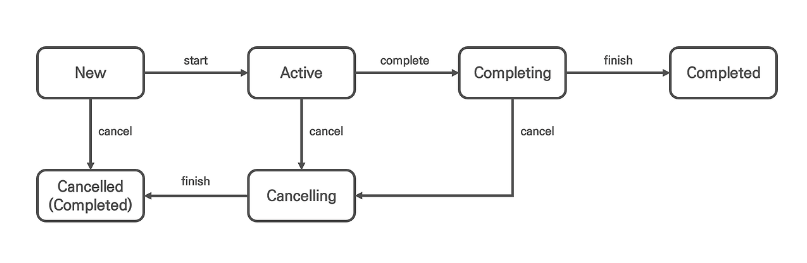

## 코틀린 코루틴의 정석

### 조세영 지음

---

## 목차

[1장 스레드 기반 작업의 한계와 코루틴의 등장](#1장-스레드-기반-작업의-한계와-코루틴의-등장)  
[3장 CoroutineDispatcher](#3장-coroutinedispatcher)  
[4장 코루틴 빌더와 Job](#4장-코루틴-빌더와-job)  
[5장 async와 Deferred](#5장-async와-deferred)  
[6장 CoroutineContext](#6장-coroutinecontext)
[7장 구조화된 동시성](#7장-구조화된-동시성)  
[8장 예외 처리](#8장-예외-처리)  
[9장 일시 중단 함수](#9장-일시-중단-함수)   
[10장 코루틴의 이해](#10장-코루틴의-이해)  
[11장 코루틴 심화](#11장-코루틴-심화)  
[12장 코루틴 단위 테스트](#12장-코루틴-단위-테스트)


## 1장 스레드 기반 작업의 한계와 코루틴의 등장
[목차로 이동](#코틀린-코루틴의-정석)

- JVM의 프로세스는 사용자 스레드가 모두 종료 될 때 프로세스가 종료되며, 메인 스레드 역시 사용자 스레드 중 하나이다.  
  만약, 멀티 스레드 환경에서 사용자 스레드가 여러 개라면 메인 스레드에서 예외가 발생해 전파되더라도 프로세스는 강제 종료되지 않는다.
- 단일 스레드에서 실행되는 애플리케이션의 문제
    - 스레드는 하나의 작업을 수행할 때 다른 작업을 동시에 수행하지 못한다.   
      메인스레드 역시 동시에 실행할 수 없고 실행하는 작업의 시간이 커지게 된다면 이후에 실행할 작업을 실행할 수없어 응답성에 문제가 발생한다.
        - 멀티 스레드 프로그래밍으로 해결 가능
- 멀티 스레드 프로그래밍
    - 스레드를 여러 개 사용해서 작업을 처리하는 프로그래밍 기법
    - 각각의 스레드가 한 번에 하나의 작업을 처리할 수 있으므로 여러 작업을 동시에 처리하는 것이 가능하다.(병렬 처리)

- 코루틴 또한 기존의 멀티 스레드 프로그래밍 문제를 해결한 토대 위에서 만들어졌다.
    - 코루틴 기능이 없었을 시절에는 스레드와 스레드풀을 활용해서 멀티 스레드 프로그래밍 방식을 구현했다.

- JVM은 스레드를 사용자 스레드와 데몬 스레드로 구분한다.
    - 사용자 스레드 : 우선도가 높은 스레드
    - 데몬 스레드 : 우선도가 낮은 스레드
    - JVM 프로세스가 종료되는 시점은 우선도가 높은 사용자 스레드가 모두 종료될 때이다.

- Thread 클래스를 직접 다루는 방법의 한계
    - Thread 클래스를 상속한 클래스를 인스턴스화 하여 실행할 때 마다 새로운 스레드가 생성된다.
        - 스레드 생성 비용은 비싸기 때문에 성능적으로 좋지 않다.
    - 스레드 생성과 관리에 대한 책임이 개발자에게 있다.
        - 복잡성이 증가하며, 실수로 인해 오류나 메모리 누수를 발생시킬 가능성이 증가한다.

- Executor 프레임워크 : 개발자가 스레드를 직접 관리하는 문제를 해결하고 생성된 스레드의 재사용성을 높이기 위해 등장, `스레드풀`개념 사용
    - ExecutorService를 통해 작업하기 위한 스레드를 받아서 작업을 처리하고 모든 작업이 완료된 스레드를 다시 반환하는 역할을 진행할 수 있다.
    - Thread 클래스의 단점을 보완할 수 있는 장점이 있다.
    - 개발자가 더 이상 스레드를 직접 관리하지 않고 스레드의 재사용을 편하게 할 수 있도록 도와준다.

- Executor 프레임워크의 한계
    - 스레드 블로킹 : 스레드가 아무것도 하지 못하고 사용될 수 없는 상태에 있는 것
        - 여러 스레드가 동기화 블록에 동시 접근하는 경우 하나의 스레드만 동기화 블록에 접근이 허용되기에 발생 가능
        - 뮤텍스나 세마포어로 인해 공유되는 자원에 접근 할 수 있는 스레드가 제한되는 경우에도 발생 가능
        - sleep 같이 대기함수를 사용하는 경우에도 스레드가 점유된 상태를 유지하며 발생 가능

- 코루틴은 스레드 블로킹 문제를 어떻게 극복하는가?
    - 코루틴은 `Job 단위` 코루틴을 통해 스레드 블로킹 문제를 해결
        - Job 단위 코루틴 : 스레드에서 작업 실행 도중 일시 중단할 수 있는 작업 단위
    - 코루틴은 자신이 스레드를 사용하지 않을 때 스레드 사용 권한을 반납 → 해당 스레드에서 다른 코루틴이 실행 가능하게 된다.
    - 코루틴은 스레드에 비해 생성과 전환 비용이 적게 들고 스레드에 자유롭게 뗐다 붙였다 할 수 있어 작업을 생성하고 전환하는 데 필요한 리소스와 시간이 매우 줄어들기에 `경량 스레드`라고 불린다.

## 3장 CoroutineDispatcher
[목차로 이동](#코틀린-코루틴의-정석)

- CoroutineDispatcher ( 코루틴을 보내는 주체 )
    - 추상 클래스여서 다양하게 구현될 수있다.
    - CoroutineDispatcher 객체가 코루틴을 스레드로 보내는 데 사용할 수 있는 스레드나 스레드 풀을 가지며, 코루틴을 실행 요청한 스레드에서 코루틴이 실행되도록 만들 수 있다.
    - 자신에게 실행 요청된 코루틴들을 작업 대기열에 적재하고, 자신이 사용할 수 있는 스레드가 새로운 작업을 실행할 수 있는 상태라면 스레드로 코루틴을 보내 실행될 수 있게 만드는 역할

### 제한된 디스패처와 무제한 디스패처

- 제한된 디스패처 : 사용할 수 있는 스레드나 스레드풀이 제한된 디스패처
- 무제한 디스패처 : 사용할 수 있는 스레드나 스레드풀이 제한되지 않은 디스패처

### 단일 스레드 디스패처

- 사용할 수 있는 스레드가 하나인 코루틴 디스패처 객체
- newSingleThreadContext 함수로 생성

    ```kotlin
    val dispatcher : CoroutineDispatcher = newSingleThreadContext(name="스레드명")
    ```

### 멀티 스레드 디스패처

- 2개 이상의 스레드를 사용할 수 있는 코루틴 디스패처 객체
- newFixedThreadPoolContext 함수로 생성

  ```kotlin
    val multiThreadDispatcher: CoroutineDispatcher = newFixedThreadPoolContext(
        nThread = 2,
        name = "스레드명"
    )
  ```

코루틴에서 멀티 스레드 디스패처로 코루틴 디스패처를 생성한다면 섬세하게 다뤄야 하는 API라는 경고를 보게된다. → 스레드 생성비용이 비싸기때문에 주의를 기울여야한다고 언급 !

그렇기에 코루틴은 개발자가 직접 코루틴 디스패처 객체를 생성할 때 발생하는 문제를 방지하기 위해 미리 정의된 목록을 제공한다.

```
  Dispatchers.IO : 네트워크 요청이나 파일 입출력 등의 입출력(I/O)작업을 위한 CoroutineDispatcher
  Dispatchers.Default : CPU를 많이 사용하는 연산작업을 위한 CoroutineDispatcher
  Dispatchers.Main : 메인 스레드를 사용하기 위한 CoroutineDispatcher
	
  Dispatchers.Unconfined : 제한된 디스패처가 아니다.
```

---

### Dispatchers.IO

- 네트워크 통신을 위해 HTTP 요청을 하거나 DB 작업 같은 입출력 작업 여러 개를 동시에 수행하기 위한 목적으로 미리 정의한 코루틴 디스패처
- 싱글톤 인스턴스
- 공유 스레드풀에 속한 스레드를 사용할 수 있도록 구현되어 있다.

### Dispatchers.Default

- 대용량 데이터를 처리해야 하는 작업처럼 CPU 연산이 필요한 작업을 CPU 바운드 작업이라고 한다.
- CPU 바운드 작업이 필요할 때 사용하는 코루틴 디스패처
- 싱글톤 인스턴스
- 공유 스레드풀에 속한 스레드를 사용할 수 있도록 구현되어 있다.
- 무겁고 오래 걸리는 연산을 처리하게 될 때 해당 연산을 위해 사용 가능한 모든 스레드가 작업을 처리하게 될 수 있다.  
  → 다른 연산을 진행하지 못하는 상황이 발생할 수 있다.     
  → 이를 방지 하기 위해 일부 스레드만 사용해 특정 연산을 실행할 수 있도록 하는 `limitedParallelism` 함수를 지원한다.
    - `Dispatchers.Default.limtedParallelism(”스레드개수”)`
        - 해당 연산에 사용할 스레드 개수를 제한할 수 있다.

```
  입출력 작업과 CPU 바운드 작업 
  입출력 작업과 CPU 바운드 작업의 중요한 차이는 작업이 실행됐을 때 스레드를 지속적으로 사용하는지의 여부이다.
  입출력 작업 : 작업을 실행 한 후 결과를 반환받을 때까지 스레드를 사용하지 않음
  CPU 바운드 작업 : 작업을 하는 동안 스레드를 지속적으로 사용
    
  입출력 작업 : 입출력 작업 실행 후 스레드가 대기하는 동안 해당 스레드에서 다른 입출력 작업을 동시에 실행할 수 있어서 효율적이다.
  CPU 바운드 작업 : 스레드가 지속적으로 사용되기 때문에 스레드 기반 작업을 사용해 실행됐을 때와 처리 속도에 큰 차이가 없다.
```

- 코루틴 라이브러리에서 스레드의 생성과 관리를 효율적으로 할 수 있도록 애플리케이션 레벨의 공유 스레드 풀을 제공한다.
    - Dispatchers.IO, Dispatchers.Default는 `공유 스레드풀`에서 사용할 스레드를 가져다 쓰는 방식으로 구현되어 있다.
    - newFixedThreadPoolConext 함수로 만들어지는 디스패처는 `자신만 사용할 수 있는 전용 스레드풀을 생성한다.`
- Dispatchers.IO의 `limitedParallelism` 와 Dispatchers.Default의 `limitedParallelism` 차이점
    - Dispatchers.Default의 `limitedParallelism` 는 공유 스레드풀의 Dispatchers.Default의 스레드들 중에서 개수만큼 따로 작업을 위해 빼놓는다.
    - Dispatchers.IO의 `limitedParallelism`는 공유 스레드풀의 Dispatchers.IO의 스레드와 별개로 다른 공유 스레드들을 개수만큼 전용으로 사용한다.
        - IO에서 `limitedParallelism` 함수를 사용해야 할 때는 특정 작업이 다른 작업에 영향을 받지 않아야 돼서 별도 스레드 풀에서 실행되는 것이 필요할 때 사용한다.
        - 새로운 스레드를 만들어서 사용하는 방식이므로 생성비용이 비싸기 때문에 남용하지 말아야한다.

### Dispatchers.Main

- UI가 있는 애플리케이션에서 메인 스레드의 사용을 위해 사용되는 특별한 CoroutineDispatcher 객체
- kotlinx-coroutines-android 등 별도 라이브러리를 추가해야 객체를 사용할 수 있다.

## 4장 코루틴 빌더와 Job
[목차로 이동](#코틀린-코루틴의-정석)

### 코루틴 빌더

- 코루틴을 생성하는 함수 : runBlocking, launch, …
- 모든 코루틴 빌더 함수는 코루틴을 만들고 코루틴을 추상화한 Job 객체를 생성

### Job

- 코루틴의 상태를 추적하고 제어하는데 사용

```
  delay 함수 : 작업의 실행을 일정 시간 동안 지연시키는 역할
  해당 함수가 실행되는 동안 스레드는 다른 코루틴이 사용할 수 있다.
  Thread.sleep도 delay 함수와 동일하지만 해당 함수가 실행되는 동안 스레드가 블로킹돼 사용할 수 없는 상태가 된다.
```

- join 함수 : 코루틴 간에 순차 처리 가능
    - join의 대상이 된 코루틴이 완료될 때까지 일시 중단
- joinAll 함수 : 복수의 코루틴의 실행이 모두 끝날 때까지 호출부의 코루틴을 일시 중단
    - 내부 동작 : Job 타입의 객체를 받은 후 forEach로 각 객체를 join 한다.

### CoroutineStart.LAZY 로 코루틴 지연 하기

- 지연 시작이 적용된 코루틴은 생성 후 대기 상태에 놓이며, 실행을 요청하지 않으면 시작되지 않는다.
- launch 함수에 옵션으로 (start = CoroutineStart.LAZY) 설정 → lazyJob이 생성
- 지연 코루틴을 실행하기 위해서는 Job 객체의 start 함수를 명시적으로 호출해야 한다.

### 코루틴 취소하기

- cancel 함수 사용해서 Job 취소하기
- Job인스턴스.cancel() 로 예외 상황 발생이나 종료를 원할 경우 취소해준다.
    - Job 객체에 cancel()을 호출하면 코루틴은 즉시 취소되는 것이 아니라 Job 객체 내부의 취소 확인용 플래그를 변경하여 취소되었음을 알린다.
    - 이후 미래 어느 시점에 코루틴의 취소 요청을 체크하고 취소된다.
- 취소 후 바로 실행해야 할 로직이 존재한다면 cancelAndJoin 함수를 사용해야 한다.
    - 해당 코루틴이 취소 완료될 때까지 호출부의 코루틴이 일시중단
    - cancelAndJoin 함수 호출 후 그다음 바로 실행해야 할 메서드를 호출해서 순차적으로 작업을 진행되게 한다.
- 코루틴은 언제 취소를 확인하는가 ?
    - 일반적으로 `일시 중단 시점`이나 `코루틴이 실행을 대기하는 시점`에 확인하고 만약, 이 시점들이 없다면 코루틴은 취소되지 않는다.
- 만약 무한 루프 반복문의 코루틴을 취소하고 싶다면 ?
    - delay 사용
        - 무한 루프 내부에 delay(밀리초 단위)를 호출   
          → while문 반복할 때마다 작업을 강제로 지연 시키기에 불필요한 작업 지연이 발생해 성능 저하가 발생할 수 있다.
    - yield 사용
        - yield 함수가 호출되면 코루틴은 자신이 사용하던 스레드를 양보한다.
        - 이 방법 또한 무한 루프를 돌 때마다 스레드 사용이 양보되면서 일시 중단되는 문제가 발생한다.  
          아무리 경량 스레드라고 하더라도 매번 일시 중단되는 것은 작업을 비효율적으로 만든다.

    - `CoroutineScope.isActive` 사용
        - 코루틴에 취소가 요청되면 isActive 프로퍼티 값은 false로 바뀌며, while문 무한루프 인자로 this.isActive를 넘겨서 코루틴이 취소요청되면 취소될 수 있게 한다.
        - cancel 호출 시 isActive가 false 로 변화하니 코루틴 내에 무한루프가 잠시 멈추지도 않고 스레드 사용을 양보하지도 않으면서 계속 작업할 수 있어서 효율적이다.
        ```kotlin
            fun cancelByIsActiveStatus() {
              val time = AtomicLong(0)
              CoroutineScope(Dispatchers.IO).launch {
                while (this.isActive) {
                   if (time.incrementAndGet() == 1000L) this.cancel()
                }
                println("test 코루틴 종료")
             } 
           }
        ``` 
        - 1000까지 time을 증가시킨 후 while문을 탈출해 test 코루틴 종료까지 출력된다.

### 코루틴의 상태와 Job의 상태 변수

- 코루틴의 상태

 

- 생성(New) : 코루틴 빌더를 통해 코루틴을 생성하면 코루틴은 기본적으로 생성 상태에 놓인다.

  자동으로 실행 중 상태로 넘어간다. 만약 생성 상태의 코루틴의 실행 중 상태로 자동으로 변경되지 않도록 하고 싶다면 코루틴 빌더의 start 인자로 CoroutineStart.LAZY를 넘겨 지연 코루틴으로
  만든다.

- 실행중(Active) : 지연 코루틴이 아닌 코루틴을 만들면 자동으로 실행 중 상태로 바뀐다.

  코루틴이 실제로 실행 중일 때만 아니라 실행된 후에 일시 중단된 때도 실행 중 상태로 본다.

- 실행완료중(Completing) : 부모 코루틴이 자식 코루틴의 작업 완료를 기다리고 있는 상태
- 실행완료(Completed) : 코루틴의 모든 코드가 실행 완료된 경우
- 취소중(Cancelling) : Job.cancel() 등을 통해 코루틴에 취소가 요청됐을 경우 취소 중 상태로 넘어가며, 이는 아직 취소된 상태가 아니어서 코루틴은 계속해서 실행된다.
- 취소 완료(Cancelled) : 코루틴의 취소 확인 시점에 취소가 확인된 경우 취소 완료 상태가 된다. 이 상태에서는 코루틴은 더이상 실행되지 않는다.
- Job 객체에서 외부로 공개하는 코루틴의 상태 변수
    - isActive : 코루틴이 활성화돼 있는지의 여부
        - 코루틴이 실행된 후 취소가 요청되지 않았으며 실행이 완료되지 않은 상태
        - 취소가 요청되거나 실행이 완료된 코루틴은 활성화되지 않은 것으로 간주한다.
    - isCancelled : 코루틴이 취소 요쳥됐는지의 여부
        - 코루틴이 취소 요청되면 true 반환, true 상태라도 즉시 취소되는 것은 아니다.
    - isCompleted : 코루틴 실행이 완료됐는지의 여부
        - 코루틴의 모든 코드가 실행 완료되거나 취소 완료되면 true를 반환하며, 실행 중인 상태에서는 false를 반환한다.
- 코루틴 상태별 Job 상태표

  | 코루틴 상태 | isActive | isCancelled | isCompleted |
        | --- | --- | --- | --- |
  | 생성 | false | false | false |
  | 실행 중 | true | false | false |
  | 실행 완료 중 | true | false | false |
  | 실행 완료 | false | false | true |
  | 취소 중 | false | true | false |
  | 취소 완료 | false | true | true |

## 5장 async와 Deferred
[목차로 이동](#코틀린-코루틴의-정석)

### async 코루틴 빌더

결과값이 있는 코루틴 객체인 Deferred 가 반환되며, Deferred 객체를 통해 코루틴으로부터 결괏값을 수신할 수 있다.

### Deferred 객체

미래 어느 시점에 결과값이 반환될 수 있음을 표현하는 코루틴 객체 ( Job 객체에서 몇 가지 기능이 추가된 Job 객체의 일종 )

코루틴이 실행 완료될 때 결과값을 반환하므로 언제 결과값이 반환될 지 모르고 필요하다면 수신될 때까지 대기해야 한다.   
→ 수신 대기를 위해 await 함수를 제공한다.

await 함수 : 코루틴이 실행 완료 될 때까지 호출부의 코루틴을 일시 중단한다는 점에서 Job객체의 join 함수와 유사하게 동작한다.

### 복수의 코루틴으로부터 결과값 수신하기

- await 함수로 반환값을 받아서 하나하나 실행
- 또는 awaitAll(가변인자) 를 통해 인자로 받은 모든 코루틴의 결과를 받은 후 처리
- Collection 에서도 확장함수로 제공하는 awaitAll 함수를 사용할 수 있다.
    - ex) listOf(deferredOne,deferredTwo).awaitAll()
    - 인자로 async의 결과값인 Deferred로 감싸진 데이터를 넣어주기

### withContext

함수의 인자로 CoroutineContext 객체를 사용해 block 람다식을 실행하고 완료되면 결과를 반환

async-await 작업을 대체할 수 있다. ( async-await 쌍을 연속적으로 실행했을 때의 동작과 유사 )

### 동작 방식

- 겉보기에는 async-await 를 연속적으로 호출하는 것과 비슷하게 동작하지만 내부적으로는 다르게 동작
- async-await 쌍은 새로운 코루틴을 생성해 작업을 처리하지만 withContext는 실행 중이던 코루틴을 그대로 유지한 채로 실행 환경만 변경해 작업을 처리
    - 새로운 코루틴을 만드는 대신 기존의 코루틴에서 CoroutineContext 객체만 바꿔서 실행

### 주의할 점

- withContext는 새로운 코루틴을 만들지 않기 때문에 하나의 코루틴에서 withContext 함수가 여러 번 호출되면 순차적으로 실행
- 복수의 독립적인 작업이 병렬로 실행돼야 하는 상황에서 사용할 경우 성능에 문제를 일으킬 수 있다.
    - 하나의 runBlocking 안에서 withContext를 여러개 사용할 경우 동기적으로 사용하게 되어버림

## 6장 CoroutineContext
[목차로 이동](#코틀린-코루틴의-정석)

### 코루틴 빌더, launch와 async

- 매개변수로 context, start, block을 가진다.
    - context : CoroutineContext 타입
    - start : CoroutineStart 타입
    - block : launch는 Unit 반환하는 람다식, async는 제네릭 타입 T를 반환하는 람다식

### CoroutineContext 구성요소

- 주요 구성요소
    - CoroutineName : 코루틴 이름 설정
    - CoroutineDispatcher : 코루틴을 스레드에 할당해 실행
    - Job : 코루틴의 추상체로 코루틴을 조작하는 데 사용
    - CoroutineExceptionHandler : 코루틴에서 발생한 예외를 처리
- CoroutineContext는 key-value 쌍으로 구성 요소를 관리한다.
    - key에 직접 대입하는 방법을 사용하지 않고 CoroutineContext 객체 간에 더하기 연산자를 사용해 CoroutineContext 객체를 구성한다.

     ```kotlin
       val coroutineContext : CoroutineContext = newSingleThreadContext("MyThread") + CoroutineName("MyCoroutine")
     ```

- 구성요소가 없는 CoroutineContext는 EmptyCoroutineContext를 통해 만들 수 있다.

  `val emptyCoroutinContext : CoroutineContext = EmptyCoroutineContext`

- CoroutineContext 객체에 같은 구성 요소가 둘 이상 더해진다면 나중에 추가된 구성 요소가 이전의 값을 덮어씌운다.

### CoroutineContext에 Job 추가하기

- Job 객체는 기본적으로 launch나 runBlocking 같은 코루틴 빌더 함수를 통해 자동 생성되지만 Job()을 호출해  생성할 수 도 있다.
    - Job 객체를 직접 생성해 추가하면 코루틴의 구조화가 깨지기 때문에 직접 생성해서 추가하는 것은 주의가 필요하다.

### CoroutineContext 구성요소

- 접근하기
    - CoroutineContext.Key 인터페이스를 구현해 만들 수 있는데 일반적으로 CoroutineContext 구성 요소는 자신의 내부에 키를 싱글톤 객체로 구현한다.
        - CoroutineName.Key
        - Job.Key
        - CoroutineDispatcher.Key ← 아직 실험 중인 API 이므로 @OptIn(ExperimentalStdlibApi::class) 어노테이션으로 실험중 임을 나타낸다.
            - 실험중인 API를 사용하고 싶지 않다면 Dispatchers.IO.Key 등을 사용한다.
        - CoroutineExceptionHandler.Key
    - 구성 요소의 key 프로퍼티는 동반 객체(companion object)로 선언된 Key와 동일한 객체를 가리킨다.
      - 주요 구성 요소 객체들은 동반 객체로 CoroutineContext.Key를 구현하는 Key를 갖고 있기에 Key를 명시적으로 사용하지 않아도 된다
- 제거하기
    - minusKey 함수를 호출하고 제거할 구성요소를 작성하면 된다.
    - `val deletedCoroutineContext = coroutineContext.minusKey(CoroutineName)`
        - `CoroutineName.Key 사용할 자리에 CoroutineName을 사용해도 된다.`
    - minusKey 주의 사항
        - minusKey를 호출한 CoroutineContext 객체는 그대로 유지되고, 구성 요소가 제거된 새로운 CoroutineContext 객체가 반환된다.

## 7장 구조화된 동시성
[목차로 이동](#코틀린-코루틴의-정석)

### 구조화된 동시성의 원칙

- 비동기 작업을 구조화함으로써 비동기 프로그래밍을 보다 안정적이고 예측할 수 있게 만드는 원칙
- 코루틴을 부모-자식 관계로 구조화
    - 부모 코루틴을 만드는 빌더의 람다식 속에서 새로운 코루틴 빌더를 호출

### 구조화된 코루틴의 특징

- 부모 코루틴의 실행 환경이 자식 코루틴에게 상속
- 작업을 제어하는 데 사용
- 부모 코루틴이 취소되면 자식 코루틴도 취소된다
- 부모 코루틴은 자식 코루틴이 완료될 때까지 대기한다
- CoroutineScope를 사용해 코루틴이 실행되는 범위를 제한할 수 있다.

### 실행 환경 덮어씌우기

- 부모 코루틴의 실행환경이 자식 코루틴에게 상속되지만 자식 코루틴의 CoroutineContext가 있다면 동일한 구성정보는 덮어씌워진다.
- 다만 주의할 점은 다른 CoroutineContext 구성요소들과는 달리 Job 객체는 상속되지 않는다.

### Job객체가 상속되지 않는 이유

- launch나 async 포함한 모든 코루틴 빌더 함수는 호출 때마다 코루틴 추상체인 Job 객체를 새롭게 생성한다.
    - 코루틴 제어에 Job 객체가 필요한데 부모 코루틴으로부터 상속받는다면 개별 코루틴의 제어가 어려워진다.
    - 그렇기에 코루틴 빌더를 통해 생성된 코루틴들은 서로 다른 Job을 가진다.
        - 상속관계의 코루틴의 Job들은 서로 다른 Job이지만 구조화하는 데 사용된다.

      | Job 프로퍼티 | 타입 | 설명 |
              | --- | --- | --- |
      | parent | Job? | 코루틴은 부모 코루틴이 없을 수 있고, 부모 코루틴이 있더라도 최대 하나이다. |
      | children | Sequence<Job> | 하나의 코루틴이 복수의 자식 코루틴을 가질 수 있다. |
        - 최상위 Job의 경우 parent가 없으니 null을 가질 수 있는 Job? 타입이다.

### 취소의 전파

- 코루틴은 자식 코루틴으로 취소를 전파하는 특성을 갖는다.
- 특정 코루틴에 취소가 요청되면 자식 코루틴 방향으로만 전파되며, 부모 코루틴으로는 취소가 전파되지 않는다.
    - 자식은 부모 작업의 일부로 생각하여, 부모 코루틴의 작업이 취소,실패할 경우 자식의 작업은 반환된 결과를 사용할 곳이 없기에 리소스가 낭비되는 것을 방지하기 위해 자식 코루틴으로만 취소가 전파된다.

### 부모 코루틴의 자식 코루틴에 대한 완료 의존성

- 코루틴의 구조화는 큰 작업을 연관된 여러 작은 작업으로 나누는 방식으로 이뤄지는데 작은 작업이 모두 완료되어야 큰 작업이 완료될 수 있기 때문이다.
- invokeOnCompletion 함수 : 코루틴이 실행완료되거나 취소 완료 되었을 때 실행되는 콜백을 등록하는 함수
- `자식 코루틴이 실행 완료되지 않으면 부모 코루틴도 실행완료 될 수 없다.`

### CoroutineScope 생성

- CoroutineScope 인터페이스 활용

    ```kotlin
    public interface CoroutineScope { 
        public abstract val coroutineContext : CoroutineContext
    }
    ```

    ```kotlin
    class CustomCoroutineScope : CoroutineScope {
        override val coroutineContext : CoroutineContext = Job() + newSingleThreadContext("CustomScopeThread")
    }
    ```

    - CoroutineScope interface를 구현하여 커스텀 CoroutineScope 생성 가능
- CoroutineScope 함수 사용

    ```kotlin
    public fun CoroutineScope(context : CoroutineContext) : CoroutineScope = 
        ContextScope(if (context[Job] != null) context else context + Job())
    ```

- CoroutineScope 내부에서 실행되는 코루틴이 CoroutineScope로부터 코루틴 실행 환경인 CoroutineContext를 제공받는다.

### CoroutineScope에 속한 코루틴의 범위

- 기본적으로 runBlocking은 CoroutineScope 객체를 사용해 실행되는 모든 코루틴이 CoroutineScope 범위에 포함된다.
- 객체 범위에서 벗어나기 → 새로운 CoroutineScope 객체를 생성하고, 생성한 객체를 사용해 코루틴을 실행

    ```kotlin
    fun main() = runBlocking<Unit> {
    	launch(CoroutineName("Co1"){
    	
    		launch(CoroutineName("Co2"){
    		}
    		
    		CoroutineScope(Dispatchers.IO).launch(CoroutineName("Co3"){	
    		}
    		
    	}
    }
    ```

    - “Co3” 코루틴이 기존 CoroutineScope 객체의 범위를 벗어날 수 있는 이유
        - CoroutineScope 함수가 호출되면 생성되는 새로운 Job 객체에 있다. → 기존 계층 구조를 따르지 않는 새로운 Job 객체가 생성되기 떄문
        - `코루틴의 구조화를 깨는 작업은 비동기 작업을 안전하지 않게 만들기 때문에 최대한 지양해야한다.`

### 구조화와 Job

- CoroutineScope 객체를 조작하는 것이 실제로는 CoroutineContext 객체 속의 Job 객체를 조작하는 것
- runBlocking 함수 호출로 코루틴이 생성될 경우 → 부모 Job이 없는 Job 객체 생성 ( 루트 Job )
    - 이러한 Job 객체에 의해 제어되는 코루틴을 루트 코루틴이라고 한다.
- Job 구조화 깨기
    - runBlocking 하위에 CoroutineScope로 새로운 루트의 코루틴을 생성해 사용
        - 이 경우, runBlocking은 자식 코루틴의 작업이 없으므로 로직이 없을 경우 바로 종료된다.
    - 루트 역할을 하는 Job(부모가 없는 Job객체)를 CoroutineContext 구성 당시에 넣어준다.
- 생성된 Job의 부모를 명시적으로 설정하기
    - `public fun Job(parent : Job? = null) : CompletableJob = JobImpl(parent)`
    - parent 인자에 null 을 넣을 경우 루트 Job, parent Job을 넣어줄 경우 부모를 설정한 Job 객체를 생성할 수 있다.
    - Job 객체를 생성할 경우 문제가 발생할 수 있다.
- Job 객체 생성 시 주의할 점
    - 생성된 Job은 자동으로 실행 완료되지 않는다.
        - `명시적으로 완료 함수인 complete을 호출해야 완료된다.`
---

- runBlocking 코루틴 빌더는 생성된 코루틴이 완료될 때까지 호출 스레드(=메인 스레드)를 차단하고 사용하는 코루틴을 만드는 반면 launch 코루틴 빌더로 생성된 코루틴은 호출 스레드를 차단하지 않는다.


## 8장 예외 처리
[목차로 이동](#코틀린-코루틴의-정석)

코루틴에서의 예외 전파
- 예외 발생 후 처리를 안할 경우 최상위 부모 코루틴 방향으로 계속 예외 전파

예외 전파 제한
- Job 객체를 사용한 예외 전파 제한
    - 코루틴의 구조화를 깨서 예외 전파를 제한한다.  
      → 취소 전파까지 제한하게 되며 구조화가 깨지게 되어 비동기 작업을 불안정하게 만든다.
- SupervisorJob 객체를 사용한 예외 전파 제한
    - SupervisorJob 객체는 자식 코루틴으로부터 예외를 전파받지 않는 특수한 Job 객체로 하나의 자식 코루틴에서 발생한 예외가 다른 자식 코루틴에게 영향을 미치지 못하도록 만드는 데 사용
    - `public fun SupervisorJob(parent: Job? = null) : CompletableJob = SupervisorJobImpl(parent)`
    - SupervisorJob 객체를 생성하여 CoroutineContext를 구성할 때 넣어준다.
        - SupervisorJob 객체에 의해 runBlocking이 호출돼 만들어진 Job 객체와의 구조화를 깬다.
- SupervisorJob 객체 사용 + 코루틴의 구조화를 유지
    - SupervisorJob의 인자로 부모Job 객체를 넘긴다.
        - `val supervisorJob = SupervisorJob(parent = this.coroutineContext[Job])`
    - `SupervisorJob()을 통해 생성된 Job 객체는 Job()을 통해 생성된 Job객체와 같이 자동으로 완료 처리 되지 않는다.`
- CoroutineScope에 SupervisorJob과 함께 사용하기
    - `val coroutineScope = CoroutineScope(SupervisorJob())`
- supervisorScope 사용한 예외 전파 제한
    - supervisorScope 함수 : SupervisorJob 객체를 가진 CoroutineScope 객체를 생성하며, 이 SupervisorJob 객체는 supervisorScope 함수를 호출한 코루틴의 Job 객체를 부모로 가진다.
    - 내부에서 실행되는 코루틴들은 SupervisorJob과 부모-자식 관계로 구조화
    - 모두 실행 완료되면 자동으로 완료 처리

### SupervisorJob 사용할 때 흔히 하는 실수

- 예외 전파 방지를 위해 코루틴 빌더 함수의 context 인자에 SupervisorJob()을 넘기고, 코루틴 빌더 함수가 호출돼 생성되는 코루틴의 하위에 자식 코루틴들을 생성하는 것

    ```kotlin
    /**
     * 이렇게 사용할 경우 SupervisorJob()이 예외 전파 방지 역할을 제대로 수행하지 못하는 것
     * 상위 SupervisorJob이 예외 전파를 방지하지 못하고 있음
     */
    fun main() = runBlocking {
        launch(CoroutineName("Parent Coroutine") + SupervisorJob()){
            launch(CoroutineName("Coroutine1")){
                launch(CoroutineName("Coroutine3")){
                    throw Exception("예외 발생")
                }
                delay(100L)
                println("[${Thread.currentThread().name}] 코루틴 실행")
            }
            launch(CoroutineName("Coroutine2")){
                delay(100L)
                println("[${Thread.currentThread().name}] 코루틴 실행")
            }
        }
        delay(100L)
    }
    ```

    - SupervisorJob 객체를 생성할 때 SupervisorJob 객체가 Job 계층 구조의 어떤 위치에 있어야 하는지 충분히 고민하고 사용해야 한다.

### CoroutineExceptionHandler를 사용한 예외 처리

- `public inline fun CoroutineExceptionHandler(crossinline handler: (CoroutineContext, Throwable) -> Unit) : CoroutineExceptionHandler`
- CoroutineExceptionHandler 객체는 처리되지 않은 예외만 처리한다.
- 자식 코루틴이 부모 코루틴으로 예외를 전파하면 자식 코루틴에서는 예외가 처리된 것으로 봐 자식 코루틴에 설정된 코루틴 예외핸들러는 동작하지 않는다.
- 그렇기에 CoroutineExceptionHandler 객체가 설정되는 위치를 오류가 처리되는 위치로 만들어야 한다.
    - 가장 간단한 방법으로는 루트 Job과 함께 CoroutineExceptionHandler를 설정한다.
- SupervisorJob과 CoroutineExceptionHandler 함께 사용하기
    - SupervisorJob 객체는 예외를 전파받지 않을 뿐 , 예외에 대한 정보를 자식 코루틴으로부터 받는다.

### CoroutineExceptionHandler 사용할 때 흔히 하는 실수

- CoroutineExceptionHandler가 try catch 처럼 동작해 예외 전파를 제한한다고 착각

### try-catch 문을 사용한 코루틴 예외 처리

- 코루틴 람다식 내부에서 try catch로 예외처리도 가능하다.
- 하지만 try catch문을 코루틴 빌더 함수에 사용하는 것은 코루틴에서 발생한 예외를 잡을 수 없다.
    - launch 는 코루틴을 생성하는 데 사용되는 함수일 뿐, 람다식의 실행은 생성된 코루틴이 CoroutineDispatcher에 의해 스레드로 분배되는 시점에 일어난다. 즉, 코루틴 빌더 함수 자체의 실행만 체크하며, 람다식은 예외 처리 대상이 아니다.

### async의 예외 노출

- async 빌더 함수는 결과값을 Deferred 로 감싸고 await 호출 시점에 결과값을 노출한다. 이런 특성 때문에 코루틴 실행 도중 예외가 발생해 결과값이 없다면 Deferred에 대한 await 호출 시 예외가 노출된다.
    - await 함수를 try-catch문으로 감싸 예외를 처리해준다.
- await함수를 호출하지 않더라도 예외 전파는 부모 코루틴으로 전파되므로 부모 코루틴으로 전파되는 것을 방지하는 로직을 함께 처리해야 한다. ( supervisoJob, supervisorScope,…  등등 활용 )

### 전파되지 않는 예외

- CancellationException
    - CancellationException 예외가 발생해도 부모 코루틴으로 전파되지 않는다.
    - 코루틴의 취소에 사용되는 특별한 예외
    - Job 객체의 cancel 함수를 호출하면 CancellationException의 서브 클래스인 JobCancellationException 발생시켜 코루틴을 취소시킨다.
- withTimeOut / withTimeOutOrNull
    - CancellationException을 사용하는 대표적인 함수
    - 제한 시간을 두고 작업을 실행할 수 있도록 만드는 함수
    - 대표적으로 네트워크 호출의 실행 시간을 제한하는데 데 사용 가능
    - `public suspend fun <T> withTimeOut(timeMillis: Long, block: suspend coroutineScope.()->T): T`
    - CancellationException 의 서브클래스인 TimeoutCancellationException 발생시켜 코루틴을 취소시킨다.
        - TimeoutCancellationException 발생되더라도 예외가 부모 코루틴으로 전파되지 않고 해당 예외가 발생한 코루틴만 취소시킨다.

## 9장 일시 중단 함수
[목차로 이동](#코틀린-코루틴의-정석)

- suspend fun 키워드로 선언되는 함수로 함수 내에 일시 중단 지점을 포함할 수 있는 특별한 기능을 제공
- 일시 중단 지점을 포함하고 있는 함수

### 일시 중단 함수는 코루틴이 아니다.

- 일시 중단 함수를 별도의 코루틴상에서 실행하고 싶으면 일시 중단 함수를 launch 빌더 함수로 감싸준다.

### 일시 중단 함수 호출 가능 지점

1. 코루틴 내부
2. 일시 중단 함수

### 일시 중단 함수에서 코루틴 빌더 호출 시 생기는 문제

- launch나 async 같은 코루틴 빌더 함수는 CoroutineScope의 확장 함수로 선언돼 있기 때문에 일시 중단 함수 내부에서 일시 중단 함수를 호출한 코루틴의 CoroutineScope 객체에 접근할 수 없다.
- 일시 중단 함수에서 launch 나 async 같은 코루틴 빌더 함수를 호출하기 위해서는 CoroutineScope 객체에 접근 할 수 있도록 해야한다.

### coroutineScope 사용해 일시 중단 함수에서 코루틴 실행하기

- coroutineScope 일시 중단 함수를 사용하면 일시 중단 함수 내부에 새로운 CoroutineScope 객체를 생성할 수 있다.
    - coroutineScope는 구조화를 깨지 않는 CoroutineScope 객체를 생성하며, block 람다식에서 수신 객체(this)로 접근 할 수 있다.
    - `public suspend fun <R> coroutineScope(block : suspend CoroutineScope.() -> R ): R`

```kotlin
suspend fun searchByKeyword(keyword: String): Array<String> = coroutineScope { // this : CoroutineScope
	val dbResultsDeferred = async {
		searchFromDB(keyword) 
	}
	val serverResultsDeferred = async {
		searchFromServer(keyword)
	}
	
	return@coroutineScope arrayOf(dbResultDeferred.await(),serverResultsDeferred.await())
}
```

- 여기서 발생하는 문제 : 로직 진행 중 예외가 발생할 경우 부모 코루틴에게 전파되어 호출부의 코루틴까지 모두 취소된다.
    - 문제 해결 → supervisorScope

### supervisorScope 사용해 일시 중단 함수에서 코루틴 실행하기

- 위 코드에서 coroutineScope 를 supervisorScope로 변경하여 부모 코루틴으로 예외를 전파시키지 않는다. 또한, await 결과를 try-catch 로 감싸 예외 처리를 진행한다.

## 10장 코루틴의 이해
[목차로 이동](#코틀린-코루틴의-정석)

- 루틴 : `특정한 일을 처리하기 위한 일련의 명령`, 함수 또는 메서드
- 서브루틴 : 함수 내에서 함수가 호출될 경우, `호출된 함수`를 의미
- 서브루틴은 한 번 호출되면 끝까지 실행된다. 서브루틴이 호출되면 루틴을 실행하던 스레드는 서브루틴의 실행이 완료될 떄까지 다른 작업을 할 수 없다.
- 코루틴 : 함께 실행되는 루틴, 서로 간에 스레드 사용을 양보하며 함께 실행된다.

### 코루틴의 스레드 양보

- 스레드를 양보하는 주체 : 코루틴
    - 스레드에 코루틴을 할당해 실행되도록 만드는 주체는 CoroutineDispatcher 객체이지만 스레드를 양보하는 주체는 코루틴
- 양보를 일으키는 대표적인 일시 중단 함수들
    - delay
    - join
    - await
    - yield

### delay 일시 중단 함수를 통해 알아보는 스레드 양보

- 작업을 일정 시간 동안 일시 중단할 경우 delay 일시 중단 함수를 사용할 수 있다.
- delay 일시 중단 함수를 호출 후 사용중인 스레드를 양보해서 다른 코루틴들이 점유할 수 있게 한다.

### join과 await의 동작 방식 자세히 알아보기

- join

    ```kotlin
    fun main() = runBlocking {
        val job = launch {
            println("1. launch 작업이 시작됐습니다.")
            delay(1000L)
            println("2. launch 작업이 완료됐습니다.")
        }
    
        println("3. runBlocking 코루틴이 곧 일시 중단 되고 메인 스레드가 양보됩니다.")
        job.join()
        println("4. runBlocking 이 메인 스레드에 분배돼 작업이 다시 재개됩니다.")
    }
    ```

    - 호출 순서
        1. 시작하면 메인 스레드를 점유하는 것은 runBlocking 코루틴, launch 코루틴을 생성하지만 runBlocking 코루틴이 계속해서 메인 스레드를 점유하기에 launch 코루틴은 실행 대기 상태에 머문다. 이후 3번 로그를 출력하고 job.join()을 실행하면 비로소 메인 스레드가 양보된다.
        2. 메인 스레드에 launch 코루틴이 보내져 실행된다. 1번 로그 출력하고 delay 일시 중단 함수를 호출해 메인 스레드를 양보한다. 하지만 runBlocking 코루틴은 job.join()에 의해 launch 코루틴이 실행 완료될 때까지 재개되지 못하므로 실행되지 못한다.
        3. delay가 종료되고 재개되며, 2번 로그를 출력하고 실행이 완료된다.
        4. launch 코루틴의 실행이 완료되면 runBlocking 코루틴은 재개돼 4번 로그를 출력한다.
    - join이나 await의 대상이 된 코루틴이 실행 완료될 때까지 재개되지 않는다.그사이 양보된 스레드는 다른 코루틴을 실행하는 데 사용할 수 있다.
    - 개발자가 직접 스레드 양보를 호출하지 않아도 스레드 양보를 자동으로 처리한다.
    - 스레드 양보를 직접 호출해야 하는 경우가 있다면 yield 함수 호출

### yield 함수 호출해 스레드 양보하기

- 스레드 양보를 직접 호출해야 할 필요가 있는 경우 사용

## 11장 코루틴 심화
[목차로 이동](#코틀린-코루틴의-정석)

### 가변 변수를 사용할 때의 문제점

- 메모리 가시성 문제 : 스레드가 변수를 읽는 메모리 공간에 관한 문제로 CPU 캐시와 메인 메모리 등으로 이뤄지는 하드웨어 메모리 구조와 연관
    - CPU 캐시에만 반영되고 메인 메모리로 전파되지 못해서 데이터의 불일치가 발생할 수 있다.
- 경쟁 상태(Race Condition) 문제 : 2개의 스레드가 동시에 값을 읽고 업데이트 할 때 같은 데이터를 갖고 2번의 업데이트가 일어 날 수 있다 ( 둘 다 1000 이라는 값을 갖고 +1 하는 연산을 진행해서 1002가 아닌 1001 의 값을 얻게 된다. )

### JVM 구조

- Thread Stack Area와 Heap Area 를 갖는다.
    - Stack Area : Primitive type 또는 Heap 영역의 참조 주소값을 저장하고 있다.
    - Heap Area : JVM 스레드에서 공통으로 사용되는 메모리 공간으로 객체나 배열 같은 크고 복잡한 데이터 저장

### 하드웨어의 메모리 구조

- CPU 레지스터, CPU 캐시 메모리, 메인 메모리 영역으로 구성
    - 각 CPU는 CPU 레지스터와 캐시 메모리를 둔다. 캐시 메모리를 두어 공통 조회 영역인 메인 메모리에 접근하지 않고도 데이터를 빠르게 조회할 수 있다.

### 공유 상태에 대한 메모리 가시성 문제와 해결 방법

- 메인 메모리에서 값을 읽고 캐시 메모리에만 업데이트한 상태로 두고 flush 하지 않아 데이터 동기화 문제가 발생
- 이 상태에서 다른 CPU에서 메인 메모리에 접근해 데이터를 업데이트 하려고 한다. → 데이터 불일치
    - 해결 방법 : `@Volatile` 사용해 공유 상태에 대한 메모리 가시성 문제 해결
    - @Volatile 어노테이션이 설정된 변수를 읽고 쓸 때는 CPU 캐시 메모리를 사용하지 않는다. ( 메인 메모리를 사용 )

### 공유 상태에 대한 경쟁 상태 문제와 해결 방법

- @Volatile 어노테이션을 사용해 데이터를 읽고 쓰더라도 `동시에 데이터에 접근하는 문제`로 데이터의 불일치가 여전히 발생하고 있다.
- 해결 방법
    - Mutex 사용해 동시 접근 제한하기
        - 공유 변수의 변경 가능 지점을 `임계 영역으로 만들어 동시 접근을 제한`한다.
        - Mutex 객체의 lock 일시 중단 함수가 호출되면 락이 획득되며, 이후  unlock이 호출되기 전까지 다른 코루틴이 해당 임계영역에 진입할 수 없다.
        - lock 을 획득 했다면 꼭 해제가 필요하다. ( 해제하지 않으면 다른 스레드에서 접근이 불가능 → 문제 발생 )
            - 사용자가 직접 lock,unlock 을 호출하는 것보다 mutex.withLock 일시 중단 함수를 사용하는 것이 안전하다.
                - withLock 함수 : 사용자가 직접 Mutex 객체를 lock,unlock 관리하지 않아도 된다.
        - `ReetrantLock 객체 대신 Mutex 객체 사용하는 이유`
            - Mutex 객체의 lock은 일시 중단 함수 → Mutex 객체에 락이 걸려 있으면 코루틴은 기존의 락이 해제될 때까지 스레드를 양보하고 일시 중단한다. ( `스레드가 블로킹 되지 않아` 스레드에서 다른 작업을 실행할 수 있다. )
            - ReentrantLock 객체에 대해 lock이 걸려있다면 lock을 호출한 `스레드를 블로킹`하고 기다린다. ( 해당 스레드에서는 다른 작업을 사용할 수 없다. )
    - 공유 상태 변경을 위해 전용 스레드 사용하기
        - 하나의 전용 스레드를 생성하여 동시에 접근하는 문제를 방지한다.
        - newSingleThreadContext 로 단일 스레드를 생성
            - Dispatchers.IO.limitedParallelism(1) 이나 Dispatchers.Default.limitedParallelism(1) 도 사용 가능
    - 원자성 있는 데이터 구조를 사용한 경쟁 상태 문제 해결
        - AtomicXXX 등의 클래스를 활용하여 원자성을 보장할 수 있다.
        - 객체의 참조에 원자성 부여하기 위해 data class를 AtomicReference로 감싸 원자성을 부여할 수 있다.

        ```kotlin
        	data class Counter(val name: String, val count: Int)
        	val atomicCounter = AtomicReference(Counter("MyCounter",0))
        	
        	fun main() = runBlocking {
        		withContext(Dispatchers.Default){
        			repeat(10_000){
        				launch{
        					atomicCounter.getAndUpdate{
        						it.copy(count = it.count + 1 ) 
        					}
        				}
        			}
        		}
        		println(atomicCounter.get())
        	}
        ```

        - 원자성 있는 객체를 코루틴에서 사용할 때 한계
            - 다른 스레드의 코루틴이 해당 객체에 대한 연산을 실행 중인 경우 스레드를 블로킹하고 연산 중인 스레드가 연산이 완료될 때까지 기다린다.
            - 스레드가 블로킹 된다.
            - 또한, 원자성을 보장하는 객체에서 읽기 작업과 쓰기 작업을 따로 사용하면 읽기 작업 후 쓰기 작업 전 사이 시간에 다른 스레드에서 값에 대한 접근할 수 있는 경우도 있어 원하는 결과가 아닐수도 있다.
                - getAndUpdate, getAndIncrease 와 같은 함수를 사용해서 읽고 쓰기 작업을 한번에 처리한다.

### CoroutineStart 옵션

- CoroutineStart.DEFAULT
    - 코루틴 빌더 함수를 호출한 즉시 생성된 코루틴의 실행을 CoroutineDispatcher 객체에 예약하며, 코루틴 빌더 함수를 호출한 코루틴은 계속해서 실행된다
- CoroutineStart.ATOMIC
    - 코루틴이 실행 요청 됐지만 CoroutineDispatcher 객체가 사용할 수 있는 스레드가 모두 작업중이어서 스레드로 보내지지 않는 경우 코루틴은 생성 상태에서 머물게 된다.(실행 대기 상태라고도 한다.)
    - 아토믹 옵션을 설정하면 실행 대기 상태에서 cancel을 호출하더라도 해당 코루틴은 취소 되지 않는다
    - 코루틴의 실행대기상태에서 취소를 방지하기 위한 옵션
- CoroutineStart.UNDISPATCHED
- 일반적인 코루틴은 실행 요청시, CoroutineDispatcher객체의 작업 대기열에서 대기하다가 CoroutineDispatcher객체에 의해 스레드에 할당돼 실행된다.
    - 하지만 UNDISPATCHED 옵션이 적용된 코루틴은 CoroutineDispatcher객체의 작업 대기열을 거치지 않고 `호출자`의 스레드에서 즉시 실행된다
- 주의할 점은 `처음 코루틴 빌더가 호출 됐을 때만`CoroutineDispatcher객체를 거치지 않고 실행된다는 것이다.
    - 코루틴 내부에서 일시 중단 후 재개되면 CoroutineDispatcher객체를 거쳐 실행된다

### 무제한 디스패처

- Unconfined Dispatcher
- 코루틴을 자신을 실행시킨 스레드에서 즉시 실행하도록 만드는 디스패처
- 특징
    - 코루틴이 `자신을 생성한 스레드에서 즉시 실행`된다
    - CoroutineStart.UNDISPATCHED 옵션과 비슷하지만 일시 중단 이후에 `실행되는 스레드`의 차이가 존재한다
    - 무제한 디스패처를 사용해 실행된 코루틴은 스레드 스위칭 없이 즉시 실행된다
    - 중단 시점 이후의 재개하는 코루틴을 `재개하는 스레드`에서 한다
    - 일시 중단 후 재개될때는 `DefaultExecutor`라고 불리는 스레드에서 실행 → delay 함수를 실행하는 스레드
- 일반적인 상황에서 무제한 디스패처를 사용하면 비동기 작업이 불안정해지기에 테스트 등 특수 상황에서만 사용할 것을 권장한다

### 코루틴의 동작 방식과 Continuation

- 코루틴은 코드를 실행하는 도중 일시 중단하고 다른 작업으로 전환한 후 필요한 시점에 다시 실행을 재개하는 기능을 지원한다
- 코루틴이 일시 중단을 하고 재개하기 위해서는 `코루틴의 실행 정보`가 어딘가에 저장돼 전달해야 한다
- 코루틴은 CPS(Continuation Passing Style) 이라는 프로그래밍 방식을 채택하려 코루틴의 실행 정보를 저장하고 전달하고 있다
- Continuation 객체
    - 코루틴의 `일시 중단 시점에 코루틴의 실행 상태`를 저장하며 , 다음에 실행해야할 작업에 대한 정보가 포함되어 있다
    - 코루틴 상태를 복원하고 이어서 작업을 실행 할 수 있도록 도와주는 핵심적인 역할
- 코루틴에서 일시 중단이 일어나면 `Continuation객체에 실행 정보가 저장`되며 , 일시 중단된 코루틴은 Continuation객체에 대해 `resume 함수`가 호출 돼야 재개된다
- 고수준 api에서는 Continuation객체를 외부로 노출하지 않기에 프로덕션 코드 작성 시에는 직접 사용할 일이 없다
- 하지만 코루틴 라이브러리의 저수준 api인 suspendCancellableCoroutine 함수를 사용해 Continuation객체를 직접 다루는 코드를 만들 수 있다

## 12장 코루틴 단위 테스트
[목차로 이동](#코틀린-코루틴의-정석)

### 테스트 환경 설정하기

junit-jupiter-api :JUnit5를 사용하기 위한 api 라이브러리  
junit-jupiter-engine: junit api를 사용해 테스트를 실행하는 엔진  
tasks.test 블록에 useJUnitPlatform() 을 추가한다.

testImplementation: 테스트 코드를 컴파일하고 실행하는 데 사용하는 의존성을 설정하는 함수  
testRuntimeOnly: 컴파일시에는 필요없지만 테스트가 실행될때 필요한 의존성을 설정하는 함수  
- 위 두 함수는 src/test 경로에서만 유효하다.
- 프로덕션 빌드를 만들때는 test 의존성은 포함하지 않는다
- JUnit5 @BeforeEach는 JUnit4 @Before 와 같은 동작을 한다

다른 객체들과 의존성이 있는 객체를 테스트 하는 방법 → 테스트 더블을 사용해 의존성 있는 객체 테스트하기

### 테스트 더블

- 객체에 대한 대체물을 의미하며, 객체의 행동을 모방하는 객체를 만드는 데 사용
- 테스트 대상 객체가 다른 객체에 대한 의존성이 있다면 테스트 더블을 사용해 의존성 있는 객체의 구체적인 구현에 의존하는 문제를 해결할 수 있다
- 테스트 더블 종류
    - 스텁
    - 페이크
    - 목
    - 더미
    - 스파이

### 스텁

- 미리 정의된 데이터를 반환하는 모방 객체
- 반환값이 없는 동작은 구현하지 않으며, 반환값이 있는 동작만 미리 정의된 데이터를 반환하도록 구현
- 유연하게 작성하기 위해서는 매개변수로 더미 데이터를 받는 식으로 진행

### 페이크

- 실제 객체와 비슷하게 동작하도록 구현된 모방 객체

- 매번 인터페이스를 구현해 테스트 더블을 만드는 것은 매우 비효율적 → Mokito나 MockK 같은 라이브러리 사용

- 코루틴 일시중단 함수 테스트 → 일시중단 함수를 일반 함수에서 사용할 수 없으므로 테스트 함수에서 runBlocking으로 감싸서 해결
    - 하지만 실제 시간만큼 delay 시간이 소요된다.
    - 코루틴 함수에서 delay 같은 시간지연 함수가 포함될 경우 오랜 시간을 기다려야할 수도 있다 → 코루틴 라이브러리는 가상시간에서 테스트를 진행할 수 있는 코루틴 스케줄러를 제공
    - 코루틴 테스트 라이브러리 의존성 추가 필요

### TestCoroutineScheduler 객체 제공

- advanceTimeBy 호출하면 함수의 인자로 입력된 값만큼 가상 시간이 밀리초 단위로 흐른다
- 얼마나 흘렀는지 확인하고 싶으면 currentTime 프로퍼티 사용

- `TestCoroutineScheduler 객체의 가상 시간 사용 방법`
    - `TestCoroutineScheduler` 객체는 테스트용 CoroutineDispatcher 객체인 TestDispatcher를 만드는 `StandardTestDispatcher` 함수와 함께 사용 가능
    - StandardTestDispatcher 함수에 TestCoroutineScheduler 객체를 전달하면 생성되는 `TestDispatcher` 객체가 가상 시간을 사용하도록 만들 수 있다.
    - 직접 가상 시간을 사용하는 방식은 거의 사용하지 않지만 흐름을 이해하기 위해 가상 시간 사용 방법에 대한 이해가 필요하다.

- advanceUntilIdle 사용해 모든 코루틴 실행하기
    - 모든 디스패처와 연결된 작업이 모두 완료될 때 까지 가상 시간을 흐르게 만드는 함수

- StandardTestDispatcher 함수에는 기본적으로 `TestCoroutineScheduler 객체를 생성하는 부분이 포함`되어 있다.

    ```kotlin
    public fun StandardTestDispatcher(
    	scheduler: TestCoroutineScheduler? = null,
    	name : String? = null
    ): TestDisptacher = StandardTestDispatcherImpl(
    	scheduler = TestMainDipstacher.currentTestScheduler ?: TestCoroutineScheduler(), name ) 
    ```

- TestCoroutineScheduler 객체를 생성하는 부분을 제거할 수 있지만 여전히 TestDispatcher 객체를 생성하고 CoroutineScope 함수로 감싸서 사용해야하는 번거로움이 있다. → 이 문제를 해결하기 위해 코루틴 테스트 라이브러리는 같은 동작을 하면서 더 많은 기능을 제공하는 `TestScope 함수`를 제공한다.
- TestScope에 대한 확장 함수를 통해 TestCoroutineScheduler 객체의 함수들과 프로퍼티를 TestScope 객체가 직접 호출할 수 있도록 만든다.
- 여전히 TestScope 함수를 생성하고, TestScope 객체에 대해 advanceUntilIdle 함수를 호출해 내부의 코루틴이 모두 실행될 때까지 가상 시간을 직접 흐르게 만들고 있다.

  → 이 모든 것을 자동으로 실행해주는 `runTest 함수`를 제공한다.

- 포함 관계 : runTest > TestScope > StandardTestDispatcher > TestCoroutineScheduler

### runTest

- runTest 함수로 테스트 함수 전체를 감싸준다면 테스트 환경 설정하는 부분에서도 일시중단함수가 호출될 수 있고, 결과를 비교하는 부분에서도 일시 중단 함수를 호출할 수 있는 부분을 커버할 수 있다.
- runTest 함수는 람다식에서 TestScope 객체를 수신 객체로 갖기에 this를 통해 TestScope 객체에 접근할 수 있다.
- runTest 함수의 `람다식 내부에서 launch 코루틴을 새롭게 생성`하게 된다면 자동으로 `시간을 흐르게 하지 않는다` .
- runTest 함수는 `runTest 함수로 생성된 내부에서 실행된 일시 중단 함수에 대해서만` 가상 시간이 흐르게 만든다.

- runTest 내부에서 새로운 코루틴 함수를 가상 시간환경에서 테스트 하기

```kotlin
class StringStateHolder(
	private val dispatcher: CoroutineDispatcher = Dispatchers.IO
){
	private val coroutineScope = CorotuineScope(dispatcher)
	
	var stringState =""
		private set
		
	fun updateStringWithDelay(string : String){
		coroutineScope.launch {
			delay(1000L)
			stringState = string
		}
	}
}
```

- 매개변수로 `CoroutineDispatcher`를 주입받는다. (비즈니스 로직에서는 Dispatchers.IO, Test 로직에서는 testDispatcher 으로 의존성을 바꿔줄 수 있다.)
- `무한히 실행되는 작업을 테스트` 하기 위해서는 runTest 람다식의 수신 객체인 TestScope가 제공하는 `backgroundScope`를 사용해야 한다.
    - runTest 코루틴의 `모든 코드가 실행되면 자동으로 취소`되며, 테스트가 `무한히 실행되는 것을 방지`할 수 있다.