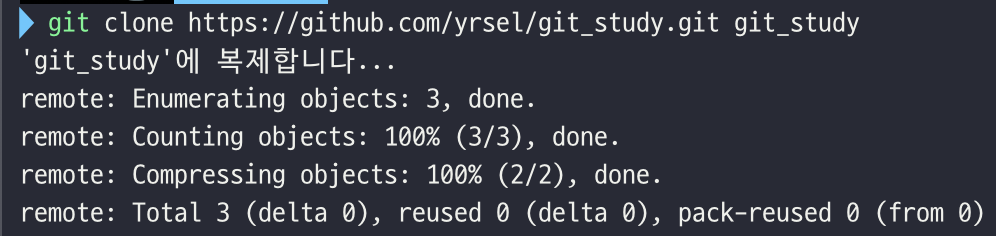
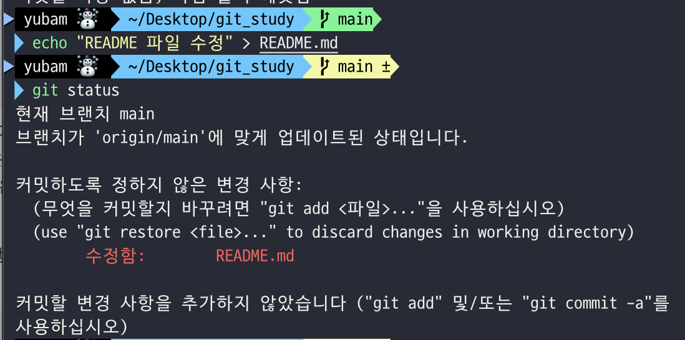
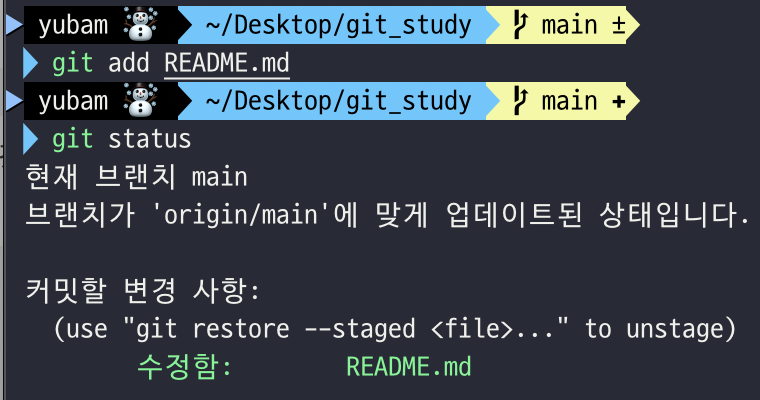
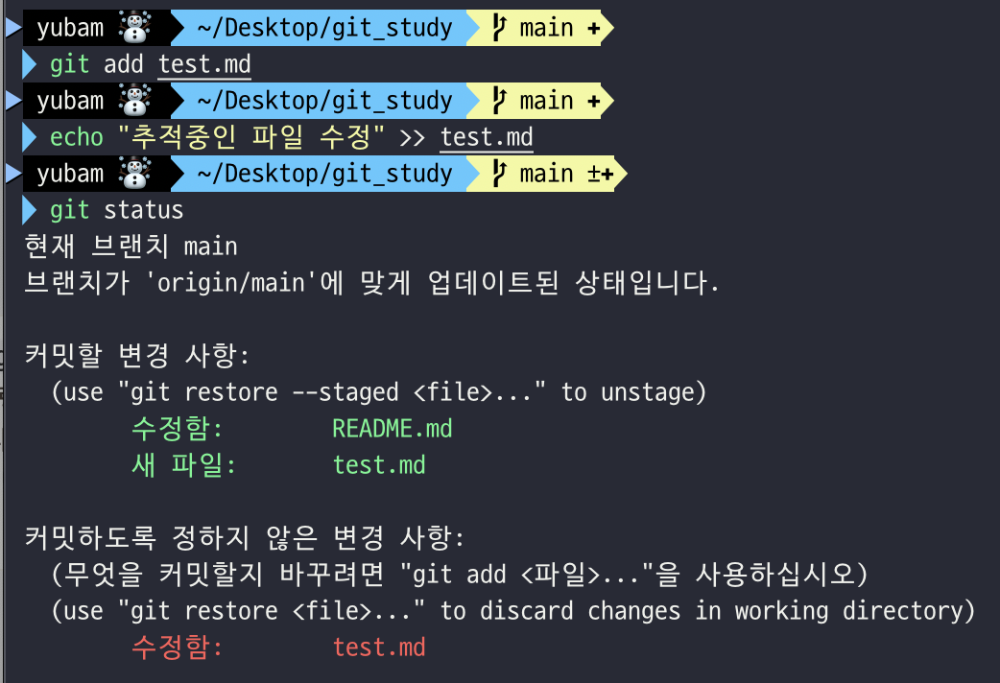

## Git

- 컴퓨터 파일의 변경사항을 추적하고 여러 명의 사용자들 간에 작업을 조율하기 위한 스냅샷 스트림 기반의 분산 버전 관리 시스템
- Remote와 Local구조로 여러명의 개발자가 동일한 프로젝트에 접근, 수정 가능하다.

### Git의 세가지 상태

자료 : [Git 공식문서 - 파일 생명주기](https://git-scm.com/book/ko/v2/Git%EC%9D%98-%EA%B8%B0%EC%B4%88-%EC%88%98%EC%A0%95%ED%95%98%EA%B3%A0-%EC%A0%80%EC%9E%A5%EC%86%8C%EC%97%90-%EC%A0%80%EC%9E%A5%ED%95%98%EA%B8%B0)

 

- Committed : 데이터가 로컬 데이터베이스에 안전하게 저장되었다는 것을 의미
- Modified : 수정한 파일을 아직 로컬 데이터베이스에 커밋하지 않을 것을 의미 (working Directory)
- Staged : 현재 수정한 파일을 곧 커밋할 것이라고 표시한 상태를 의미 (staging Area)

- 실습

  - git clone 으로 git 환경 구축

    

  - 프로젝트의 README 파일 수정 (Modified 상태)

    

  - 수정한 README 파일 add 명령어 실행 (Staged 상태)

    

  - touch 명령어로 크기 0인 파일 생성 후 스테이징 영역에 올린 후 echo 명령어로 파일 수정

    - `커밋 변경 사항`에 새 파일에도 존재하고 `수정된 사항`에도 존재 (현재 로컬과 스테이징 영역에 차이가 존재한다.)

    

자료 : [Git 공식문서](https://git-scm.com/book/ko/v2/%EC%8B%9C%EC%9E%91%ED%95%98%EA%B8%B0-Git-%EA%B8%B0%EC%B4%88)

  

- .git directory : Git이 프로젝트의 메타데이터와 객체 데이터베이스를 저장하는 곳
  - 다른 컴퓨터에 있는 저장소를 clone 하거나 git init 명령어에 의해 생성된다.
- 워킹 트리 : 프로젝트의 특정 버전을 Checkout 한 것
  - Git 디렉토리는 작업하는 디스크에 있고 그 디렉토리 안에 압축된 데이터베이스에서 파일을 가져와 워킹 트리를 만든다.
- Staging Area : Git 디렉토리에 있다.
  - 커밋할 파일에 대한 정보를 저장한다.

### Git 명령어

- git init : .git 폴더가 생성되며 git으로 버전관리 할 경로에서 사용한다.
- git clone
  - 로컬 저장소를 복제할 경우 : `git clone /로컬/저장소/경로`
  - 원격 서버의 저장소를 복제할 경우 : `git clone 사용자명@호스트:/원격/저장소/경로`
- git status : 현재 git 프로젝트의 상태를 보여준다.
  - 로컬, 인덱스(스테이징 영역), 최신 커밋트리를 비교하여 변경내역을 확인
- git add : 파일 변경 내용을 스테이징(staging)영역에 추가하기 위해 사용한다.
- git remote : 외부 저장소 url을 관리하기 위한 명령어
  - `git remote add origin <원격 서버 주소>`
    - 기존 원격 저장소를 복제한게 아니라면 원격 서버 주소를 git에게 알려줘야 한다.
  - `git remote add <원격 저장소 이름><원격 저장소 URL>`
    - 해당 URL 원격 저장소에 설정한 이름으로 연결
  - `git remote -v` : 현재 디렉토리가 연결된 원격 저장소 확인
  - `git remote rm [원격 저장소 이름]` : 원격 저장소와 연결 끊기
- git push : 원격 서버로 변경 내용을 발행
  - `git push origin 브랜치명`
  - `git push`명령어는 remote 전용 명령어여서 원격 저장소에 로컬 커밋을 올릴 때 remote를 작성하지 않아도 된다.
  - `git push [alias] [local branch name]:[remote branch name]`
    - 현재 작업중인 브랜치가 아닌 다른 브랜치에 remote를 올릴 수 있다.
- git commit : 스테이징 영역에 존재하는 변경사항을 저장한다. (HEAD에 반영)
- git rm : 파일을 지우거나 스테이징 영역에서 해제할 때 사용한다.
  - 로컬 디렉토리와 git 저장소 모두에서 파일을 삭제한다.
  - `--cached` : 스테이징 영역에서 제외해 추적되지 않는 상태로 만든다.
    - 로컬 디렉토리에서는 삭제하지 않지만 git 저장소에서는 삭제
- git log : commit 목록을 확인할 수 있다.
- git branch : 계층 구조를 구성할 수 있다.
  - `git branch 브랜치명` : 브랜치 생성
  - `git branch -d 브랜치명` : 해당 브랜치 삭제
- git switch : branch를 변경하는 명령어, `checkout` 명령어에서 복원 기능 제거
- git checkout : branch를 변경하고 워킹트리(workingtree)에서 변경점을 복원하는 명령어
  - switch,restore 명령어를 사용하는 것 추천
  - `git checkout -b 브랜치명` : 브랜치를 생성하며 포인터 위치도 같이 이동
  - `git checkout -d 브랜치명` : 브랜치 삭제
  - `git push origin <브랜치명>` : 새로운 브랜치를 생성 후 push하기 전까지는 다른 사람이 접근할 수 없다. (push 하기전까지 원격저장소에는 현재 브랜치가 존재하지 않는다.)
- git restore : 특정 커밋으로 되돌리기, 스테이징 영역에 있는 파일을 unstaging 영역으로 내리기 등 파일 조작을 위한 기능 지원
  - git restore [파일명]
    - 해당 파일을 HEAD 커밋으로 복구
  - git restore --source [커밋해시] [파일명]
    - `--source` : 복구 대상을 지정
    - 해당 파일을 커밋해시 위치의 커밋으로 복구
  - git restore --staged [파일명]
    - 스테이징 영역에 올라가 있는 파일을 Unstaging 영역으로 내리기
- git revert : 버전을 되돌리되, 되돌아간 상태에 대한 새로운 버전을 만든다.
  - `git revert [취소할 커밋]`
    - 이 방법의 경우 취소할 커밋 시점 ~ 최근 커밋 시점 사이에 커밋들이 있다면 충돌이 발생할 가능성이 있다.
    - 최근 커밋 시점부터 하나하나 revert 후, 커밋을 취소하는 방식으로 진행해서 충돌을 해결
  - `git revert [취소할 커밋ID] [현재 커밋ID]`
    - 충돌 없이 revert 사용하기 위해 현재 커밋ID를 명시해준다.
- git reset : 특정 시점의 커밋으로 되돌아가고 그 시점 이후의 버전은 모두 삭제된다.
  - `--soft`: 작업 디렉토리 내 변경사항과 스테이지에 추가된 변경 사항은 유지하며, 커밋한 사실만 되돌린다.
    - 특정 커밋후의 내역들은 모두 삭제하되 삭제된 커밋 내용들은 스테이징 영역에 존재한다
  - `--mixed`: 작업 디렉토리 내 변경사항은 유지하며, 스테이지와 커밋만 되돌린다. (default)
    - 특정 커밋 후의 내역들은 모두 삭제하되 삭제된 커밋 내용들은 스테이징 되지 않은 상태로 남아있다.
  - `--hard`: 작업 디렉토리 내 변경사항, 스테이지, 커밋 모두 되돌린다.
    - 특정 커밋 후의 내역들을 모두 삭제 (git reflog를 사용하여 복구할 수는 있다.)
- git pull : 로컬 저장소를 원격 저장소에 맞춰 갱신
  - 원격 저장소의 변경 내용이 fetch 후 merge 진행
- git merge <브랜치명> : 다른 브랜치에 있는 변경 내용을 현재 브랜치에 병합
- git diff : 수정을 했지만 `아직 staged 상태가 아닌 파일`을 비교할 수 있다.
  - `git diff --staged` : 스테이징 영역과 저장소에 커밋한 것을 비교 (`--cached`와 동일)
  - `git diff <브랜치명><비교할 브랜치명>` : 변경 내용을 병합하기 전에, 어떻게 변경되었는지 비교
