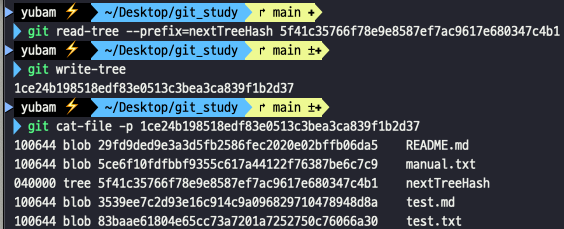

## Git 내부 구조

- git init 명령어 실행 시 생성되는 설정 파일들

     

  - HEAD : 현재 체크아웃된 브랜치를 가리키는 파일
  - refs : 커밋 객체의 포인터(브랜치, 태그와 같은 참조)들을 저장하는 폴더
  - index : 메타 데이터와 오브젝트 데이터를 저장하는 파일(Staging Area의 정보를 저장)
  - objects : 모든 데이터를 저장하는 폴더
  - config : 해당 프로젝트에만 적용되는 설정 옵션들이 있는 파일
  - info : .gitignore 파일처럼 무시할 파일의 패턴을 적어두는 곳
    - .gitignore 파일과는 달리 Git으로 관리되지 않는다.
  - hooks : 클라이언트 훅이나 서버 훅이 위치
  - 이 중, `HEAD 파일`, `index 파일`, `objects 폴더`, `refs 폴더` 가 Git의 핵심이다.

- Git은 Content-addressable 파일시스템이다

  - Git의 핵심은 단순한 파일 이름과 파일 데이터로 이루어진 데이터 저장소라는 의미이다.
  - 어떤 형식의 데이터라도 집어넣을 수 있고 해당 Key로 언제든지 데이터를 다시 가져올 수 있다.

- Git 데이터베이스에 git Object를 저장하면 objects 폴더에 파일이 하나 생성된다.
  - 데이터는 새로 만든 파일에 저장하며 Git은 데이터와 헤더로 생성한 SHA-1 암호화 알고리즘으로 파일 이름을 짓는다.
    - 암호화 해시의 처음 두 글자 : 디렉토리명, 나머지 38글자 : 파일이름 으로 사용

### Git Object

- `.git/objects`에 개별적인 blob, tree, commit, tag 파일로 존재
  - blob (binary large object, 파일 정보가 들어있는 객체)
    - 크기 : 컨텐츠 용량을 bytes로 표시
    - 컨텐츠 : 텍스트, 이미지, 음악, 단순 이진파일 처럼 다양한 형식의 파일을 저장할 수 있다.
    - 파일 이름이나 형식과 같은 메타정보는 blob에 저장되지 않고 파일 내용 전체를 담는다.
  - tree (커밋 시점의 인덱스의 스냅샷)
    - 크기 : 트리 오브젝트의 용량을 bytes로 표시
    - 하위 디렉토리의 트리 객체를 재귀적으로 참조
    - 한 디렉토리에 있는 모든 blob을 담고 있으며 객체에 대한 접근권한, 파일이름을 관리한다.
    - blob과 또다른 tree로 구성
    - 파일 식별자는 100644읽기파일(blob), 100755실행파일(blob), 040000디렉토리(tree)로 구성
      - git에서 지원하는 파일 시스템 모드 100644,100755 두 가지(`chmod 644`, `chmod 755`)
  - commit (커밋 정보가 들어 있는 객체)
    - 작성자, 커밋 실행자, 커밋 날짜, 로그 메시지, tree 객체(해당 커밋에서의 dir/file의 상태를 알 수 있다.)
    - 커밋별로 하나의 커밋 파일로 저장된다.
    - 가장 바깥 tree의 해시값, author, commiter, 커밋 메시지의 정보가 저장된다.
    - parent에는 직전 커밋의 해시값이 저장되며, LinkedList형태로 커밋들이 구성된다.
  - tag
    - 객체종류, 태그이름, tagger, 태그메시지, PGP 서명정보

### Git Object 명령어

- `find` 명령어 : 원하는 폴더나 파일 찾기
- `git cat-file` : Git 오브젝트에 사용하여 오브젝트가 품고 있는 정보를 상세하게 출력할 수 있다.
  - `-p` 옵션 : 파일 내용 출력
  - `-t` 옵션 : 해시값에 해당하는 git object 유형을 확인할 수 있다.
- `git hash-object` : 이 명령에 데이터를 주면 `.git/objects` 디렉토리에 저장하고 그 데이터 접근할 수 있는 유일한 key키를 알려준다.

  - 40자 길이의 체크섬 해시를 반환한다.
  - `-w` 옵션 : 실제로 파일 저장

- 해시값을 이용해서 버전을 되돌릴 수 있다.

  - `git hash-object -w` 명령으로 파일을 Git object로 저장

    

  - 기존 파일을 수정 후 저장

    

  - `git cat-file -p 해시값 > 파일명` 으로 해시값 버전의 내용으로 되돌리기

     

### Tree 개체

- Git의 모든 것은 Tree와 Blob Object로 저장한다.
- 하나의 Tree Object는 여러 개의 항목을 가질 수 있다.
  - Blob 개체나 하위 Tree 개체를 가리키는 SHA-1 포인터, 파일모드, 개체 타입, 파일 이름 등등

## 직접 Git Objects를 조작해서 내부 동작 이해하기

- 직접 Tree Object 만들어보기
  - Staging Area(Index) 상태로 Tree Object를 만들고 기록한다.
- `update-index` : 파일을 인위적으로 Staging Area에 추가하는 명령

  - Staging Area에 없는 파일이면 `--add` 옵션과 함께 사용해야 한다.
  - 디렉토리에 있는 파일이 아니라 데이터베이스에 추가해야하기에 `--cacheinfo` 옵션도 필요하다
  - 파일 모드, SHA-1 해시, 파일 이름 정보도 입력한다.
  - ex, `git update-index --add --cacheinfo 100644 5ce6f10fdfbbf9355c617a44122f76387be6c7c9 manual.txt`

   

   

- `git write-tree` : Staging Area에 있는 파일들을 Tree Object로 저장

  

- `git read-tree` : Tree Object를 읽어 Staging Area에 추가한다.

  - `--prefix` 옵션 : Tree 개체를 하위 디렉토리로 추가할 수 있다.

  

- `git commit-tree` : Commit Object에 대한 설명과 Tree 개체의 SHA-1를 넘긴다

  - Commit Object를 생성하면 tree의 해시값, Git config에 설정한 username, email 정보와 함께 시간 정보, 커밋 메시지를 포함하고 있다.

  

- git add, git commit 명령어 실행 시 위와 같은 흐름으로 관리된다.

### Git Objects 저장되는 구조 이미지

- 자료 : [Git Object 내부](https://git-scm.com/book/ko/v2/Git%EC%9D%98-%EB%82%B4%EB%B6%80-Git-%EA%B0%9C%EC%B2%B4)

 

- 실제 Git에서는 blob에 파일내용 그대로를 저장하는 것이 아닌 zlib으로 압축한 내용을 저장한다.

## Git Refs

- git log 해시값 : 히스토리를 볼 수 있다.
  - 커밋 해시값으로 모든 히스토리를 따라 들어가면 모든 Git Objects를 조회할 수 있다.
  - 하지만, SHA-1 값을 기억하기보다는 쉬운 이름의 포인터가 있으면 좋기에 외우기 쉬운 이름으로 된 파일에 SHA-1 값을 저장한다. -> Refs의 역할
- `.git/refs` 폴더에 파일은 없고 디렉토리만 몇 개 존재한다.

- refs 의 내부는 가장 최근 커밋의 해시값이 refs의 폴더만을 가리키는 것 뿐이다.
  - `echo 가장 최근 커밋의 해시값 > .git/refs/heads/main`
- `git update-ref` 명령으로 안전하게 Ref를 설정할 수 있다.
  `git update-ref refs/heads/main 최근 커밋의 해시값`
- 브랜치가 사용되는 방법이다.
  - 어떤 작업 중 마지막 작업을 가리키는 포인터 또는 Refs
  - `git branch <브랜치명>` 명령 실행 -> 내부적으로 update-ref 명렁 실행
  - 입력받은 브랜치 이름과 현 브랜치의 마지막 커밋의 SHA-1 값으로 update-ref 명령을 실행한다.

### HEAD

- HEAD 파일은 현 브랜치를 가리키는 간접 Refs
- HEAD refs 는 다른 Refs를 가리키는 것이라 SHA-1 값이 없다.
  - `cat .git/HEAD` -> `ref: refs/heads/main` 과 같은 내용을 확인할 수 있다.
  - checkout, switch 명령어 실행 시 HEAD는 해당 브랜치의 폴더를 가리킨다.
- `git commit`을 실행하여 커밋 Object가 만들어질 때, 지금 HEAD가 가리키고 있던 커밋의 해시값이 그 커밋 Object의 부모로 사용된다.
- `git symbolic-ref` 라는 명령어를 사용해서 Git에서 안전하게 사용할 수도 있다.
  - 현재 HEAD 위치 : `git symbolic-ref HEAD` -> `refs/heads/main`
  - HEAD 위치 변경 : `git symbolic-ref HEAD refs/heads/test`

## Tag

- Tag Object는 Commit Object와 매우 비슷하다
  - Commit Object처럼 누가, 언제 태그를 달았는지 태그 메시지는 무엇이고 어떤 커밋을 가리키는지에 대한 정보가 포함된다.
- Annotated 태그와 Lightweight 태그 두 종류로 나뉜다.
  - Lightweight 태그는 브랜치와 비슷하지만 브랜치처럼 옮길 수는 없다.
    - `git update-ref refs/tags/v1.0 커밋해시값`
  - Annotated 태그
    - Annotated 태그는 커밋을 직접 가리키지 않고 태그 개체를 가리킨다.
    - 태그 Object를 만들고 거기에 커밋을 가리키는 Refs를 저장한다.
      - 해당 파일 내부에 Object 필드명의 value가 실제로 태그가 가리키는 커밋의 해시값이다.
    - Commit Object뿐만 아니라 다른 Git Objects에도 태그를 걸 수 있다.

## 리모트

- remote Refs
- 리모트를 추가하고 push하면 Git은 각 브랜치마다 push한 마지막 커밋이 무엇인지 refs/remotes 디렉토리에 저장한다.
- ex, `origin` 이라는 리모트를 추가하고 `master` 브랜치를 push 한다.
  - `git push origin master`
- refs/heads 에 있는 Refs인 브랜치와 달리 리모트 Refs는 Checkout할 수 없고 읽기 용도로만 쓸 수 있는 브랜치이다.
- 리모트 Refs는 서버의 브랜치가 가리키는 커밋이 무엇인지 적어둔 일종의 북마크 역할
